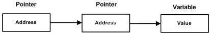

# C语言 - 指针二

## C 指针数组

在我们讲解指针数组的概念之前，先让我们来看一个实例，它用到了一个由 3 个整数组成的数组：

``` swift
#include <stdio.h>
 
const int MAX = 3;
 
int main ()
{
   int  var[] = {10, 100, 200};
   int i;
 
   for (i = 0; i < MAX; i++)
   {
      printf("Value of var[%d] = %d\n", i, var[i] );
   }
   return 0;
}
```
当上面的代码被编译和执行时，它会产生下列结果：
```
Value of var[0] = 10
Value of var[1] = 100
Value of var[2] = 200
```
可能有一种情况，我们想要让数组存储指向 int 或 char 或其他数据类型的指针。下面是一个指向整数的指针数组的声明：
``` swift
int *ptr[MAX];
```
在这里，把 ptr 声明为一个数组，由 MAX 个整数指针组成。因此，ptr 中的每个元素，都是一个指向 int 值的指针。下面的实例用到了三个整数，它们将存储在一个指针数组中，如下所示：
``` swift
#include <stdio.h>
 
const int MAX = 3;
 
int main ()
{
   int  var[] = {10, 100, 200};
   int i, *ptr[MAX];
 
   for ( i = 0; i < MAX; i++)
   {
      ptr[i] = &var[i]; /* 赋值为整数的地址 */
   }
   for ( i = 0; i < MAX; i++)
   {
      printf("Value of var[%d] = %d\n", i, *ptr[i] );
   }
   return 0;
}
```
当上面的代码被编译和执行时，它会产生下列结果：
```
Value of var[0] = 10
Value of var[1] = 100
Value of var[2] = 200
```
您也可以用一个指向字符的指针数组来存储一个字符串列表，如下：
``` swift
#include <stdio.h>
 
const int MAX = 4;
 
int main ()
{
   const char *names[] = {
                   "Zara Ali",
                   "Hina Ali",
                   "Nuha Ali",
                   "Sara Ali",
   };
   int i = 0;
 
   for ( i = 0; i < MAX; i++)
   {
      printf("Value of names[%d] = %s\n", i, names[i] );
   }
   return 0;
}
```
当上面的代码被编译和执行时，它会产生下列结果：
```
Value of names[0] = Zara Ali
Value of names[1] = Hina Ali
Value of names[2] = Nuha Ali
Value of names[3] = Sara Ali
```


## C 指向指针的指针

指向指针的指针是一种多级间接寻址的形式，或者说是一个指针链。通常，一个指针包含一个变量的地址。当我们定义一个指向指针的指针时，第一个指针包含了第二个指针的地址，第二个指针指向包含实际值的位置。



一个指向指针的指针变量必须如下声明，即在变量名前放置两个星号。例如，下面声明了一个指向 int 类型指针的指针：
``` swift
int **var;
```
当一个目标值被一个指针间接指向到另一个指针时，访问这个值需要使用两个星号运算符，如下面实例所示：
``` swift
#include <stdio.h>
 
int main ()
{
   int  var;
   int  *ptr;
   int  **pptr;

   var = 3000;

   /* 获取 var 的地址 */
   ptr = &var;

   /* 使用运算符 & 获取 ptr 的地址 */
   pptr = &ptr;

   /* 使用 pptr 获取值 */
   printf("Value of var = %d\n", var );
   printf("Value available at *ptr = %d\n", *ptr );
   printf("Value available at **pptr = %d\n", **pptr);

   return 0;
}
```
当上面的代码被编译和执行时，它会产生下列结果：
```
Value of var = 3000
Value available at *ptr = 3000
Value available at **pptr = 3000
```


## C 传递指针给函数
C 语言允许您传递指针给函数，只需要简单地声明函数参数为指针类型即可。
下面的实例中，我们传递一个无符号的 long 型指针给函数，并在函数内改变这个值：

``` swift
#include <stdio.h>
#include <time.h>
 
void getSeconds(unsigned long *par);

int main ()
{
   unsigned long sec;


   getSeconds( &sec );

   /* 输出实际值 */
   printf("Number of seconds: %ld\n", sec );

   return 0;
}

void getSeconds(unsigned long *par)
{
   /* 获取当前的秒数 */
   *par = time( NULL );
   return;
}
```
当上面的代码被编译和执行时，它会产生下列结果：
```
Number of seconds :1294450468
```
能接受指针作为参数的函数，也能接受数组作为参数，如下所示：
``` swift
#include <stdio.h>
 
/* 函数声明 */
double getAverage(int *arr, int size);
 
int main ()
{
   /* 带有 5 个元素的整型数组  */
   int balance[5] = {1000, 2, 3, 17, 50};
   double avg;
 
   /* 传递一个指向数组的指针作为参数 */
   avg = getAverage( balance, 5 ) ;
 
   /* 输出返回值  */
   printf("Average value is: %f\n", avg );
    
   return 0;
}

double getAverage(int *arr, int size)
{
  int    i, sum = 0;       
  double avg;          
 
  for (i = 0; i < size; ++i)
  {
    sum += arr[i];
  }
 
  avg = (double)sum / size;
 
  return avg;
}
```
当上面的代码被编译和执行时，它会产生下列结果：
```
Average value is: 214.40000
```


## C 从函数返回指针

在上一章中，我们已经了解了 C 语言中如何从函数返回数组，类似地，C 允许您从函数返回指针。为了做到这点，您必须声明一个返回指针的函数，如下所示：
``` swift
int * myFunction()
{
.
.
.
}
```
另外，C 语言不支持在调用函数时返回局部变量的地址，除非定义局部变量为 static 变量。
现在，让我们来看下面的函数，它会生成 10 个随机数，并使用表示指针的数组名（即第一个数组元素的地址）来返回它们，具体如下：
``` swift
#include <stdio.h>
#include <time.h>
#include <stdlib.h> 
 
/* 要生成和返回随机数的函数 */
int * getRandom( )
{
   static int  r[10];
   int i;
 
   /* 设置种子 */
   srand( (unsigned)time( NULL ) );
   for ( i = 0; i < 10; ++i)
   {
      r[i] = rand();
      printf("%d\n", r[i] );
   }
 
   return r;
}
 
/* 要调用上面定义函数的主函数 */
int main ()
{
   /* 一个指向整数的指针 */
   int *p;
   int i;
 
   p = getRandom();
   for ( i = 0; i < 10; i++ )
   {
       printf("*(p + [%d]) : %d\n", i, *(p + i) );
   }
 
   return 0;
}
```
当上面的代码被编译和执行时，它会产生下列结果：
```
1523198053
1187214107
1108300978
430494959
1421301276
930971084
123250484
106932140
1604461820
149169022
*(p + [0]) : 1523198053
*(p + [1]) : 1187214107
*(p + [2]) : 1108300978
*(p + [3]) : 430494959
*(p + [4]) : 1421301276
*(p + [5]) : 930971084
*(p + [6]) : 123250484
*(p + [7]) : 106932140
*(p + [8]) : 1604461820
*(p + [9]) : 149169022
```