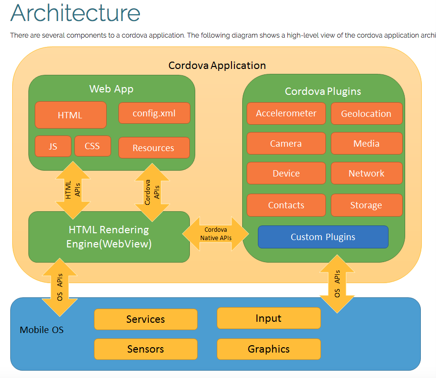
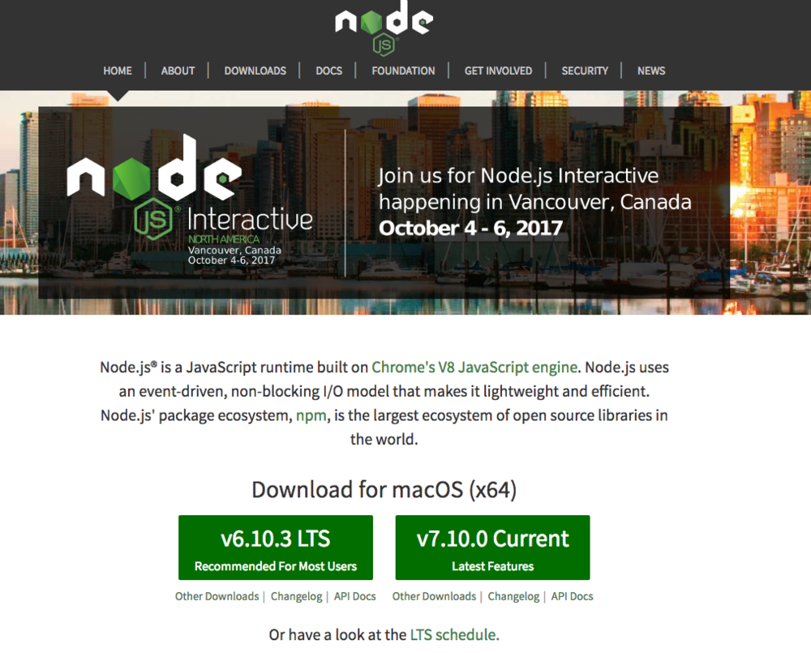
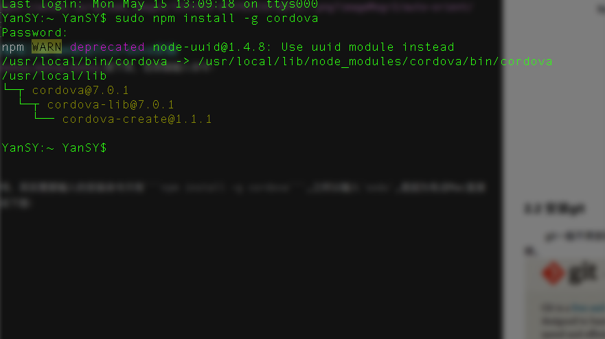
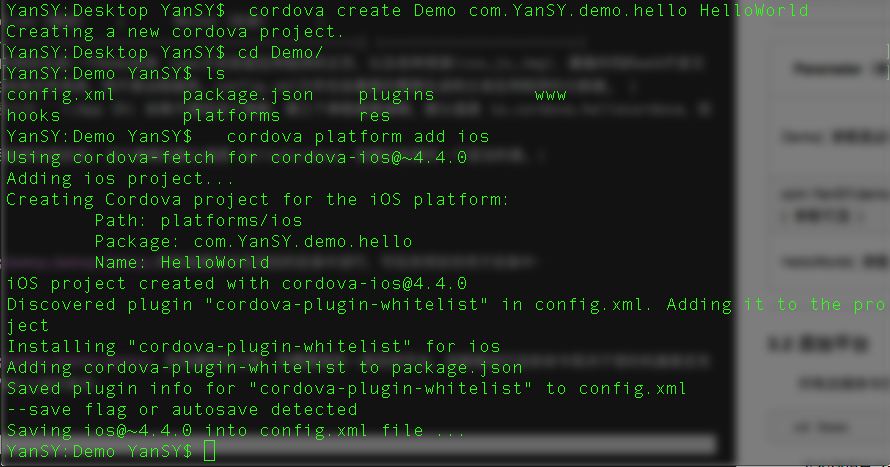
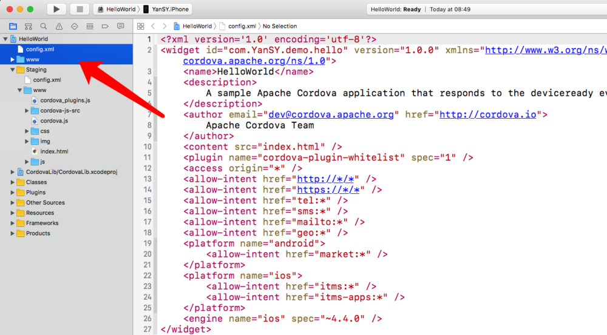
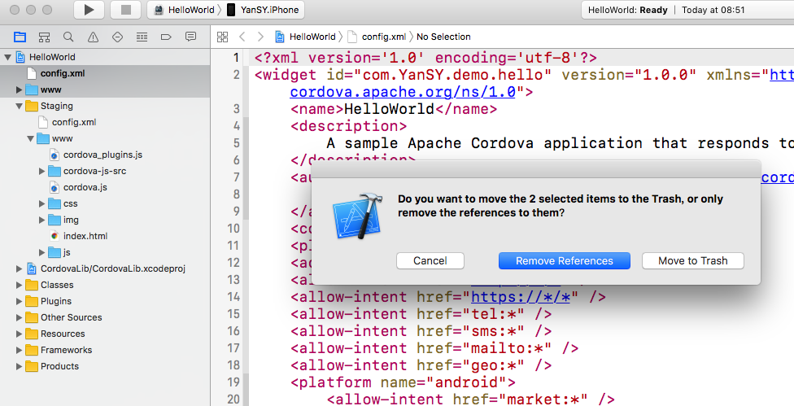

# 跨平台 - Cordova 教程一

## 1 Cordova简介
### 1.1 Cordova是什么
Cordova前身是phonegap,而PhoneGap是Nitobi软件公司2008年推出的一个框架，旨在弥补web和iOS之间的不足，使得web和iPhone SDK之间的交互更容易。后来又加入了Android SDK 和BlackBerry SDK，再然后又陆续加入了更多的平台。但是在2011年，Nitobi公司被Adobe收购，PhoneGap也被提交到Apache Incubator。由于Adobe现在拥有PhoneGap商标，PhoneGap v2.0版产品就更名为Apache Cordova。
据说Cordova是Nitobi团队当时坐落的街道名称，用此名来纪念Nitobi团队的贡献。Apache Cordova是从PhoneGap中抽出的核心代码，是驱动PhoneGap的核心引擎。
### 1.2 Cordova的工程结构
有下图可以看出，关于Cordova的工程结构以及与Native API之间的关系：



由上图可以看出，其实Cordova的使用分为上面几个框架结构，在Native与web之间交互。

## 2 Cordova安装
### 2.1 准备工作
在Mac端安装Cordova的步骤及解释。

- （1）首先，你要有一台Mac电脑，如果没有，那么，你就把这篇文章关了吧，看了也没什么用。
- （2）然后你需要安装xcode，当然，你要开发，这一点必不可少。
- （3）你需要申请证书，然后在xcode中设置配置文件开发者账号...(可后面再做)。
- （4）好了，你可以开始安装Cordova了。
### 2.2 安装Node.js
要安装Cordova，需要先安装Node.js在Node.js官网,上下载并安装，下载好以后，一步一步点击下去就好，可以的老铁，没毛病。



### 2.3 使用node.js的依赖包管理工具npm来进行cordova安装

接下来，在终端输入命令：
``` 
 sudo npm install -g cordova
```
过程可能稍微有点枯燥和漫长，请耐心等待，其实需要输入的安装命令只有npm install -g cordova,之所以输入sodu,是因为有点Mac直接输入前一句代码是安装不起的，安装效果如下图：



## 3 创建你的第一个Cordova工程

### 3.1 新建项目

继续，打开终端，cmd切换目录到工作目录下，输入以下命令，同样，可能需要点时间来完成。
``` 
 cordova create Demo com.YanSY.demo.hello HelloWorld 
```

::: tip
Demo(参数是必填)
将为你的项目生成一个Demo目录
www子目录是应用程序的主页，以及各种资源(css,js,img)，遵循共同的web开发文件命名规范。这些资源将存储在设备上的本地文件系统，而不是远程服务。config.xml文件包含重要的需要生成和分发应用程序的元数据。

com.YanSY.demo.hello (参数可选)
App ID
如果不填写这个参数，第三个参数就要省略，默认值是 io.cordova.hellocordova，但建议你填写一个适当的值。

HelloWorld(参数可选)
应用程序的项目名
这个参数的默认值是 HelloCordova，但建议你填写一个适当的值。
:::


### 3.2 添加平台支持
所有后续命令在项目的目录中进行，可在该项目任何子目录中，cmd切换到项目目录下：
```
  cd Demo
```
在构建项目之前，你需要指定一组目标平台。你能够运行这些命令取决于您的机器是否支持每一个SDK，合理是否已安装SDK。在MAC上运行命令：
```
  cordova platform add ios
```



如果需要查看Cordova支持平台以及已经添加的平台，终端输入命令：
```
  cordova platforms ls
```

### 3.3 添加插件
根据项目具体功能需要，可添加插件以简单方便调用原生接口，如需添加插件，可以去Cordova插件库 搜索需要的插件：
```
> cordova plugin add com.phonegap.plugins.barcodescanner

> cordova plugin add org.apache.cordova.file-transfer

> cordova plugin ls
```


并非所有的插件都是全平台支持的，有些可能只支持安卓，也有的可能同时支持安卓和iOS，所以在多平台开发时，请慎重选择插件。个人建议，可自定义插件类，可参考官网Cordova自定义插件。


### 3.4 迭代项目
在工程目录下运行下面的命令来构建项目：
```
  cordova build
```

或者，指定生成iOS平台代码项目：
```
  cordova platform add iosiOS_Cordova
```

## 4 运行项目
### 4.1 打开工程
步骤走完第三章，那么，一个简单的Cordova项目就已经搭建完成了，现在，我们运行下我们工程。打开目录下
```
  /Users/xxx/Desktop/Demo/platforms/ios/HelloWorld.xcworkspace
```
为了避免引起混淆，建议移除掉下图中两个文件/文件夹引用：



