# 跨平台 - Cordova教程二


## 1 将Cordova本地相关文件copy到已存的项目中
### 1.1 找到相关路径，复制文件到工程目录
首先，进入到上一篇文章中创建的Cordova项目的路径中/Users/xxx/Desktop/Demo/platforms/ios,找到下面需要copy的4个文件夹copy到工程项目的根路径中，

``` 
  CordovaLib  cordova  www  platform_www
```

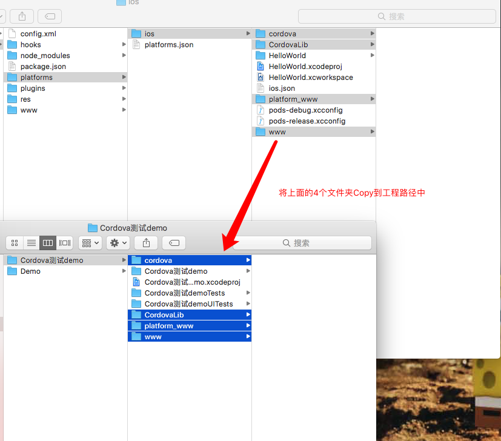

### 1.2 拷贝对应的config.xml文件到对应的工程目录

然后将下面图中所示的config.xml文件copy到需要的iOS项目路径文件夹内，如图：   
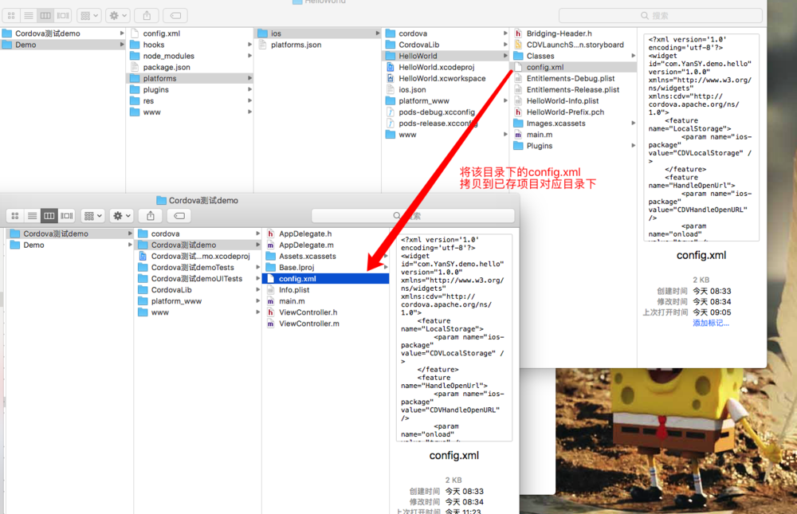 

## 2 配置相关参数

### 2.1 打开工程，进入工程TARGETS -> Build Phases 下，然后入下图所示，点击①中的按键，创建New Run Script Phase,②为创建的Run Script:

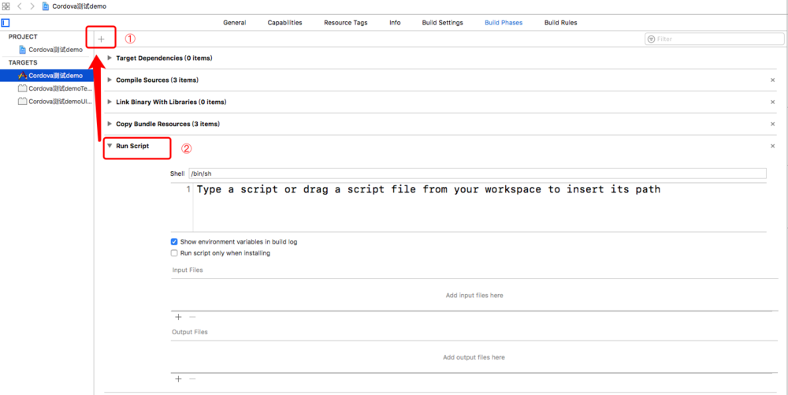 


### 2.2 将下图示意图中，①原名称Run Script修改为Copy www directory;然后讲②中的选项去掉，最后将下面的代码字段复制到③中：

``` 
NODEJS_PATH=/usr/local/bin; NVM_NODE_PATH=~/.nvm/versions/node/`nvm version 2>/dev/null`/bin; N_NODE_PATH=`find /usr/local/n/versions/node/* -maxdepth 0 -type d 2>/dev/null | tail -1`/bin; XCODE_NODE_PATH=`xcode-select --print-path`/usr/share/xcs/Node/bin; PATH=$NODEJS_PATH:$NVM_NODE_PATH:$N_NODE_PATH:$XCODE_NODE_PATH:$PATH && node cordova/lib/copy-www-build-step.js
```

如下图：
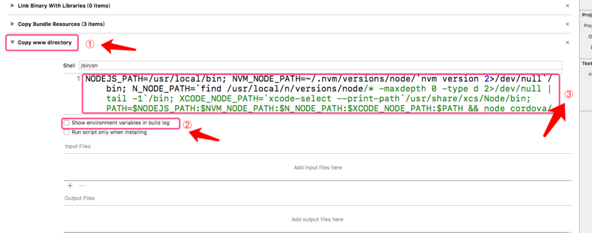 

### 2.3 在工程 Build Settings -> Other Linker Flags 中添加-ObjC -all_load
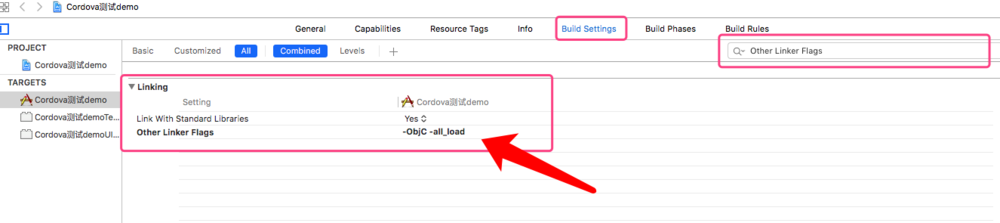 

### 2.4 Add Files to ... -> CordovaLib.xcodeproj

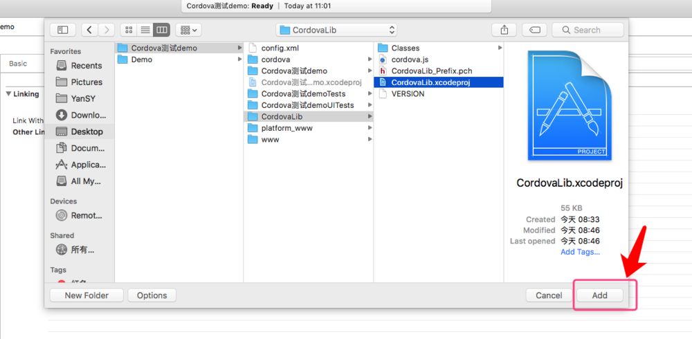 

### 2.5 Add Files to ... -> config.xml

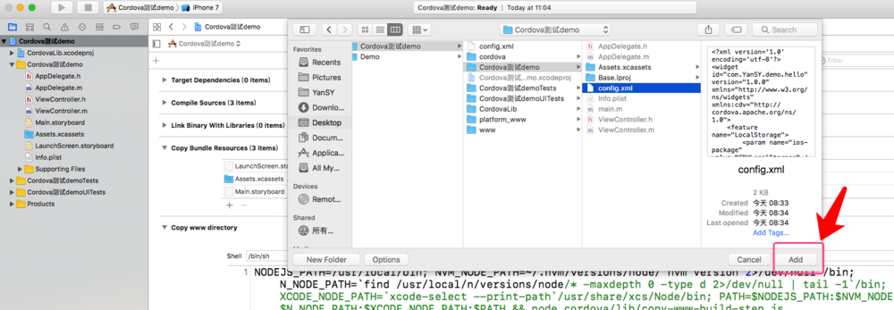 

### 2.6 Add Files to ... -> www文件夹

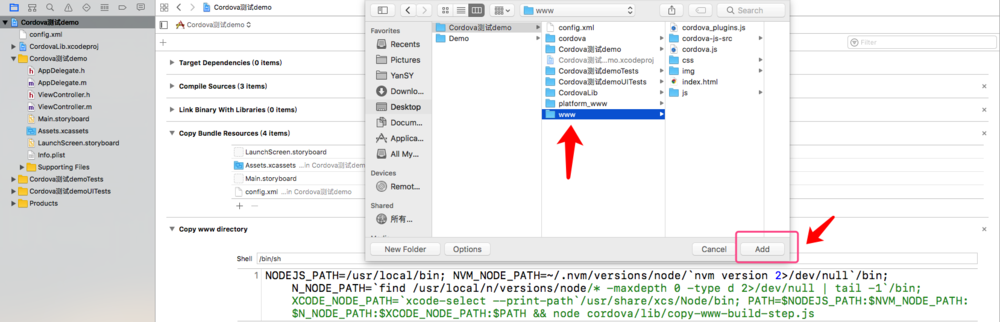 

### 2.7  Schemes按照下图配置，然后编译一次程序（command+R），最后导入下面两项

- Build Phases -> Target Dependencies -> CordovaLib
- Build Phases -> Link Binary With Libraries -> libCordova.a

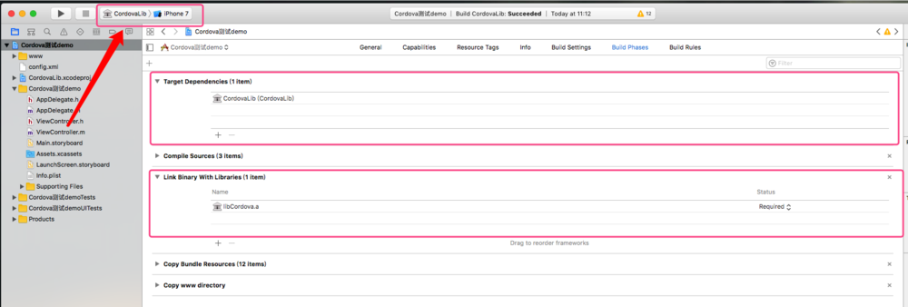 


### 2.8  Schemes按照下图配置，将"ViewController.h" 文件改为:
``` swift
#import <Cordova/CDVViewController.h>
#import <Cordova/CDVCommandDelegateImpl.h>
#import <Cordova/CDVCommandQueue.h>
@interface ViewController : CDVViewController
@end
```

如下图：

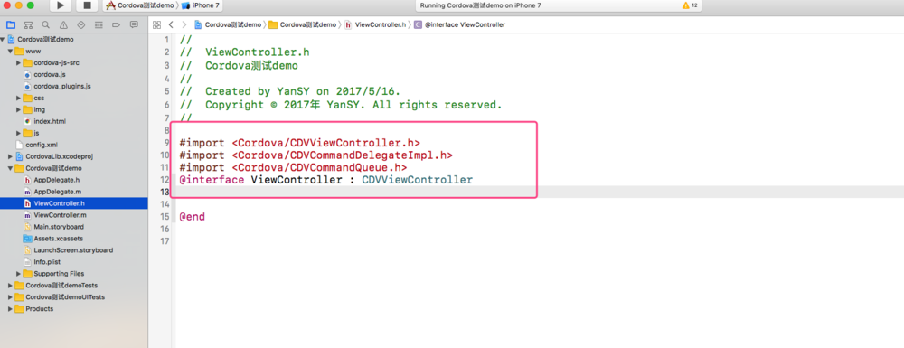 

至此，Cordova嵌入已存的开发项目就已经完成了，运行程序就可看到工程中wwww文件目录下，index.html文件中的网页信息了。只需要将该文件内容，改为公司需要的网页内容即可。具体交互以及自定义插件，将在后面文章中介绍。
## 3 自定义插件

### 3.1 在config.xml文件中加入下面代码：
```
<feature name="YourPluginName"> 
    <param name="ios-package" value="YanSYPlugin" /> 
    <param name="onload" value="true" /> 
</feature>
```
如下图：
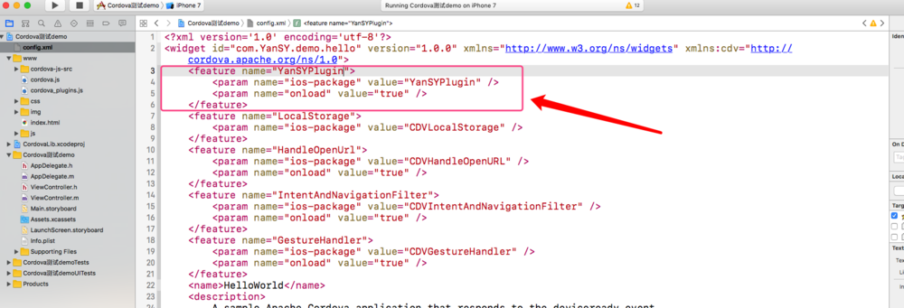 


### 3.2 创建一个YanSYPlugin类，实现下面的方法

下面介绍一个简单的web端调用原生手机相机以及选择相册图片并返回web显示的自定义插件调用：

- （1）YanSYPlugin.h 的实现


``` swift
#import <Cordova/CDVPlugin.h>

@interface YanSYPlugin : CDVPlugin<UIImagePickerControllerDelegate, UINavigationControllerDelegate>
{
    UIImagePickerController *_imagePickerController; // 定义相机控件类
}

// 本类插件方法 - 当在web调用时
- (void)myMethod:(CDVInvokedUrlCommand*)command;


@end
```

- （2）YanSYPlugin.m 的实现

``` swift
#import "YanSYPlugin.h"
//#import <GTMBase64.h>   // base64 转码

typedef void(^imgBlock)(NSString * data);
@interface YanSYPlugin()

@property(nonatomic,strong) imgBlock MyBlock;

@end


@implementation YanSYPlugin

- (void)myMethod:(CDVInvokedUrlCommand*)command{
    /*
     
     NSString* _callbackId; 回调时的id
     NSString* _className;  类名
     NSString* _methodName; 方法名
     NSArray* _arguments;   参数
     
     */
    [self.commandDelegate runInBackground:^{
        
        NSString* myarg = [command.arguments objectAtIndex:0];
        
        if (myarg !=nil) {
            [self switchMethodWithName:myarg andCommand:(CDVInvokedUrlCommand*)command];
        }
        else{
            return ;
        }
        
    }];
    
}

// 根据方法选择判断调用具体内容
- (void)switchMethodWithName:(NSString *)name andCommand:(CDVInvokedUrlCommand*)command{
    
    _imagePickerController = [[UIImagePickerController alloc] init];
    _imagePickerController.delegate = self;
    _imagePickerController.modalTransitionStyle = UIModalTransitionStyleFlipHorizontal;
    _imagePickerController.allowsEditing = YES;
    
    
    __block CDVPluginResult* pluginResult = nil;
    NSString * standbyJSStr = [NSString stringWithFormat:@"%@",@"data:image/png;base64,iVBORw0KGgoAAAANSUhEUgAAABcAAAAVCAYAAACt4nWrAAAEDWlDQ1BJQ0MgUHJvZmlsZQAAOI2NVV1oHFUUPrtzZyMkzlNsNIV0qD8NJQ2TVjShtLp/3d02bpZJNtoi6GT27s6Yyc44M7v9oU9FUHwx6psUxL+3gCAo9Q/bPrQvlQol2tQgKD60+INQ6Ium65k7M5lpurHeZe58853vnnvuuWfvBei5qliWkRQBFpquLRcy4nOHj4g9K5CEh6AXBqFXUR0rXalMAjZPC3e1W99Dwntf2dXd/p+tt0YdFSBxH2Kz5qgLiI8B8KdVy3YBevqRHz/qWh72Yui3MUDEL3q44WPXw3M+fo1pZuQs4tOIBVVTaoiXEI/MxfhGDPsxsNZfoE1q66ro5aJim3XdoLFw72H+n23BaIXzbcOnz5mfPoTvYVz7KzUl5+FRxEuqkp9G/Ajia219thzg25abkRE/BpDc3pqvphHvRFys2weqvp+krbWKIX7nhDbzLOItiM8358pTwdirqpPFnMF2xLc1WvLyOwTAibpbmvHHcvttU57y5+XqNZrLe3lE/Pq8eUj2fXKfOe3pfOjzhJYtB/yll5SDFcSDiH+hRkH25+L+sdxKEAMZahrlSX8ukqMOWy/jXW2m6M9LDBc31B9LFuv6gVKg/0Szi3KAr1kGq1GMjU/aLbnq6/lRxc4XfJ98hTargX++DbMJBSiYMIe9Ck1YAxFkKEAG3xbYaKmDDgYyFK0UGYpfoWYXG+fAPPI6tJnNwb7ClP7IyF+D+bjOtCpkhz6CFrIa/I6sFtNl8auFXGMTP34sNwI/JhkgEtmDz14ySfaRcTIBInmKPE32kxyyE2Tv+thKbEVePDfW/byMM1Kmm0XdObS7oGD/MypMXFPXrCwOtoYjyyn7BV29/MZfsVzpLDdRtuIZnbpXzvlf+ev8MvYr/Gqk4H/kV/G3csdazLuyTMPsbFhzd1UabQbjFvDRmcWJxR3zcfHkVw9GfpbJmeev9F08WW8uDkaslwX6avlWGU6NRKz0g/SHtCy9J30o/ca9zX3Kfc19zn3BXQKRO8ud477hLnAfc1/G9mrzGlrfexZ5GLdn6ZZrrEohI2wVHhZywjbhUWEy8icMCGNCUdiBlq3r+xafL549HQ5jH+an+1y+LlYBifuxAvRN/lVVVOlwlCkdVm9NOL5BE4wkQ2SMlDZU97hX86EilU/lUmkQUztTE6mx1EEPh7OmdqBtAvv8HdWpbrJS6tJj3n0CWdM6busNzRV3S9KTYhqvNiqWmuroiKgYhshMjmhTh9ptWhsF7970j/SbMrsPE1suR5z7DMC+P/Hs+y7ijrQAlhyAgccjbhjPygfeBTjzhNqy28EdkUh8C+DU9+z2v/oyeH791OncxHOs5y2AtTc7nb/f73TWPkD/qwBnjX8BoJ98VVBg/m8AAAEFSURBVDgRY/z969//GO9HDAd3f2agNmDKjX9KE4NBDmXasPwDTgcX14sxPP+vg4JBYsQCJmIVkqNu1HCsoUbTYGEJiBBgCE8SZLCw5WTg4CDeLkt7bgYrB24UFx878JXh+MGvcDGW6ctl4BxSGCCDSxpQk2VPwysUw4l3Kik2Q9XS1HAWkCV//vxn2LL2M8Od6z9Q3AfyOnq4oiggwGF5++YvQ4TzA4Yrl75jUSpGkeFMM3re4DAYi10kCjHt3kb9ohbmBqZHN3/B2FSnmdg4GaluKMxAJitn1FwGk6AGzZRXKcrAykId16Obw2RgwsmwYJMcg4omBwOlVniH8jFISbPBPQ0Ay3NHXHSKRhIAAAAASUVORK5CYII="];
    

    if ([name isEqualToString:@"调用相机"]) {
        
        [self selectImageFromCameraWithBlock:^(NSString *data) {
            // 因当前转码格式为iOS原生转码，web端无法解析 ，所以百度了一波图片转码成功后复用，若转码格式正确 可直接上传字符串
            // NSString *jsStr = [NSString stringWithFormat:@"data:image/png;base64,%@",data];
            // 使用备用字符串上传
            pluginResult = [CDVPluginResult resultWithStatus:CDVCommandStatus_OK messageAsString:standbyJSStr];
            [self.commandDelegate sendPluginResult:pluginResult callbackId:command.callbackId];
        }];
    }
    else if ([name isEqualToString:@"查看相册"]){
        [self selectImageFromAlbumWithBlock:^(NSString *data) {
            // 因当前转码格式为iOS原生转码，web端无法解析 ，所以百度了一波图片转码成功后复用，若转码格式正确 可直接上传字符串
            // NSString *jsStr = [NSString stringWithFormat:@"data:image/png;base64,%@",data];
            // 使用备用字符串上传
            pluginResult = [CDVPluginResult resultWithStatus:CDVCommandStatus_OK messageAsString:standbyJSStr];
            [self.commandDelegate sendPluginResult:pluginResult callbackId:command.callbackId];
        }];
    }
    else{
        pluginResult = [CDVPluginResult resultWithStatus:CDVCommandStatus_ERROR messageAsString:@"You Are Error"];
        [self.commandDelegate sendPluginResult:pluginResult callbackId:command.callbackId];
    }
}

#pragma mark 从摄像头获取图片或视频
- (void)selectImageFromCameraWithBlock:(imgBlock)block{
    
    self.MyBlock = block;
    _imagePickerController.sourceType = UIImagePickerControllerSourceTypeCamera;
    //相机类型（拍照、录像...）字符串需要做相应的类型转换
    //视频上传质量
    //UIImagePickerControllerQualityTypeHigh高清
    //UIImagePickerControllerQualityTypeMedium中等质量
    //UIImagePickerControllerQualityTypeLow低质量
    //UIImagePickerControllerQualityType640x480
    _imagePickerController.videoQuality = UIImagePickerControllerQualityTypeHigh;
    //设置摄像头模式（拍照，录制视频）为录像模式
    _imagePickerController.cameraCaptureMode = UIImagePickerControllerCameraCaptureModePhoto;
    [self.viewController presentViewController:_imagePickerController animated:YES completion:nil];
}

#pragma mark 从相册获取图片或视频
- (void)selectImageFromAlbumWithBlock:(imgBlock)block{
    self.MyBlock = block;
    _imagePickerController.sourceType = UIImagePickerControllerSourceTypePhotoLibrary;
    [self.viewController presentViewController:_imagePickerController animated:YES completion:nil];
}

#pragma mark UIImagePickerControllerDelegate
//该代理方法仅适用于只选取图片时
- (void)imagePickerController:(UIImagePickerController *)picker didFinishPickingImage:(UIImage *)image editingInfo:(nullable NSDictionary<NSString *,id> *)editingInfo {

    NSString *encodedImageStr = [self imageProcessing:image];
    self.MyBlock(encodedImageStr);
}

//适用获取所有媒体资源，只需判断资源类型
- (void)imagePickerController:(UIImagePickerController *)picker didFinishPickingMediaWithInfo:(NSDictionary<NSString *,id> *)info{

    NSString *encodedImageStr = [self imageProcessing:info[UIImagePickerControllerEditedImage]];
    self.MyBlock(encodedImageStr);
    [self.viewController dismissViewControllerAnimated:YES completion:nil];
}


// 图像处理 若未下载base64者 可不用查看
- (NSString *)imageProcessing:(UIImage *)proImage{
    
    // 判断传过来照片的大小进行裁剪
    CGFloat width  = proImage.size.width;
    CGFloat height = proImage.size.height;
    CGSize size;
    if (width>height) {
        size = CGSizeMake(800, 450);
    }
    else{
        size = CGSizeMake(450, 800);
    }
    // 创建一个bitmap的context
    // 并把它设置成为当前正在使用的context
    UIGraphicsBeginImageContext(size);
    // 绘制改变大小的图片
    [proImage drawInRect:CGRectMake(0,0, size.width, size.height)];
    // 从当前context中创建一个改变大小后的图片
    UIImage * tailoringImage =UIGraphicsGetImageFromCurrentImageContext();
    // 使当前的context出堆栈
    UIGraphicsEndImageContext();
    
    // 判断图片大小进行压缩
    NSData *imageData = UIImageJPEGRepresentation(tailoringImage,1.0);
    
    NSLog(@"imagedata == %lud,size.width = %f==%f",(unsigned long)imageData.length,tailoringImage.size.width,tailoringImage.size.height);
    
    if (imageData.length>100*1024) {
        if (imageData.length>1024*1024) {     //1M以及以上
            imageData=UIImageJPEGRepresentation(tailoringImage, 0.1);
        }else if (imageData.length>512*1024) {//0.5M-1M
            imageData=UIImageJPEGRepresentation(tailoringImage, 0.3);
        }else if (imageData.length>200*1024) {//0.25M-0.5M
            imageData=UIImageJPEGRepresentation(tailoringImage, 0.7);
        }
    }
    NSLog(@"imagedata == %lud,size.width = %f==%f",(unsigned long)imageData.length,tailoringImage.size.width,tailoringImage.size.height);
    
    // 最后进行 base64 转码
    // 注：iOS端转base64 的方法可能web无法简析为图片，可从pod下载第三方库 GTMBase64 进行转码 ，这里不再赘述
    // NSString * encodedImageStr = [GTMBase64 stringByEncodingData:imageData];
    
    // 原生转码方法
    NSString * encodedImageStr = [imageData base64EncodedStringWithOptions:NSDataBase64Encoding64CharacterLineLength];
    
    return encodedImageStr;
}


@end
```

- （3）编写index.html文件如下

``` html
<!DOCTYPE html>
<html>
    <head>
        <meta charset="utf-8" />
        <title></title>
        <script type="text/javascript" src="cordova.js"></script>
        <script type="text/javascript" src="cordova_plugins.js"></script>
        <script type="text/javascript" src="jquery.min.js"></script>
        <script type="text/javascript">
            document.addEventListener("deviceready", yourCallbackFunction, false);
            
            function cameraBTClick(){
                Cordova.exec(successFunction, failFunction, "YanSYPlugin", "myMethod", ["调用相机"]);
            }
        function PhotoAlbumBTClick(){
            Cordova.exec(failFunction, failFunction, "YanSYPlugin", "myMethod", ["查看相册"]);
        }
        
        function failFunction(error){
            alert("error");
            document.getElementById("returnValue").value = img;
        }
        function aaaa(){
            document.getElementById("2").innerHTML = "
        
    </head>
    
    <body>
        <p>点击下面按钮调用相机拍照</p>
        <button onclick="cameraBTClick()">调用相机</button>
    </body>
    
    <body>
        <p>点击下面按钮选择相册照片</p>
        <button onclick="PhotoAlbumBTClick()">查看相册</button>
        <button onclick="aaaa()">测试</button>
        <h1>这是回调结果展示区</h1>
        <textarea id ="returnValue" type="value" rows="5" cols="40">
        </textarea>
        
    </body>
    
    <body>/Users/YanSY/Desktop/代码运行示意11.gif
        <p>
        
        </p>
        <p id="2" > </p>
        
    </body>
    
    
</html>
```

将以上代码，按步骤写入程序中，可测试调用原生相机，注意，需要在plist文件中添加隐私权限。运行效果示例如下，因为转码格式为iOS原生格式转码，与web不兼容，所以上传回调时并未用选择照片或者拍摄照片上传，如果需要，请在工程中下载第三方库 GTMBase64 进行转码回调。