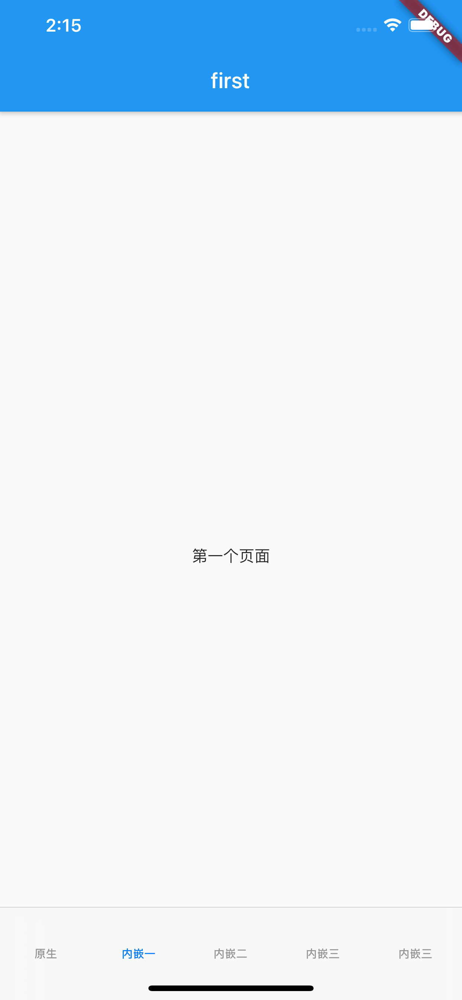

#  Flutter  - flutter_boost集成


## FlutterBoost简介
新一代Flutter-Native混合解决方案。 FlutterBoost是一个Flutter插件，它可以轻松地为现有原生应用程序提供Flutter混合集成方案。FlutterBoost的理念是将Flutter像Webview那样来使用。在现有应用程序中同时管理Native页面和Flutter页面并非易事。 FlutterBoost帮你处理页面的映射和跳转，你只需关心页面的名字和参数即可（通常可以是URL）。
## 前置条件
在继续之前，您需要将Flutter集成到你现有的项目中。flutter sdk 的版本需要和boost版本适配，否则会编译失败.

效果图：


## 创建flutter项目

在桌面创建boost文件夹,cd到boost文件夹
``` javascript
$ cd /Users/userName/Desktop/boost
```
创建flutter工程
``` javascript
$ flutter create --template module flutter_module
```
执行后
``` javascript
Creating project flutter_module... androidx: true
  flutter_module/test/widget_test.dart (created)
  flutter_module/flutter_module.iml (created)
  flutter_module/.gitignore (created)
  flutter_module/.metadata (created)
  flutter_module/pubspec.yaml (created)
  flutter_module/README.md (created)
  flutter_module/lib/main.dart (created)
  flutter_module/flutter_module_android.iml (created)
  flutter_module/.idea/libraries/Flutter_for_Android.xml (created)
  flutter_module/.idea/libraries/Dart_SDK.xml (created)
  flutter_module/.idea/modules.xml (created)
  flutter_module/.idea/workspace.xml (created)
Running "flutter pub get" in flutter_module...                      0.7s
Wrote 12 files.

All done!
Your module code is in flutter_module/lib/main.dart.
```
使用vccode或者Android Studio 打开flutter项目
在pubspec.yaml 添加flutter_boost依赖
``` javascript
dependencies:
  flutter:
    sdk: flutter

  # The following adds the Cupertino Icons font to your application.
  # Use with the CupertinoIcons class for iOS style icons.
  cupertino_icons: ^0.1.2
  flutter_boost: ^1.12.13
```
然后在vccode命令行执行 
``` javascript
flutter pub get
```

修改flutter页面内容，main.dart 整体代码
``` dart
import 'package:flutter/material.dart';
import 'package:flutter_boost/flutter_boost.dart';

void main() {
  runApp(MyApp());
}

class MyApp extends StatefulWidget {
  @override
  _MyAppState createState() => _MyAppState();
}

class _MyAppState extends State<MyApp> {
  @override
  void initState() {
    super.initState();

    FlutterBoost.singleton.registerPageBuilders({
      'first': (pageName,  params, _) => FirstRouteWidget(),
      'second': (pageName, params, _) => SecondRouteWidget(),
      'tab': (pageName, params, _) => TabRouteWidget(),
      ///可以在native层通过 getContainerParams 来传递参数
      'flutterPage': (pageName, params, _) {
        print("flutterPage params:$params");
        return FlutterRouteWidget();
      },
    });
  }

  @override
  Widget build(BuildContext context) {
    return MaterialApp(
        title: 'Flutter Boost example',
        builder: FlutterBoost.init(postPush: _onRoutePushed),
        home: Container());
  }

  void _onRoutePushed(
      String pageName, String uniqueId, Map params, Route route, Future _) {
  }
}

class FirstRouteWidget extends StatelessWidget {
  @override
  Widget build(BuildContext context) {
    return Scaffold(
      appBar: AppBar(
        title: Text("first"),
      ),
      body: Center(
        child: Container(
          child: Text("第一个页面"),
        ),
      ),
    );
  }
}


class SecondRouteWidget extends StatelessWidget {
  @override
  Widget build(BuildContext context) {
    return Scaffold(
      appBar: AppBar(
        title: Text("second"),
      ),
      body: Center(
        child: Container(
          child: Text("SecondRouteWidget"),
        ),
      ),
    );
  }
}

class TabRouteWidget extends StatelessWidget {
  @override
  Widget build(BuildContext context) {
    return Scaffold(
      appBar: AppBar(
        title: Text("third"),
      ),
      body: Center(
        child: Container(
          child: Text("TabRouteWidget"),
        ),
      ),
    );
  }
}


class FlutterRouteWidget extends StatelessWidget {
  @override
  Widget build(BuildContext context) {
    return Scaffold(
      appBar: AppBar(
        title: Text("fourth"),
      ),
      body: Center(
        child: Container(
          child: Text("FlutterRouteWidget"),
        ),
      ),
    );
  }
}

```

## 创建Swift项目

打开Podfile 修改
``` ruby
# Uncomment the next line to define a global platform for your project
# platform :ios, '9.0'

target 'SwiftProject' do
  # Comment the next line if you don't want to use dynamic frameworks
  use_frameworks!
  flutter_application_path = "../flutter_module"
  load File.join(flutter_application_path, '.ios', 'Flutter', 'podhelper.rb')
  install_all_flutter_pods(flutter_application_path)

  # Pods for SwiftProject

end

```
执行后，就会安装flutter_boost
``` ruby
Analyzing dependencies
Downloading dependencies
Installing Flutter (1.0.0)
Installing FlutterPluginRegistrant (0.0.1)
Installing flutter_boost (0.0.2)
Installing flutter_module (0.0.1)
Generating Pods project
Integrating client project
Pod installation complete! There are 4 dependencies from the Podfile and 4 total pods installed.
```

修改代码嵌入flutter
AppDelegate.swift
``` swift
import UIKit
import Flutter
import flutter_boost

@UIApplicationMain
class AppDelegate: FlutterAppDelegate {


    override func application(_ application: UIApplication, didFinishLaunchingWithOptions launchOptions: [UIApplication.LaunchOptionsKey: Any]?) -> Bool {
        // Override point for customization after application launch.
        
        // 开启flutter
        FlutterBoostPlugin.sharedInstance().startFlutter(with: SwiftPlatform()) { (engin) in
            
        }

        return true
    }

    // MARK: UISceneSession Lifecycle

    override func application(_ application: UIApplication, configurationForConnecting connectingSceneSession: UISceneSession, options: UIScene.ConnectionOptions) -> UISceneConfiguration {
        // Called when a new scene session is being created.
        // Use this method to select a configuration to create the new scene with.
        return UISceneConfiguration(name: "Default Configuration", sessionRole: connectingSceneSession.role)
    }

    override func application(_ application: UIApplication, didDiscardSceneSessions sceneSessions: Set<UISceneSession>) {
        // Called when the user discards a scene session.
        // If any sessions were discarded while the application was not running, this will be called shortly after application:didFinishLaunchingWithOptions.
        // Use this method to release any resources that were specific to the discarded scenes, as they will not return.
    }


}


```

SceneDelegate.swift

``` swift
import UIKit
import flutter_boost

class SceneDelegate: UIResponder, UIWindowSceneDelegate {

    var window: UIWindow?


    func scene(_ scene: UIScene, willConnectTo session: UISceneSession, options connectionOptions: UIScene.ConnectionOptions) {
        // Use this method to optionally configure and attach the UIWindow `window` to the provided UIWindowScene `scene`.
        // If using a storyboard, the `window` property will automatically be initialized and attached to the scene.
        // This delegate does not imply the connecting scene or session are new (see `application:configurationForConnectingSceneSession` instead).
        guard let windowScene = (scene as? UIWindowScene) else { return }
        
        window = UIWindow.init(windowScene: windowScene)
        window?.frame = windowScene.coordinateSpace.bounds
        
        // 原生页面
        let vc1 = ViewController.init()
        vc1.view.backgroundColor = UIColor.white
        let nav1 = UINavigationController.init(rootViewController: vc1)
        vc1.title = "原生"
        
        // flutter页面
        let flutterVC1 = FLBFlutterViewContainer.init()
        flutterVC1 .setName("first", params: [:])
        flutterVC1.tabBarItem.title = "内嵌一"
        
        let flutterVC2 = FLBFlutterViewContainer.init()
        flutterVC2 .setName("second", params: [:])
        flutterVC2.tabBarItem.title = "内嵌二"
        
        let flutterVC3 = FLBFlutterViewContainer.init()
        flutterVC3 .setName("tab", params: [:])
        flutterVC3.tabBarItem.title = "内嵌三"
        
        let flutterVC4 = FLBFlutterViewContainer.init()
        flutterVC4 .setName("flutterPage", params: [:])
        flutterVC4.tabBarItem.title = "内嵌三"
        
        let tab = UITabBarController.init()
        tab.viewControllers = [nav1,flutterVC1,flutterVC2,flutterVC3,flutterVC4]
        window?.rootViewController = tab
        
        window?.makeKeyAndVisible()
        
        
    }

    func sceneDidDisconnect(_ scene: UIScene) {
        // Called as the scene is being released by the system.
        // This occurs shortly after the scene enters the background, or when its session is discarded.
        // Release any resources associated with this scene that can be re-created the next time the scene connects.
        // The scene may re-connect later, as its session was not neccessarily discarded (see `application:didDiscardSceneSessions` instead).
    }

    func sceneDidBecomeActive(_ scene: UIScene) {
        // Called when the scene has moved from an inactive state to an active state.
        // Use this method to restart any tasks that were paused (or not yet started) when the scene was inactive.
    }

    func sceneWillResignActive(_ scene: UIScene) {
        // Called when the scene will move from an active state to an inactive state.
        // This may occur due to temporary interruptions (ex. an incoming phone call).
    }

    func sceneWillEnterForeground(_ scene: UIScene) {
        // Called as the scene transitions from the background to the foreground.
        // Use this method to undo the changes made on entering the background.
    }

    func sceneDidEnterBackground(_ scene: UIScene) {
        // Called as the scene transitions from the foreground to the background.
        // Use this method to save data, release shared resources, and store enough scene-specific state information
        // to restore the scene back to its current state.
    }


}

```


SwiftPlatform.swift
``` swift
import UIKit
import flutter_boost

class SwiftPlatform: NSObject,FLBPlatform {
    
    //里面实现FLBPlatform协议的方法，具体代码可以参考官方demo自行修改
    func open(_ url: String, urlParams: [AnyHashable : Any], exts: [AnyHashable : Any], completion: @escaping (Bool) -> Void) {
        var animated = false;
        if exts["animated"] != nil{
            animated = exts["animated"] as! Bool;
        }
        let vc = FLBFlutterViewContainer.init();
        vc.setName(url, params: urlParams);
        self.navigationController().pushViewController(vc, animated: animated);
        completion(true);
    }
    
    func present(_ url: String, urlParams: [AnyHashable : Any], exts: [AnyHashable : Any], completion: @escaping (Bool) -> Void) {
        var animated = false;
        if exts["animated"] != nil{
            animated = exts["animated"] as! Bool;
        }
        let vc = FLBFlutterViewContainer.init();
        vc.setName(url, params: urlParams);
        navigationController().present(vc, animated: animated) {
            completion(true);
        };
    }
    
    func close(_ uid: String, result: [AnyHashable : Any], exts: [AnyHashable : Any], completion: @escaping (Bool) -> Void) {
        var animated = false;
        if exts["animated"] != nil{
            animated = exts["animated"] as! Bool;
        }
        let presentedVC = self.navigationController().presentedViewController;
        let vc = presentedVC as? FLBFlutterViewContainer;
        if vc?.uniqueIDString() == uid {
            vc?.dismiss(animated: animated, completion: {
                completion(true);
            });
        }else{
            self.navigationController().popViewController(animated: animated);
        }
    }
    
    func navigationController() -> UINavigationController {
        let delegate = UIApplication.shared.delegate as! AppDelegate
        let navigationController = delegate.window?.rootViewController as! UINavigationController
        return navigationController;
    }
    
}

```

运行项目即可实现内嵌flutter页面。

