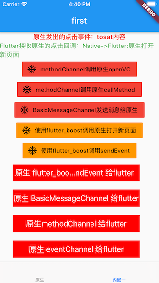
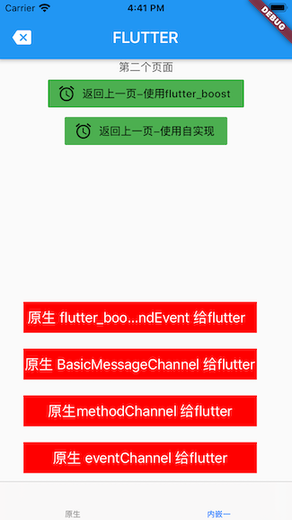

#  Flutter  - 原生交互

## 效果图



:::tip
Flutter可以原生之间可以通过Platform Channels APIs进行通信，API主要有以下三种：
MethodChanel：用于传递方法调用（method invocation）
其中最常用的是MethodChanel.

EventChannel：用于事件流的发送（event streams）
其中EventChannel用于从原生向Flutter发送通知事件，例如flutter通过其监听原生的重力感应变化等。与MethodChannel不同，EventChannel是原生到Flutter的单向调用，调用是多播（一对多）的。

MessageChannel：用于传递字符串和半结构化的消息
BasicMessageChannel用于在Flutter和原生互相发送消息，一方给另一方发送消息，收到消息之后给出回复。
:::


## MethodChannel使用
### 一、原生调用Flutter

1.1 原生端代码
``` swift
// 原生调用MethodChannel
methChannel = FlutterMethodChannel(name: "com.aaa/MethodChannel", binaryMessenger: self.platEngine!.binaryMessenger)
         
// 调用
    @objc func methodChannelClick() -> Void {
        if SwiftPlatform.shared.methChannel != nil {
            SwiftPlatform.shared.methChannel!.invokeMethod("showDialogue", arguments: ["message":"native传过来的"])
        }
        
    }
         
```

1.2 Flutter 端代码
``` dart
  // 创建methodChannel
  static const MethodChannel methodChannel =
      MethodChannel("com.aaa/MethodChannel");
      
 // 监听调用
     // flutter接收原生method调用
    methodChannel.setMethodCallHandler(_platformCallHandler);
    
      // Method监听
  Future<dynamic> _platformCallHandler(MethodCall call) async {
    switch (call.method) {
      case 'showDialogue':
        _nativeMsg = call.arguments["message"];
        setState(() {});

        return Future.value('called from platform!');
      default:
        print('Unknowm method ${call.method}');
        throw MissingPluginException();
        break;
    }
  }
```
### 二、Flutter调用原生

2.1 Flutter代码
``` dart
  // 创建methodChannel
  static const MethodChannel methodChannel =
      MethodChannel("com.aaa/MethodChannel");
      
         FlatButton.icon(
              onPressed: () async {
                Map<String, String> params = {"aaa": "bbbb"};
                _defaultCallback =
                    await methodChannel.invokeMethod('openVC', params);
                setState(() {});
              },
              icon: Icon(Icons.ac_unit),
              label: Text("methodChannel调用原生openVC"),
              color: Colors.red,
            ),

```

2.2 原生端代码

``` swift
 // 原生调用MethodChannel
         methChannel = FlutterMethodChannel(name: "com.aaa/MethodChannel", binaryMessenger: self.platEngine!.binaryMessenger)

/// flutter 调用原生，不使用flutterboost的
    func flutterCallNative() -> Void {
        
        let methodChannel =  FlutterMethodChannel(name: "com.aaa/MethodChannel", binaryMessenger: self.platEngine!.binaryMessenger)
        methodChannel.setMethodCallHandler { (call, result) in
            if(call.method == "openVC"){
                print("原生打开新页面")
                result("Native->Flutter:原生打开新页面")
            } else  if(call.method == "closeVC"){
                print("关闭当前页面")
                 result("Native->Flutter:关闭当前页面")
                self.navigationController().popViewController(animated: true);
            }else  if(call.method == "callMethod"){
                print("原生调用方法")
                 result("Native->Flutter:回调成功")
            }
            
        }
        
    }

```


## EventChannel使用
### 一、原生调用Flutter

1.1 原生端代码
``` swift
// 添加事件监听
let eventChannel  = FlutterEventChannel(name: "com.aaa/EventChannel", binaryMessenger: self.platEngine!.binaryMessenger);
        eventChannel.setStreamHandler(self)
        
        
// 实现代理
/// FlutterStreamHandler 代理
    func onListen(withArguments arguments: Any?, eventSink events: @escaping FlutterEventSink) -> FlutterError? {
        eventSink = events;
        return nil;
        
    }
    /// FlutterStreamHandler 代理
    func onCancel(withArguments arguments: Any?) -> FlutterError? {
        return FlutterError()
    }
    
// 点击实现
    @objc func aclick() -> Void {
        if (SwiftPlatform.shared.eventSink != nil) {
            SwiftPlatform.shared.eventSink!("event事件传递给flutter")
        }
    }
```
1.2 Flutter端代码
``` dart
// EventChannel
  static const EventChannel eventChannel =
      EventChannel("com.aaa/EventChannel", const StandardMethodCodec());

    // eventChannel监听
    eventChannel
        .receiveBroadcastStream("init")
        .listen(_onEvent, onError: _onError);
        
 
  // 数据接收
  void _onEvent(Object value) {
    print(value);
    _nativeMsg = value;
    setState(() {});
  }

  // 错误处理
  void _onError(dynamic) {}
```


## BasicMessageChannel使用
### 一、原生调用Flutter

1.1 原生端代码
``` swift
        // 原生调用BasicMessageChannel
        baseChannel = FlutterBasicMessageChannel(name: "com.aaa/BasicMessageChannel", binaryMessenger: self.platEngine!.binaryMessenger, codec: FlutterStringCodec())
        
    @objc func basicMessageChannel() -> Void {
        if SwiftPlatform.shared.baseChannel != nil {
            SwiftPlatform.shared.baseChannel!.sendMessage("原生发送消息给flutter-basicMessageChannel")
        }
    }
```
1.2 Flutter端代码
``` dart
// BasicMessageChannel
  static const BasicMessageChannel baseMessagechannel =
      BasicMessageChannel('com.aaa/BasicMessageChannel', StringCodec());

    // flutter接收原生baseMessagechannel调用
    baseMessagechannel.setMessageHandler(_handlerMessage);
    
      // baseMessagechannel监听
  Future<String> _handlerMessage(message) async {
    _nativeMsg = message;
    setState(() {});
    return '收到native的消息$message';
  }
```
### 二、Flutter调用原生

2.1 Flutter端代码
``` dart
// BasicMessageChannel
  static const BasicMessageChannel baseMessagechannel =
      BasicMessageChannel('com.aaa/BasicMessageChannel', StringCodec());

// 点击实现
 FlatButton.icon(
              onPressed: () async {
                _defaultCallback = await baseMessagechannel.send("发送给原生");
                setState(() {});
              },
              icon: Icon(Icons.ac_unit),
              label: Text("BasicMessageChannel发送消息给原生"),
              color: Colors.red,
            ),
```
2.2 原生端代码
``` swift
 // 原生调用BasicMessageChannel
        baseChannel = FlutterBasicMessageChannel(name: "com.aaa/BasicMessageChannel", binaryMessenger: self.platEngine!.binaryMessenger, codec: FlutterStringCodec())
        
        // 原生监听Flutter点击
        baseChannel?.setMessageHandler({ (msg, result) in
            print("原生收到的\(msg ?? "")")
            result("原生收到")
        })
```


## Flutter 端所有代码
``` dart
import 'package:flutter/material.dart';
import 'package:flutter/services.dart';
import 'package:flutter_boost/flutter_boost.dart';

void main() {
  runApp(MyApp());
}

class MyApp extends StatefulWidget {
  @override
  _MyAppState createState() => _MyAppState();
}

class _MyAppState extends State<MyApp> {
  @override
  void initState() {
    super.initState();

    FlutterBoost.singleton.registerPageBuilders({
      'first': (pageName, params, _) => FirstRouteWidget(),
      'second': (pageName, params, _) => SecondWidgetPage(),
    });
  }

  @override
  Widget build(BuildContext context) {
    return MaterialApp(
        title: 'Flutter Boost example',
        builder: FlutterBoost.init(postPush: _onRoutePushed),
        home: Container());
  }

  void _onRoutePushed(
      String pageName, String uniqueId, Map params, Route route, Future _) {}
}

class FirstRouteWidget extends StatefulWidget {
  FirstRouteWidget({Key key}) : super(key: key);

  @override
  _FirstRouteWidgetState createState() => _FirstRouteWidgetState();
}

class _FirstRouteWidgetState extends State<FirstRouteWidget> {
  // 回调结果默认值
  String _defaultCallback = "回调结果默认值";
  // 原生发出的点击事件显示
  String _nativeMsg = "原生调用事件默认值";
  VoidCallback listenCancelable;

// EventChannel
  static const EventChannel eventChannel =
      EventChannel("com.aaa/EventChannel", const StandardMethodCodec());

  // 创建methodChannel
  static const MethodChannel methodChannel =
      MethodChannel("com.aaa/MethodChannel");

// BasicMessageChannel
  static const BasicMessageChannel baseMessagechannel =
      BasicMessageChannel('com.aaa/BasicMessageChannel', StringCodec());

  @override
  void initState() {
    super.initState();

    // eventChannel监听
    eventChannel
        .receiveBroadcastStream("init")
        .listen(_onEvent, onError: _onError);

     // 监听原生通过flutter_boost 发送 sendEvent
    listenCancelable = FlutterBoost.singleton.channel
        .addEventListener('showToast', (name, arguments) async {
      _nativeMsg = arguments["message"];
      setState(() {});
      return null;
    });

    // flutter接收原生method调用
    methodChannel.setMethodCallHandler(_platformCallHandler);
    // flutter接收原生baseMessagechannel调用
    baseMessagechannel.setMessageHandler(_handlerMessage);
  }

  // baseMessagechannel监听
  Future<String> _handlerMessage(message) async {
    _nativeMsg = message;
    setState(() {});
    return '收到native的消息$message';
  }
  // Method监听
  Future<dynamic> _platformCallHandler(MethodCall call) async {
    switch (call.method) {
      case 'showDialogue':
        _nativeMsg = call.arguments["message"];
        setState(() {});

        return Future.value('called from platform!');
      default:
        print('Unknowm method ${call.method}');
        throw MissingPluginException();
        break;
    }
  }

  // 数据接收
  void _onEvent(Object value) {
    print(value);
    _nativeMsg = value;
    setState(() {});
  }

  // 错误处理
  void _onError(dynamic) {}

  @override
  void dispose() {
    super.dispose();
    listenCancelable.call();
  }

  @override
  Widget build(BuildContext context) {
    return Scaffold(
      appBar: AppBar(
        title: Text("first"),
      ),
      body: Center(
        child: Container(
            child: Column(
          mainAxisAlignment: MainAxisAlignment.start,
          children: <Widget>[
            Text(
              "原生发出的点击事件：$_nativeMsg",
              style: TextStyle(
                  fontSize: 15, fontWeight: FontWeight.bold, color: Colors.red),
            ),
            Text(
              "Flutter接收原生的点击回调：$_defaultCallback",
              style: TextStyle(fontSize: 15, color: Colors.green),
            ),
            FlatButton.icon(
              onPressed: () async {
                Map<String, String> params = {"aaa": "bbbb"};
                _defaultCallback =
                    await methodChannel.invokeMethod('openVC', params);
                setState(() {});
              },
              icon: Icon(Icons.ac_unit),
              label: Text("methodChannel调用原生openVC"),
              color: Colors.red,
            ),
            FlatButton.icon(
              onPressed: () async {
                Map<String, String> params = {"aaa": "bbbb"};
                _defaultCallback =
                    await methodChannel.invokeMethod('callMethod', params);
                setState(() {});
              },
              icon: Icon(Icons.ac_unit),
              label: Text("methodChannel调用原生callMethod"),
              color: Colors.red,
            ),
            FlatButton.icon(
              onPressed: () async {
                _defaultCallback = await baseMessagechannel.send("发送给原生");
                setState(() {});
              },
              icon: Icon(Icons.ac_unit),
              label: Text("BasicMessageChannel发送消息给原生"),
              color: Colors.red,
            ),
            FlatButton.icon(
              onPressed: () {
                Map<String, String> params = {"aaa": "bbbb"};
                FlutterBoost.singleton.open("second",
                    urlParams: params, exts: {"animated": true});
              },
              icon: Icon(Icons.ac_unit),
              label: Text("使用flutter_boost调用原生打开新页面"),
              color: Colors.orange,
            ),
            FlatButton.icon(
              onPressed: () {
                Map<String, String> params = {"aaa": "bbbb"};
                FlutterBoost.singleton.channel.sendEvent("default", params);
              },
              icon: Icon(Icons.ac_unit),
              label: Text("使用flutter_boost调用sendEvent"),
              color: Colors.orange,
            ),
          ],
        )),
      ),
    );
  }
}

// 第二个flutter页面
class SecondWidgetPage extends StatefulWidget {
  SecondWidgetPage({Key key}) : super(key: key);

  @override
  _SecondWidgetPageState createState() => _SecondWidgetPageState();
}

class _SecondWidgetPageState extends State<SecondWidgetPage> {
  MethodChannel methodChannel = MethodChannel("com.aaa/MethodChannel");
  @override
  Widget build(BuildContext context) {
    return Scaffold(
      appBar: AppBar(
        title: Text("FLUTTER"),
        leading: IconButton(
            icon: Icon(Icons.backspace),
            onPressed: () {
              FlutterBoost.singleton.close("second");
            }),
      ),
      body: Container(
        child: Center(
            child: Column(
          mainAxisAlignment: MainAxisAlignment.start,
          children: <Widget>[
            Text("第二个页面"),
            FlatButton.icon(
              onPressed: () {
                FlutterBoost.singleton.close("second");
              },
              icon: Icon(Icons.access_alarm),
              label: Text(
                "返回上一页-使用flutter_boost",
              ),
              color: Colors.green,
            ),
            FlatButton.icon(
              onPressed: () {
                Map<String, String> params = {"aaa": "bbbb"};
                methodChannel.invokeMethod('closeVC', params);
              },
              icon: Icon(Icons.access_alarm),
              label: Text(
                "返回上一页-使用自实现",
              ),
              color: Colors.green,
            ),
          ],
        )),
      ),
    );
  }
}

```


## 原生端（swift版）所有代码

SceneDelegate.swift
``` swift
import UIKit
import flutter_boost

class SceneDelegate: UIResponder, UIWindowSceneDelegate {
    
    
    var window: UIWindow?

    
    func scene(_ scene: UIScene, willConnectTo session: UISceneSession, options connectionOptions: UIScene.ConnectionOptions) {
        
        
        FlutterBoostPlugin.sharedInstance().startFlutter(with: SwiftPlatform.shared) { (engin:FlutterEngine) in
            
            // 记录当前的engin
            SwiftPlatform.shared.platEngine = engin;
            SwiftPlatform.shared.addEventLister();
            
        }
        
        guard let windowScene = (scene as? UIWindowScene) else { return }
        
        window = UIWindow.init(windowScene: windowScene)
        window?.frame = windowScene.coordinateSpace.bounds
        
        // 原生页面
        let vc1 = ViewController.init()
        vc1.view.backgroundColor = UIColor.white
        let nav1 = UINavigationController.init(rootViewController: vc1)
        vc1.title = "原生"
        
        // flutter页面
        let flutterVC1 = MyFlutterViewController.init()
        flutterVC1.setName("first", params: [:])
        flutterVC1.title = "内嵌一"
        let nav2 = UINavigationController.init(rootViewController: flutterVC1)
        
        let tab = UITabBarController.init()
        tab.viewControllers = [nav1,nav2]
        window?.rootViewController = tab
        window?.makeKeyAndVisible()
        
        let btn = UIButton.init(frame: CGRect.init(x: 30, y: UIScreen.main.bounds.height-100, width: 300, height: 40))
        btn.addTarget(self, action: #selector(aclick), for: UIControl.Event.touchUpInside);
        btn.setTitle("原生 eventChannel 给flutter", for: UIControl.State.normal)
        btn.backgroundColor  = UIColor.red
        window?.addSubview(btn);
        
        let btn3 = UIButton.init(frame: CGRect.init(x: 30, y: UIScreen.main.bounds.height-100-60, width: 300, height: 40))
        btn3.addTarget(self, action: #selector(methodChannelClick), for: UIControl.Event.touchUpInside);
        btn3.setTitle("原生methodChannel 给flutter", for: UIControl.State.normal)
        btn3.backgroundColor  = UIColor.red
        window?.addSubview(btn3);
        
        let btn4 = UIButton.init(frame: CGRect.init(x: 30, y: UIScreen.main.bounds.height-100-60*2, width: 300, height: 40))
        btn4.addTarget(self, action: #selector(basicMessageChannel), for: UIControl.Event.touchUpInside);
        btn4.setTitle("原生 BasicMessageChannel 给flutter", for: UIControl.State.normal)
        btn4.backgroundColor  = UIColor.red
        window?.addSubview(btn4);
        
        
        
        
        let btn2 = UIButton.init(frame: CGRect.init(x: 30, y: UIScreen.main.bounds.height-100-60*3, width: 300, height: 40))
        btn2.addTarget(self, action: #selector(aclick2), for: UIControl.Event.touchUpInside);
        btn2.setTitle("原生 flutter_boost的sendEvent 给flutter", for: UIControl.State.normal)
        btn2.backgroundColor  = UIColor.red
        window?.addSubview(btn2);
        
        
        
    
        
    }
    
    
    @objc func aclick() -> Void {
        if (SwiftPlatform.shared.eventSink != nil) {
            SwiftPlatform.shared.eventSink!("event事件传递给flutter")
        }
    }
    
    @objc func aclick2() -> Void {
        FlutterBoostPlugin.sharedInstance().sendEvent("showToast", arguments: ["message":"tosat内容"])
    }
    
    @objc func methodChannelClick() -> Void {
        if SwiftPlatform.shared.methChannel != nil {
            SwiftPlatform.shared.methChannel!.invokeMethod("showDialogue", arguments: ["message":"native传过来的"])
        }
        
    }
    
    @objc func basicMessageChannel() -> Void {
        if SwiftPlatform.shared.baseChannel != nil {
            SwiftPlatform.shared.baseChannel!.sendMessage("原生发送消息给flutter-basicMessageChannel")
        }
    }
    
    func sceneDidDisconnect(_ scene: UIScene) {
        // Called as the scene is being released by the system.
        // This occurs shortly after the scene enters the background, or when its session is discarded.
        // Release any resources associated with this scene that can be re-created the next time the scene connects.
        // The scene may re-connect later, as its session was not neccessarily discarded (see `application:didDiscardSceneSessions` instead).
    }
    
    func sceneDidBecomeActive(_ scene: UIScene) {
        // Called when the scene has moved from an inactive state to an active state.
        // Use this method to restart any tasks that were paused (or not yet started) when the scene was inactive.
    }
    
    func sceneWillResignActive(_ scene: UIScene) {
        // Called when the scene will move from an active state to an inactive state.
        // This may occur due to temporary interruptions (ex. an incoming phone call).
    }
    
    func sceneWillEnterForeground(_ scene: UIScene) {
        // Called as the scene transitions from the background to the foreground.
        // Use this method to undo the changes made on entering the background.
    }
    
    func sceneDidEnterBackground(_ scene: UIScene) {
        // Called as the scene transitions from the foreground to the background.
        // Use this method to save data, release shared resources, and store enough scene-specific state information
        // to restore the scene back to its current state.
    }
    
    
}


```
SwiftPlatform.swift
``` swift
import UIKit
import flutter_boost
class SwiftPlatform: NSObject,FLBPlatform, FlutterStreamHandler {
    
    // 单例
    static let shared = SwiftPlatform()
    
    // 记录当前的engine
    var platEngine:FlutterEngine? {

        didSet(value){
            flutterCallNative()
            nativeToFlutter()
        }
        
    }
    
    var cancelable: FLBVoidCallback?
    
    // event回调
    var eventSink: FlutterEventSink?
    
    var methChannel:FlutterMethodChannel?
    var baseChannel:FlutterBasicMessageChannel?
    
    // 原生监听flutter的event事件
    func addEventLister() -> Void {

        // flutter 调用原生
       cancelable =  FlutterBoostPlugin.sharedInstance().addEventListener({ (name:String?,argument:[AnyHashable:Any]?) in
        print("调用原生事件名：\(String(describing: name)), \(String(describing: argument)) ")

        }, forName: "default")

    }
    
    // flutter 调用原生，不使用flutterboost的
    func flutterCallNative() -> Void {
        
        let methodChannel =  FlutterMethodChannel(name: "com.aaa/MethodChannel", binaryMessenger: self.platEngine!.binaryMessenger)
        methodChannel.setMethodCallHandler { (call, result) in
            if(call.method == "openVC"){
                print("原生打开新页面")
                result("Native->Flutter:原生打开新页面")
            } else  if(call.method == "closeVC"){
                print("关闭当前页面")
                 result("Native->Flutter:关闭当前页面")
                self.navigationController().popViewController(animated: true);
            }else  if(call.method == "callMethod"){
                print("原生调用方法")
                 result("Native->Flutter:回调成功")
            }
            
        }
        
    }
    
    // 原生发送事件到flutter
    func nativeToFlutter() -> Void {
        // 添加事件监听
        let eventChannel  = FlutterEventChannel(name: "com.aaa/EventChannel", binaryMessenger: self.platEngine!.binaryMessenger);
        eventChannel.setStreamHandler(self)
        
        
        // 原生调用MethodChannel
         methChannel = FlutterMethodChannel(name: "com.aaa/MethodChannel", binaryMessenger: self.platEngine!.binaryMessenger)
     
        // 原生调用BasicMessageChannel
        baseChannel = FlutterBasicMessageChannel(name: "com.aaa/BasicMessageChannel", binaryMessenger: self.platEngine!.binaryMessenger, codec: FlutterStringCodec())
        
        // 原生监听Flutter点击
        baseChannel?.setMessageHandler({ (msg, result) in
            print("原生收到的\(msg ?? "")")
            result("原生收到")
        })
    }
    
    /// FlutterStreamHandler 代理
    func onListen(withArguments arguments: Any?, eventSink events: @escaping FlutterEventSink) -> FlutterError? {
        eventSink = events;
        return nil;
        
    }
    /// FlutterStreamHandler 代理
    func onCancel(withArguments arguments: Any?) -> FlutterError? {
        return FlutterError()
    }
    
    
    //里面实现FLBPlatform协议的方法，具体代码可以参考官方demo自行修改
    func open(_ url: String, urlParams: [AnyHashable : Any], exts: [AnyHashable : Any], completion: @escaping (Bool) -> Void) {
        var animated = false;
        if exts["animated"] != nil{
            animated = exts["animated"] as! Bool;
        }
        let vc = FLBFlutterViewContainer.init();
        vc.setName(url, params: urlParams);

        self.navigationController().hidesBottomBarWhenPushed = true;
        self.navigationController().pushViewController(vc, animated: animated);
        

        completion(true);
    }
    
    func present(_ url: String, urlParams: [AnyHashable : Any], exts: [AnyHashable : Any], completion: @escaping (Bool) -> Void) {
        var animated = false;
        if exts["animated"] != nil{
            animated = exts["animated"] as! Bool;
        }
        let vc = FLBFlutterViewContainer.init();
        vc.setName(url, params: urlParams);
        navigationController().present(vc, animated: animated) {
            completion(true);
        };
    }
    
    func close(_ uid: String, result: [AnyHashable : Any], exts: [AnyHashable : Any], completion: @escaping (Bool) -> Void) {
        var animated = false;
        if exts["animated"] != nil{
            animated = exts["animated"] as! Bool;
        }
        let presentedVC = self.navigationController().presentedViewController;
        let vc = presentedVC as? FLBFlutterViewContainer;
        if vc?.uniqueIDString() == uid {
            vc?.dismiss(animated: animated, completion: {
                completion(true);
            });
        }else{
            self.navigationController().popViewController(animated: animated);
        }
    }
    
    func navigationController() -> UINavigationController {

        let sets = UIApplication.shared.connectedScenes
        let windowScene = sets.first as! UIWindowScene
        
        let delegate = windowScene.delegate as! SceneDelegate
        
        let tab =  delegate.window?.rootViewController as! UITabBarController
        let navigationController =   tab.selectedViewController as! UINavigationController
              
        return navigationController
    }
    
}

```
MyFlutterViewController.swift
``` swift
import UIKit
import flutter_boost

class MyFlutterViewController: FLBFlutterViewContainer {

    override func viewDidLoad() {
        super.viewDidLoad()

        // Do any additional setup after loading the view.
    }
    
    override func viewWillAppear(_ animated: Bool) {
         super.viewWillAppear(animated)
         self.navigationController?.setNavigationBarHidden(true, animated: animated)
     }
    /*
    // MARK: - Navigation

    // In a storyboard-based application, you will often want to do a little preparation before navigation
    override func prepare(for segue: UIStoryboardSegue, sender: Any?) {
        // Get the new view controller using segue.destination.
        // Pass the selected object to the new view controller.
    }
    */

}

```
ViewController.swift
``` swift
import UIKit

class ViewController: UIViewController {

    override func viewDidLoad() {
        super.viewDidLoad()
        // Do any additional setup after loading the view.
    }


}


```


