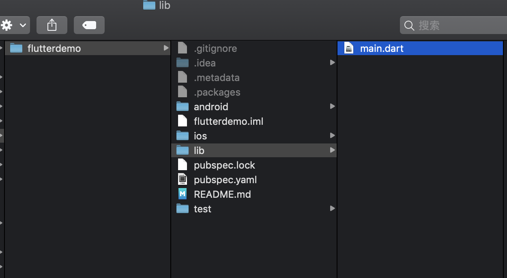
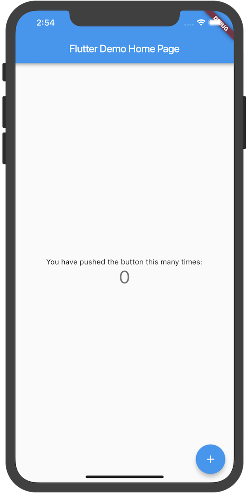
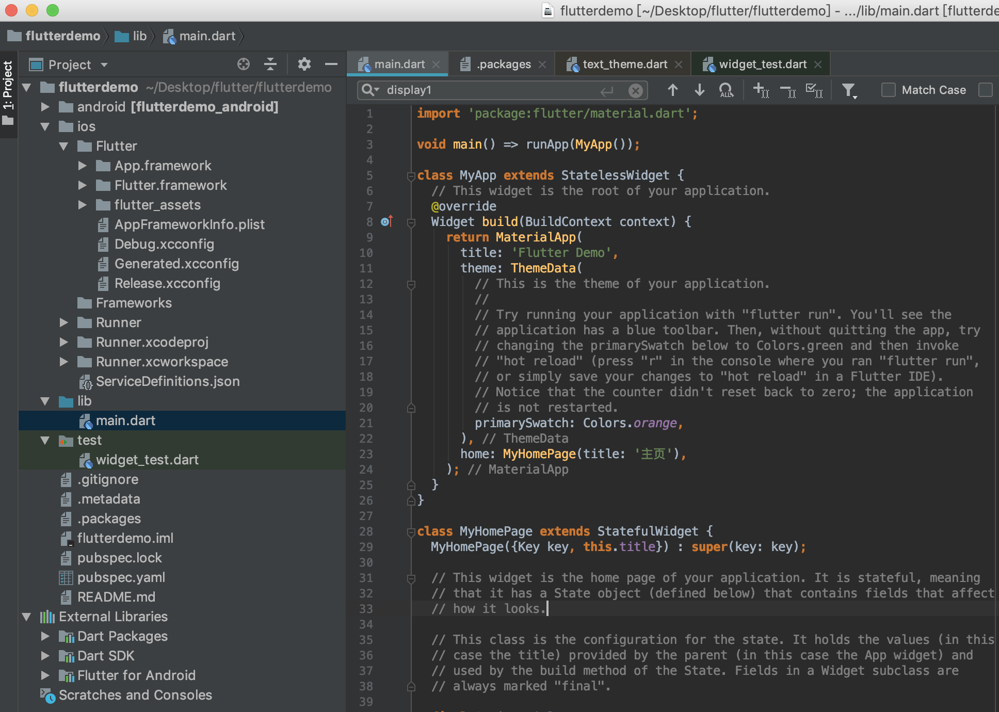
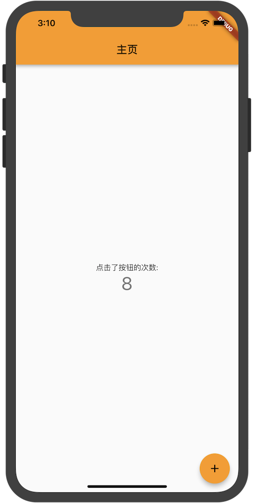

#  Flutter  -  上手体验


## 起步: 体验
本页介绍如何 “试驾” Flutter: 从我们的模板创建一个新的Flutter应用程序，运行它，并学习如何使用Hot Reload进行更新重载

Flutter是一个灵活的工具包，所以请首先选择您的开发工具来编写、构建和运行您的Flutter应用程序。

``` js
$ flutter create FlutterDemo
```
::: tip
这里会提示，要用小写字母
:::
``` js
"FlutterDemo" is not a valid Dart package name.


From the [Pubspec format description](https://www.dartlang.org/tools/pub/pubspec.html):

**DO** use `lowercase_with_underscores` for package names.

Package names should be all lowercase, with underscores to separate words,
`just_like_this`.  Use only basic Latin letters and Arabic digits: [a-z0-9_].
Also, make sure the name is a valid Dart identifier -- that it doesn't start
with digits and isn't a reserved word.
```
下面重新创建用小写字母

``` js
$ flutter create flutterdemo
```
执行完成之后,最后会看到如下输出
``` js
All done!
[✓] Flutter is fully installed. (Channel stable, v1.0.0, on Mac OS X 10.14 18A391, locale zh-Hans-CN)
[✗] Android toolchain - develop for Android devices is not installed.
[✓] iOS toolchain - develop for iOS devices is fully installed. (Xcode 10.1)
[!] Android Studio is not available. (not installed)
[✓] Connected device is fully installed. (2 available)

Run "flutter doctor" for information about installing additional components.

In order to run your application, type:

  $ cd flutterdemo
  $ flutter run

Your application code is in flutterdemo/lib/main.dart.
```
创建好之后，目录结构如下图：


上述命令创建一个Flutte让项目，项目名为flutterdemo，其中包含一个使用Material 组件的简单演示应用程序。

在项目目录中，您的应用程序的代码位于 lib/main.dart.

## 运行应用程序
``` js
$ cd flutterdemo
$ flutter run
```
``` js
More than one device connected; please specify a device with the '-d <deviceId>' flag, or use '-d all' to act on all
devices.

iPhone        • 9498e3ad2a6731582384923849asjldfjeee • ios • iOS 12.0
iPhone XS Max • D5824389-4720-4307-9C9B-AD26D2671318     • ios • iOS 12.1 (simulator)
```
去选中一个设备：
``` js
$ flutter run -d D5824389-4720-4307-9C9B-AD26D2671318
```
会显示如下显示：
``` js
Launching lib/main.dart on iPhone XS Max in debug mode...
Starting Xcode build...                                          
 ├─Assembling Flutter resources...                    1.1s
 
 └─Compiling, linking and signing...                  8.0s
 
Xcode build done.                                           11.0s
 9.4s
Syncing files to device iPhone XS Max...                     1.7s

🔥  To hot reload changes while running, press "r". To hot restart (and rebuild state), press "R".
An Observatory debugger and profiler on iPhone XS Max is available at: http://127.0.0.1:59959/
For a more detailed help message, press "h". To detach, press "d"; to quit, press "q".
```

模拟器就会启动，模拟器运行效果图：



## 修改

用WebStorm打开修改main.dart


修改文件如下：

``` dart
import 'package:flutter/material.dart';

void main() => runApp(MyApp());

class MyApp extends StatelessWidget {
  // This widget is the root of your application.
  @override
  Widget build(BuildContext context) {
    return MaterialApp(
      title: 'Flutter Demo',
      theme: ThemeData(
        // This is the theme of your application.
        //
        // Try running your application with "flutter run". You'll see the
        // application has a blue toolbar. Then, without quitting the app, try
        // changing the primarySwatch below to Colors.green and then invoke
        // "hot reload" (press "r" in the console where you ran "flutter run",
        // or simply save your changes to "hot reload" in a Flutter IDE).
        // Notice that the counter didn't reset back to zero; the application
        // is not restarted.
        primarySwatch: Colors.orange,
      ),
      home: MyHomePage(title: '主页'),
    );
  }
}

class MyHomePage extends StatefulWidget {
  MyHomePage({Key key, this.title}) : super(key: key);

  // This widget is the home page of your application. It is stateful, meaning
  // that it has a State object (defined below) that contains fields that affect
  // how it looks.

  // This class is the configuration for the state. It holds the values (in this
  // case the title) provided by the parent (in this case the App widget) and
  // used by the build method of the State. Fields in a Widget subclass are
  // always marked "final".

  final String title;

  @override
  _MyHomePageState createState() => _MyHomePageState();
}

class _MyHomePageState extends State<MyHomePage> {
  int _counter = 0;

  void _incrementCounter() {
    setState(() {
      // This call to setState tells the Flutter framework that something has
      // changed in this State, which causes it to rerun the build method below
      // so that the display can reflect the updated values. If we changed
      // _counter without calling setState(), then the build method would not be
      // called again, and so nothing would appear to happen.
      _counter++;
    });
  }

  @override
  Widget build(BuildContext context) {
    // This method is rerun every time setState is called, for instance as done
    // by the _incrementCounter method above.
    //
    // The Flutter framework has been optimized to make rerunning build methods
    // fast, so that you can just rebuild anything that needs updating rather
    // than having to individually change instances of widgets.
    return Scaffold(
      appBar: AppBar(
        // Here we take the value from the MyHomePage object that was created by
        // the App.build method, and use it to set our appbar title.
        title: Text(widget.title),
      ),
      body: Center(
        // Center is a layout widget. It takes a single child and positions it
        // in the middle of the parent.
        child: Column(
          // Column is also layout widget. It takes a list of children and
          // arranges them vertically. By default, it sizes itself to fit its
          // children horizontally, and tries to be as tall as its parent.
          //
          // Invoke "debug painting" (press "p" in the console, choose the
          // "Toggle Debug Paint" action from the Flutter Inspector in Android
          // Studio, or the "Toggle Debug Paint" command in Visual Studio Code)
          // to see the wireframe for each widget.
          //
          // Column has various properties to control how it sizes itself and
          // how it positions its children. Here we use mainAxisAlignment to
          // center the children vertically; the main axis here is the vertical
          // axis because Columns are vertical (the cross axis would be
          // horizontal).
          mainAxisAlignment: MainAxisAlignment.center,
          children: <Widget>[
            Text(
              '点击了按钮的次数:',
            ),
            Text(
              '$_counter',
              style: Theme.of(context).textTheme.display1,
            ),
          ],
        ),
      ),
      floatingActionButton: FloatingActionButton(
        onPressed: _incrementCounter,
        tooltip: 'Increment',
        child: Icon(Icons.add),
      ), // This trailing comma makes auto-formatting nicer for build methods.
    );
  }
}

```

运行项目后看到更新：


