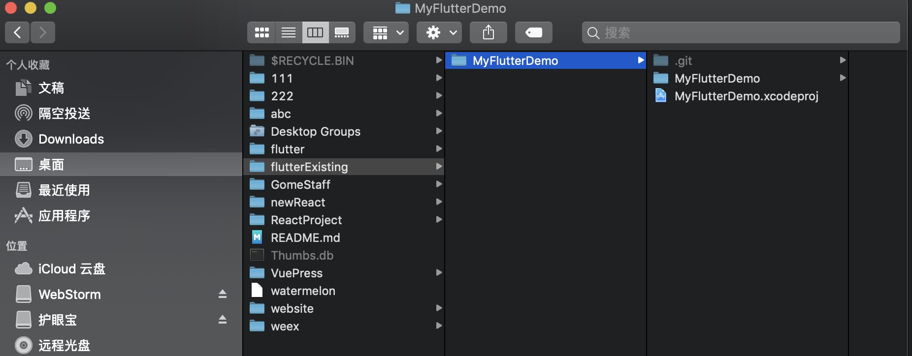
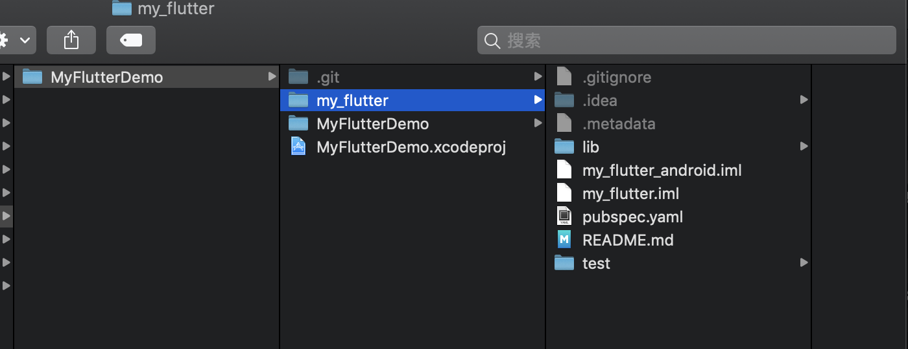
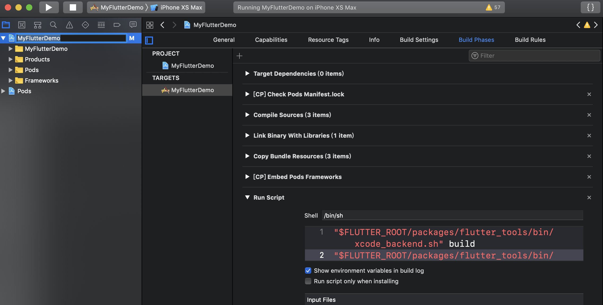
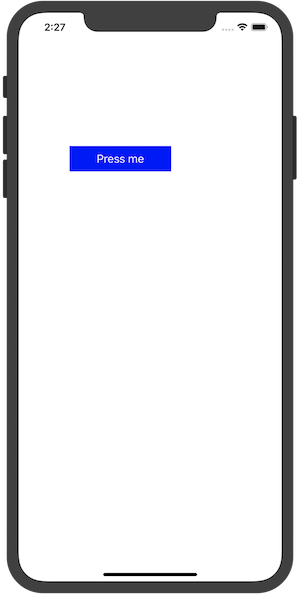
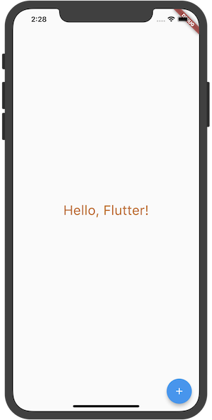

#  Flutter  - 集成到已有的项目中


## 创建一个 Flutter module
让我们假设你有一个已经存在的iOS项目在 如下如位置：


并且你想要你的Flutter项目跟iOS项目在同一级目录，执行如下命令：

``` js
$ cd /Users/xxx/Desktop/flutterExisting/MyFlutterDemo 

$ flutter create -t module my_flutter
```
这里会创建一个 Flutter module 项目，包含一下Dart代码在隐藏的文件夹.ios/ 里面。
执行完命令后会创建如下目录结构：



## 让主项目依赖Flutter

添加以下代码到你的 Podfile文件中:

``` js
source 'git@github.com/CocoaPods/Specs.git'
platform :ios, '8.0'

#inhibit_all_warnings!

 flutter_application_path = 'my_flutter/'
 eval(File.read(File.join(flutter_application_path, '.ios', 'Flutter', 'podhelper.rb')), binding)

def common

    pod 'SDWebImage', '3.7.5'
end

target 'MyFlutterDemo' do
    common
end


```

执行：
``` js
$ pod install
```
如果你要在/my_flutter/pubspec.yaml 修改Flutter插件的依赖，你需要在/my_flutter下执行‘flutter packages get’，通过 podhelp.rb 脚本来刷新插件列表。然后再次运行‘pod install’ 在iOS的Podfile目录下。
这个 podhelper.rb 脚本会确保你的插件和Flutter.framework添加到你的项目中。


## 添加 build phase 用来构建Dart代码
在MyFlutterDemo->TARGETS->Build Phases
点击加号，选择 New Run Script Phase，复制下面内容

``` js
"$FLUTTER_ROOT/packages/flutter_tools/bin/xcode_backend.sh" build
"$FLUTTER_ROOT/packages/flutter_tools/bin/xcode_backend.sh" embed

```



然后commadn+B编译项目。


## 编写代码

首先 AppDelegate 继承于FlutterAppDelegate

在 ‘AppDelegate.h’

``` swift
#import <UIKit/UIKit.h>
#import <Flutter/Flutter.h>

@interface AppDelegate : FlutterAppDelegate

@end
```
在 ‘AppDelegate.m’

``` swift
#import <FlutterPluginRegistrant/GeneratedPluginRegistrant.h> // Only if you have Flutter Plugins

#include "AppDelegate.h"

@implementation AppDelegate

// This override can be omitted if you do not have any Flutter Plugins.
- (BOOL)application:(UIApplication *)application
    didFinishLaunchingWithOptions:(NSDictionary *)launchOptions {
  [GeneratedPluginRegistrant registerWithRegistry:self];
  return [super application:application didFinishLaunchingWithOptions:launchOptions];
}

@end
```

在 ViewController.m 

``` swift
#import "ViewController.h"
#import <Flutter/Flutter.h>

@interface ViewController ()

@end

@implementation ViewController

- (void)viewDidLoad {
    [super viewDidLoad];
    UIButton *button = [UIButton buttonWithType:UIButtonTypeCustom];
    [button addTarget:self
               action:@selector(handleButtonAction)
     forControlEvents:UIControlEventTouchUpInside];
    [button setTitle:@"Press me" forState:UIControlStateNormal];
    [button setBackgroundColor:[UIColor blueColor]];
    button.frame = CGRectMake(80.0, 210.0, 160.0, 40.0);
    [self.view addSubview:button];
}

- (void)handleButtonAction {
    FlutterViewController* flutterViewController = [[FlutterViewController alloc] init];
    [self presentViewController:flutterViewController animated:false completion:nil];
}

@end


```

点击按钮就可以进入flutter 页面

修改main.dart文件

``` js
import 'package:flutter/material.dart';
import 'package:flutter/services.dart';


void main () => runApp(MyApp());

class MyApp extends StatelessWidget{


  @override

  Widget build(BuildContext context){


    return MaterialApp(

      title: "Text widget",
      home: Scaffold(

        body: new Center(

          child:  Text(

              "Hello, Flutter!",
            style: TextStyle(
              fontSize: 30.0,
              color: Color.fromARGB(255, 200, 100, 30),

            ),


          ),


        ),

        floatingActionButton: FloatingActionButton(
          child: Icon(Icons.add),
          onPressed: () {

            // 点击pop出当前页面
            SystemNavigator.pop();
          },
        ),


      ),


    );
  }


}
```

热更新 debugging Dart code

``` js
$ cd /my_flutter
$ flutter attach

```

运行效果：



点击蓝色按钮就会返回出示页面：




