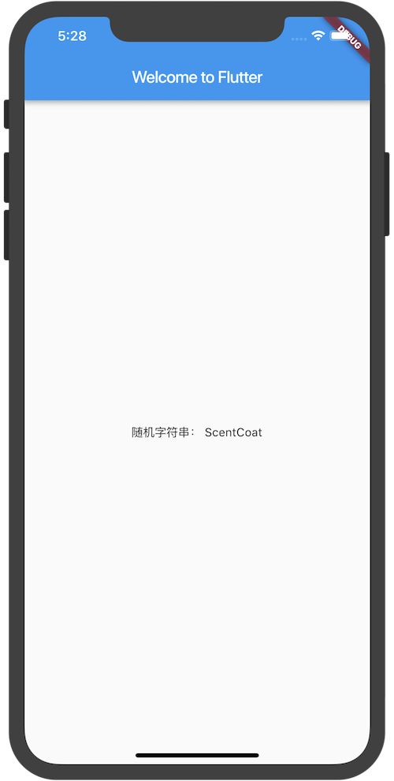
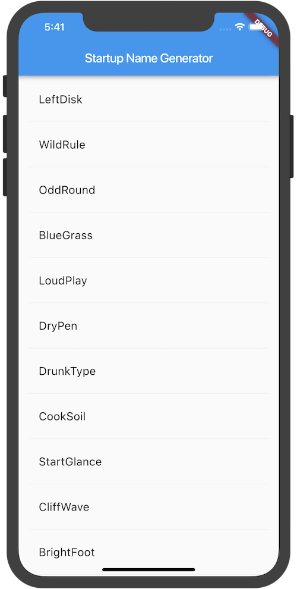
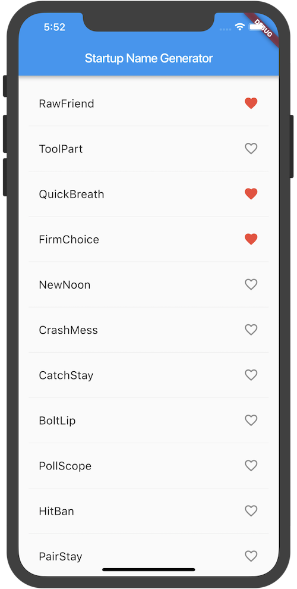
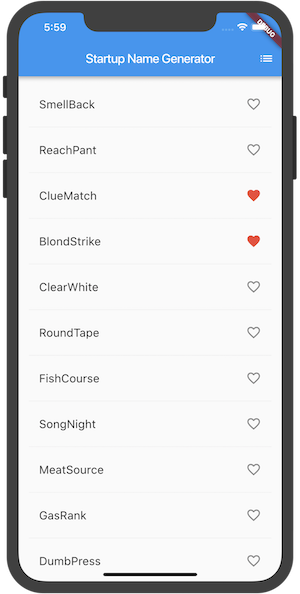
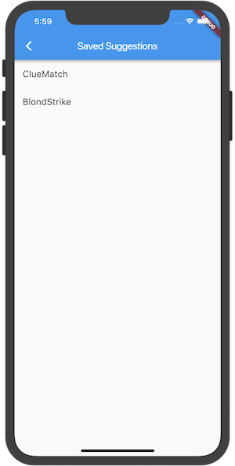
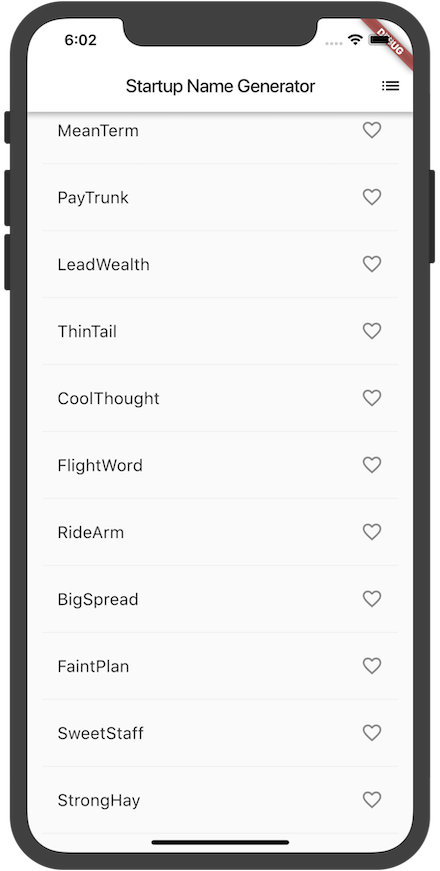

#  Flutter  - 编写第一个APP


## 第1步: 创建 Flutter app

创建一个简单的、基于模板的Flutter应用程序，按照创建您的第一个Flutter应用中的指南的步骤， 接下来你将会修改这个应用来完成最终的APP。

在这个示例中，你将主要编辑Dart代码所在的 lib/main.dart 文件,

替换 lib/main.dart.
删除lib / main.dart中的所有代码，然后替换为下面的代码，它将在屏幕的中心显示“Hello World”.

``` dart
import 'package:flutter/material.dart';

void main() => runApp(new MyApp());

class MyApp extends StatelessWidget {
  @override
  Widget build(BuildContext context) {
    return new MaterialApp(
      title: 'Welcome to Flutter',
      home: new Scaffold(
        appBar: new AppBar(
          title: new Text('Welcome to Flutter'),
        ),
        body: new Center(
          child: new Text('Hello World'),
        ),
      ),
    );
  }
}

```

**分析**

- 本示例创建一个Material APP。Material是一种标准的移动端和web端的视觉设计语言。 Flutter提供了一套丰富的Material widgets。

- main函数使用了(=>)符号, 这是Dart中单行函数或方法的简写。

- 该应用程序继承了 StatelessWidget，这将会使应用本身也成为一个widget。 在Flutter中，大多数东西都是widget，包括对齐(alignment)、填充(padding)和布局(layout)

- Scaffold 是 Material library 中提供的一个widget, 它提供了默认的导航栏、标题和包含主屏幕widget树的body属性。widget树可以很复杂。

- widget的主要工作是提供一个build()方法来描述如何根据其他较低级别的widget来显示自己。

- 本示例中的body的widget树中包含了一个Center widget, Center widget又包含一个 Text 子widget。 Center widget可以将其子widget树对其到屏幕中心。

## 第2步: 使用外部包(package)

1.pubspec文件管理Flutter应用程序的assets(资源，如图片、package等)。 在pubspec.yaml中，将english_words（3.1.0或更高版本）添加到依赖项列表，如下面高亮显示的行：

``` js
dependencies:
  flutter:
    sdk: flutter

  cupertino_icons: ^0.1.0
  english_words: ^3.1.0
  
 ```
 
2.在 lib/main.dart 中, 引入 english_words, 如高亮显示的行所示:
``` dart
import 'package:flutter/material.dart';
import 'package:english_words/english_words.dart';

void main() => runApp(new MyApp());

class MyApp extends StatelessWidget {
  @override
  Widget build(BuildContext context) {
  // 随机字符串
    final wordPair = new WordPair.random();
    return new MaterialApp(
      title: 'Welcome to Flutter',
      home: new Scaffold(
        appBar: new AppBar(
          title: new Text('Welcome to Flutter'),
        ),
        body: new Center(
          //child: new Text('Hello World'),
          // 驼峰字符串
          child: new Text(wordPair.asPascalCase),
        ),
      ),
    );
  }
}
```
::: tip
“驼峰命名法” (称为 “upper camel case” 或 “Pascal case” ), 表示字符串中的每个单词（包括第一个单词）都以大写字母开头。所以，“uppercamelcase” 变成 “UpperCamelCase”
:::

## 第3步: 添加一个 有状态的部件（Stateful widget）

Stateless widgets 是不可变的, 这意味着它们的属性不能改变 - 所有的值都是最终的.

Stateful widgets 持有的状态可能在widget生命周期中发生变化. 实现一个 stateful widget 至少需要两个类:

- 一个 StatefulWidget类。

- 一个 State类。 StatefulWidget类本身是不变的，但是 State类在widget生命周期中始终存在.
在这一步中，您将添加一个有状态的widget-RandomWords，它创建其State类RandomWordsState。State类将最终为widget维护建议的和喜欢的单词对。

1. 添加有状态的 RandomWords widget 到 main.dart。 它也可以在MyApp之外的文件的任何位置使用，但是本示例将它放到了文件的底部。RandomWords widget除了创建State类之外几乎没有其他任何东西
2. 添加 RandomWordsState 类.该应用程序的大部分代码都在该类中， 该类持有RandomWords widget的状态。这个类将保存随着用户滚动而无限增长的生成的单词对， 以及喜欢的单词对，用户通过重复点击心形 ❤️ 图标来将它们从列表中添加或删除。
3. 将build方法添加到RandomWordState中

整体代码如下：

``` dart
import 'package:flutter/material.dart';
import 'package:english_words/english_words.dart';

void main() => runApp(new MyApp());

class MyApp extends StatelessWidget {
  @override
  Widget build(BuildContext context) {
//    final wordPair = new WordPair.random();
    return new MaterialApp(
      title: 'Welcome to Flutter',
      home: new Scaffold(
        appBar: new AppBar(
          title: new Text('Welcome to Flutter'),
        ),
        body: new Center(
//          child: new Text('Hello World'),
//          child: new Text(wordPair.asPascalCase),

        child: new RandomWords(),

        ),
      ),
    );
  }
}

class RandomWords extends StatefulWidget{

  @override
  createState() => new RandomWordsState();
}

class RandomWordsState extends State<RandomWords> {
  @override
  Widget build(BuildContext context) {
    final wordPair = new WordPair.random();
    return new Text("随机字符串： "+wordPair.asPascalCase);
  }
}
```
运行效果：




## 第4步: 创建一个无限滚动ListView

在这一步中，您将扩展（继承）RandomWordsState类，以生成并显示单词对列表。 当用户滚动时，ListView中显示的列表将无限增长。 ListView的builder工厂构造函数允许您按需建立一个懒加载的列表视图。

1. 向RandomWordsState类中添加一个_suggestions列表以保存建议的单词对。 该变量以下划线（_）开头，在Dart语言中使用下划线前缀标识符，会强制其变成私有的。

另外，添加一个biggerFont变量来增大字体大小

2. 向RandomWordsState类添加一个 _buildSuggestions() 函数. 此方法构建显示建议单词对的ListView。

ListView类提供了一个builder属性，itemBuilder 值是一个匿名回调函数， 接受两个参数- BuildContext和行迭代器i。迭代器从0开始， 每调用一次该函数，i就会自增1，对于每个建议的单词对都会执行一次。该模型允许建议的单词对列表在用户滚动时无限增长。


3. 对于每一个单词对，_buildSuggestions函数都会调用一次_buildRow。 这个函数在ListTile中显示每个新词对，这使您在下一步中可以生成更漂亮的显示行

在RandomWordsState中添加一个_buildRow函数 :

4. 更新RandomWordsState的build方法以使用_buildSuggestions()，而不是直接调用单词生成库。 更改后如下面高亮部分：

**整体代码：**
``` dart

import 'package:flutter/material.dart';
import 'package:english_words/english_words.dart';

void main() => runApp(new MyApp());

class MyApp extends StatelessWidget {
  @override
  Widget build(BuildContext context) {
//    final wordPair = new WordPair.random();
    return new MaterialApp(
      title: 'Welcome to Flutter',
      home: new RandomWords(),
    );
  }
}


class RandomWords extends StatefulWidget{

  @override
  createState() => new RandomWordsState();
}

class RandomWordsState extends State<RandomWords> {
  final _suggestions = <WordPair>[];

  final _biggerFont = const TextStyle(fontSize: 18.0);

  @override
  Widget build(BuildContext context) {
//    final wordPair = new WordPair.random();
//    return new Text("随机字符串： "+wordPair.asPascalCase);

    return new Scaffold (
      appBar: new AppBar(
        title: new Text('Startup Name Generator'),
      ),
      body: _buildSuggestions(),
    );
  }

  Widget _buildSuggestions() {
    return new ListView.builder(
        padding: const EdgeInsets.all(16.0),
        // 对于每个建议的单词对都会调用一次itemBuilder，然后将单词对添加到ListTile行中
        // 在偶数行，该函数会为单词对添加一个ListTile row.
        // 在奇数行，该行书湖添加一个分割线widget，来分隔相邻的词对。
        // 注意，在小屏幕上，分割线看起来可能比较吃力。
        itemBuilder: (context, i) {
          // 在每一列之前，添加一个1像素高的分隔线widget
          if (i.isOdd) return new Divider();

          // 语法 "i ~/ 2" 表示i除以2，但返回值是整形（向下取整），比如i为：1, 2, 3, 4, 5
          // 时，结果为0, 1, 1, 2, 2， 这可以计算出ListView中减去分隔线后的实际单词对数量
          final index = i ~/ 2;
          // 如果是建议列表中最后一个单词对
          if (index >= _suggestions.length) {
            // ...接着再生成10个单词对，然后添加到建议列表
            _suggestions.addAll(generateWordPairs().take(10));
          }
          return _buildRow(_suggestions[index]);
        }
    );
  }

  Widget _buildRow(WordPair pair) {
    return new ListTile(
      title: new Text(
        pair.asPascalCase,
        style: _biggerFont,
      ),
    );
  }
}

```


运行效果：




## 第5步: 添加交互

在这一步中，您将为每一行添加一个可点击的心形 ❤️ 图标。当用户点击列表中的条目，切换其“收藏”状态时，将该词对添加到或移除出“收藏夹”。

1. 添加一个 _saved Set(集合) 到RandomWordsState。这个集合存储用户喜欢（收藏）的单词对。 在这里，Set比List更合适，因为Set中不允许重复的值。

2. 在 _buildRow 方法中添加 alreadySaved来检查确保单词对还没有添加到收藏夹中。

3. 同时在 _buildRow()中， 添加一个心形 ❤️ 图标到 ListTiles以启用收藏功能。接下来，你就可以给心形 ❤️ 图标添加交互能力了。

4. 重新启动应用。你现在可以在每一行看到心形❤️图标️，但它们还没有交互。

5. 在 _buildRow中让心形❤️图标变得可以点击。如果单词条目已经添加到收藏夹中， 再次点击它将其从收藏夹中删除。当心形❤️图标被点击时，函数调用setState()通知框架状态已经改变。


整体代码：
``` dart
import 'package:flutter/material.dart';
import 'package:english_words/english_words.dart';

void main() => runApp(new MyApp());

class MyApp extends StatelessWidget {
  @override
  Widget build(BuildContext context) {
//    final wordPair = new WordPair.random();
    return new MaterialApp(
      title: 'Welcome to Flutter',
      home: new RandomWords(),
    );
  }
}


class RandomWords extends StatefulWidget{

  @override
  createState() => new RandomWordsState();
}

class RandomWordsState extends State<RandomWords> {
  final _suggestions = <WordPair>[];
  final _saved = new Set<WordPair>();
  final _biggerFont = const TextStyle(fontSize: 18.0);

  @override
  Widget build(BuildContext context) {
//    final wordPair = new WordPair.random();
//    return new Text("随机字符串： "+wordPair.asPascalCase);

    return new Scaffold (
      appBar: new AppBar(
        title: new Text('Startup Name Generator'),
      ),
      body: _buildSuggestions(),
    );
  }

  Widget _buildSuggestions() {
    return new ListView.builder(
        padding: const EdgeInsets.all(16.0),
        // 对于每个建议的单词对都会调用一次itemBuilder，然后将单词对添加到ListTile行中
        // 在偶数行，该函数会为单词对添加一个ListTile row.
        // 在奇数行，该行书湖添加一个分割线widget，来分隔相邻的词对。
        // 注意，在小屏幕上，分割线看起来可能比较吃力。
        itemBuilder: (context, i) {
          // 在每一列之前，添加一个1像素高的分隔线widget
          if (i.isOdd) return new Divider();

          // 语法 "i ~/ 2" 表示i除以2，但返回值是整形（向下取整），比如i为：1, 2, 3, 4, 5
          // 时，结果为0, 1, 1, 2, 2， 这可以计算出ListView中减去分隔线后的实际单词对数量
          final index = i ~/ 2;
          // 如果是建议列表中最后一个单词对
          if (index >= _suggestions.length) {
            // ...接着再生成10个单词对，然后添加到建议列表
            _suggestions.addAll(generateWordPairs().take(10));
          }
          return _buildRow(_suggestions[index]);
        }
    );
  }

  Widget _buildRow(WordPair pair) {
    final alreadySaved = _saved.contains(pair);
    return new ListTile(
      title: new Text(
        pair.asPascalCase,
        style: _biggerFont,
      ),
      trailing: new Icon(
        alreadySaved ? Icons.favorite : Icons.favorite_border,
        color: alreadySaved ? Colors.red : null,
      ),
      onTap: () {
        setState(() {
          if (alreadySaved) {
            _saved.remove(pair);
          } else {
            _saved.add(pair);
          }
        });
      },
    );
  }
}


```

运行效果：




## 第6步: 导航到新页面

在这一步中，您将添加一个显示收藏夹内容的新页面（在Flutter中称为路由(route)）。您将学习如何在主路由和新路由之间导航（切换页面）。

在Flutter中，导航器管理应用程序的路由栈。将路由推入（push）到导航器的栈中，将会显示更新为该路由页面。 从导航器的栈中弹出（pop）路由，将显示返回到前一个路由。

1. 在RandomWordsState的build方法中为AppBar添加一个列表图标。当用户点击列表图标时，包含收藏夹的新路由页面入栈显示。

将该图标及其相应的操作添加到build方法中：

2. 向RandomWordsState类添加一个 _pushSaved() 方法.

3. 当用户点击导航栏中的列表图标时，建立一个路由并将其推入到导航管理器栈中。此操作会切换页面以显示新路由。

新页面的内容在在MaterialPageRoute的builder属性中构建，builder是一个匿名函数。

添加Navigator.push调用，这会使路由入栈（以后路由入栈均指推入到导航管理器的栈）

4. 添加MaterialPageRoute及其builder。 现在，添加生成ListTile行的代码。ListTile的divideTiles()方法在每个ListTile之间添加1像素的分割线。 该 divided 变量持有最终的列表项。

5. builder返回一个Scaffold，其中包含名为“Saved Suggestions”的新路由的应用栏。 新路由的body由包含ListTiles行的ListView组成; 每行之间通过一个分隔线分隔。

6. 热重载应用程序。收藏一些选项，并点击应用栏中的列表图标，在新路由页面中显示收藏的内容。 请注意，导航器会在应用栏中添加一个“返回”按钮。你不必显式实现Navigator.pop。点击后退按钮返回到主页路由。

整体代码：

``` dart
import 'package:flutter/material.dart';
import 'package:english_words/english_words.dart';

void main() => runApp(new MyApp());

class MyApp extends StatelessWidget {
  @override
  Widget build(BuildContext context) {
//    final wordPair = new WordPair.random();
    return new MaterialApp(
      title: 'Welcome to Flutter',
      home: new RandomWords(),
    );
  }
}


class RandomWords extends StatefulWidget{

  @override
  createState() => new RandomWordsState();
}

class RandomWordsState extends State<RandomWords> {
  final _suggestions = <WordPair>[];
  final _saved = new Set<WordPair>();
  final _biggerFont = const TextStyle(fontSize: 18.0);

  @override
  Widget build(BuildContext context) {
//    final wordPair = new WordPair.random();
//    return new Text("随机字符串： "+wordPair.asPascalCase);

    return new Scaffold (
      appBar: new AppBar(
        title: new Text('Startup Name Generator'),
        actions: <Widget>[
          new IconButton(icon: new Icon(Icons.list), onPressed: _pushSaved),
        ],
      ),
      body: _buildSuggestions(),
    );
  }

  Widget _buildSuggestions() {
    return new ListView.builder(
        padding: const EdgeInsets.all(16.0),
        // 对于每个建议的单词对都会调用一次itemBuilder，然后将单词对添加到ListTile行中
        // 在偶数行，该函数会为单词对添加一个ListTile row.
        // 在奇数行，该行书湖添加一个分割线widget，来分隔相邻的词对。
        // 注意，在小屏幕上，分割线看起来可能比较吃力。
        itemBuilder: (context, i) {
          // 在每一列之前，添加一个1像素高的分隔线widget
          if (i.isOdd) return new Divider();

          // 语法 "i ~/ 2" 表示i除以2，但返回值是整形（向下取整），比如i为：1, 2, 3, 4, 5
          // 时，结果为0, 1, 1, 2, 2， 这可以计算出ListView中减去分隔线后的实际单词对数量
          final index = i ~/ 2;
          // 如果是建议列表中最后一个单词对
          if (index >= _suggestions.length) {
            // ...接着再生成10个单词对，然后添加到建议列表
            _suggestions.addAll(generateWordPairs().take(10));
          }
          return _buildRow(_suggestions[index]);
        }
    );
  }

  Widget _buildRow(WordPair pair) {
    final alreadySaved = _saved.contains(pair);
    return new ListTile(
      title: new Text(
        pair.asPascalCase,
        style: _biggerFont,
      ),
      trailing: new Icon(
        alreadySaved ? Icons.favorite : Icons.favorite_border,
        color: alreadySaved ? Colors.red : null,
      ),
      onTap: () {
        setState(() {
          if (alreadySaved) {
            _saved.remove(pair);
          } else {
            _saved.add(pair);
          }
        });
      },
    );
  }

  void _pushSaved() {
    Navigator.of(context).push(
      new MaterialPageRoute(
        builder: (context) {
          final tiles = _saved.map(
                (pair) {
              return new ListTile(
                title: new Text(
                  pair.asPascalCase,
                  style: _biggerFont,
                ),
              );
            },
          );
          final divided = ListTile
              .divideTiles(
            context: context,
            tiles: tiles,
          )
              .toList();
          
          return new Scaffold(
            appBar: new AppBar(
              title: new Text('Saved Suggestions'),
            ),
            body: new ListView(children: divided),
          );
        },
      ),
    );
  }
}

```

运行效果：





## 第7步：使用主题更改UI

在这最后一步中，您将会使用主题。主题控制您应用程序的外观和风格。您可以使用默认主题，该主题取决于物理设备或模拟器，也可以自定义主题以适应您的品牌。

1. 您可以通过配置ThemeData类轻松更改应用程序的主题。 您的应用程序目前使用默认主题，下面将更改primary color颜色为白色。

通过如下高亮部分代码，将应用程序的主题更改为白色：
``` dart
class MyApp extends StatelessWidget {
  @override
  Widget build(BuildContext context) {
    return new MaterialApp(
      title: 'Startup Name Generator',
      theme: new ThemeData(
        primaryColor: Colors.white,
      ),
      home: new RandomWords(),
    );
  }
}
```


2. 热重载应用。 请注意，整个背景将会变为白色，包括应用栏。

3. 作为读者的一个练习，使用 ThemeData 来改变UI的其他方面。 Material library中的 Colors类提供了许多可以使用的颜色常量， 你可以使用热重载来快速简单地尝试、实验。

