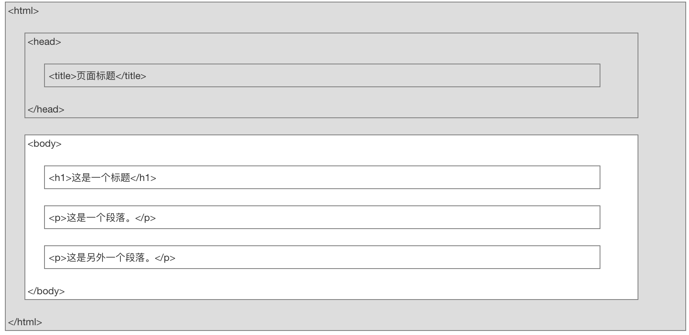
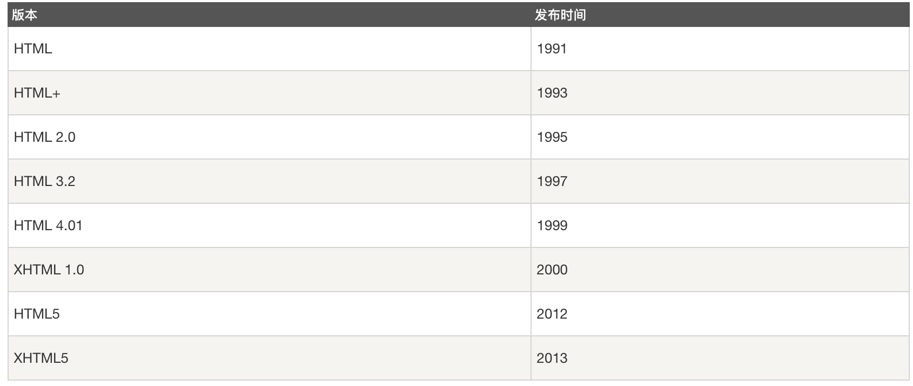

# HTML - 简介

## HTML 教程- (HTML5 标准)

超文本标记语言（英语：HyperText Markup Language，简称：HTML）是一种用于创建网页的标准标记语言。
您可以使用 HTML 来建立自己的 WEB 站点，HTML 运行在浏览器上，由浏览器来解析。
在本教程中，您将学习如何使用 HTML 来创建站点。
HTML 很容易学习！相信您能很快学会它！

## HTML 实例
本教程包含了数百个 HTML 实例。
使用本站的编辑器，您可以轻松实现在线修改 HTML，并查看实例运行结果。

::: tip
注意：对于中文网页需要使用 \<meta charset="utf-8"\> 声明编码，否则会出现乱码。有些浏览器(如 360 浏览器)会设置 GBK 为默认编码，则你需要设置为 \<meta charset="gbk"\>。
:::


``` html
<!DOCTYPE html>
<html>
<head>
<meta charset="utf-8">
<title></title>
</head>
<body>
    <h1>我的第一个标题</h1>
    <p>我的第一个段落。</p>
</body>
</html>
``` 

## HTML 简介

**实例解析**

::: tip
- \<!DOCTYPE html\> 声明为 HTML5 文档
- \<html\> 元素是 HTML 页面的根元素
- \<head\> 元素包含了文档的元（meta）数据，如 <meta charset="utf-8"> 定义网页编码格式为 utf-8。
- \<title\> 元素描述了文档的标题
- \<body\> 元素包含了可见的页面内容
- \<h1\> 元素定义一个大标题
- \<p\> 元素定义一个段落
:::

## 什么是HTML?
- HTML 是用来描述网页的一种语言。
- HTML 指的是超文本标记语言: HyperText Markup Language
- HTML 不是一种编程语言，而是一种标记语言
标记语言是一套标记标签 (markup tag)
- HTML 使用标记标签来描述网页
- HTML 文档包含了HTML 标签及文本内容
- HTML文档也叫做 web 页面

## HTML 标签
- HTML 标记标签通常被称为 HTML 标签 (HTML tag)。
- HTML 标签是由尖括号包围的关键词，比如 \<html\>
- HTML 标签通常是成对出现的，比如 \<b\> 和 \</b\>
- 标签对中的第一个标签是开始标签，第二个标签是结束标签
- 开始和结束标签也被称为开放标签和闭合标签

::: tip
- \<标签\>内容\</标签\>
:::

## HTML 元素
"HTML 标签" 和 "HTML 元素" 通常都是描述同样的意思.
但是严格来讲, 一个 HTML 元素包含了开始标签与结束标签，如下实例:
HTML 元素:
::: tip
\<p\>这是一个段落。\</p\>
:::


## HTML 网页结构
下面是一个可视化的HTML页面结构：

::: tip
只有 \<body\> 区域 (白色部分) 才会在浏览器中显示。
:::

## HTML版本
从初期的网络诞生后，已经出现了许多HTML版本:




## DOCTYPE 声明
\<!DOCTYPE\>声明有助于浏览器中正确显示网页。
网络上有很多不同的文件，如果能够正确声明HTML的版本，浏览器就能正确显示网页内容。
doctype 声明是不区分大小写的，以下方式均可：

``` html
<!DOCTYPE html> 

<!DOCTYPE HTML> 

<!doctype html> 

<!Doctype Html>
```

## 通用声明
HTML5
``` html
<!DOCTYPE html>
```
HTML 4.01
``` html
<!DOCTYPE HTML PUBLIC "-//W3C//DTD HTML 4.01 Transitional//EN"
"http://www.w3.org/TR/html4/loose.dtd">
```
XHTML 1.0
``` html
<!DOCTYPE html PUBLIC "-//W3C//DTD XHTML 1.0 Transitional//EN"
"http://www.w3.org/TR/xhtml1/DTD/xhtml1-transitional.dtd">
```
查看完整网页声明类型 [DOCTYPE 参考手册](http://www.runoob.com/tags/tag-doctype.html)。

## 中文编码
目前在大部分浏览器中，直接输出中文会出现中文乱码的情况，这时候我们就需要在头部将字符声明为 UTF-8。
HTML 实例
``` html
<!DOCTYPE html>
<html>
<head>
<meta charset="UTF-8">
<title>页面标题</title>
</head>
<body>

<h1>我的第一个标题</h1>
 
<p>我的第一个段落。</p>
 
</body>
</html>
 ```