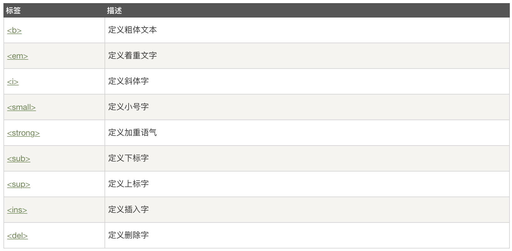
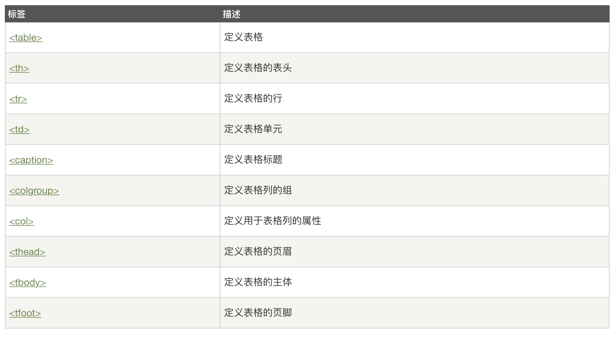
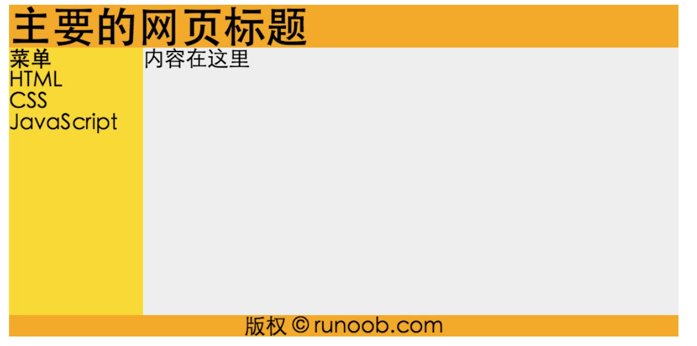
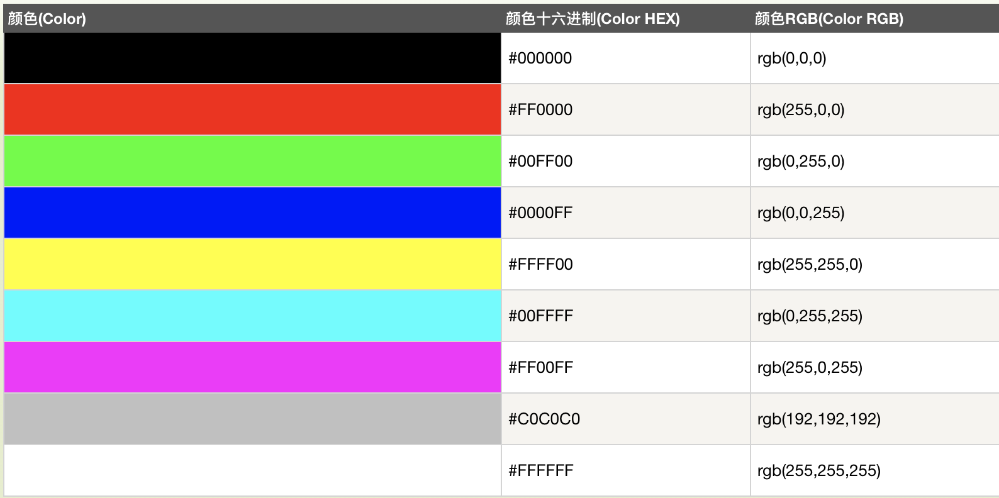
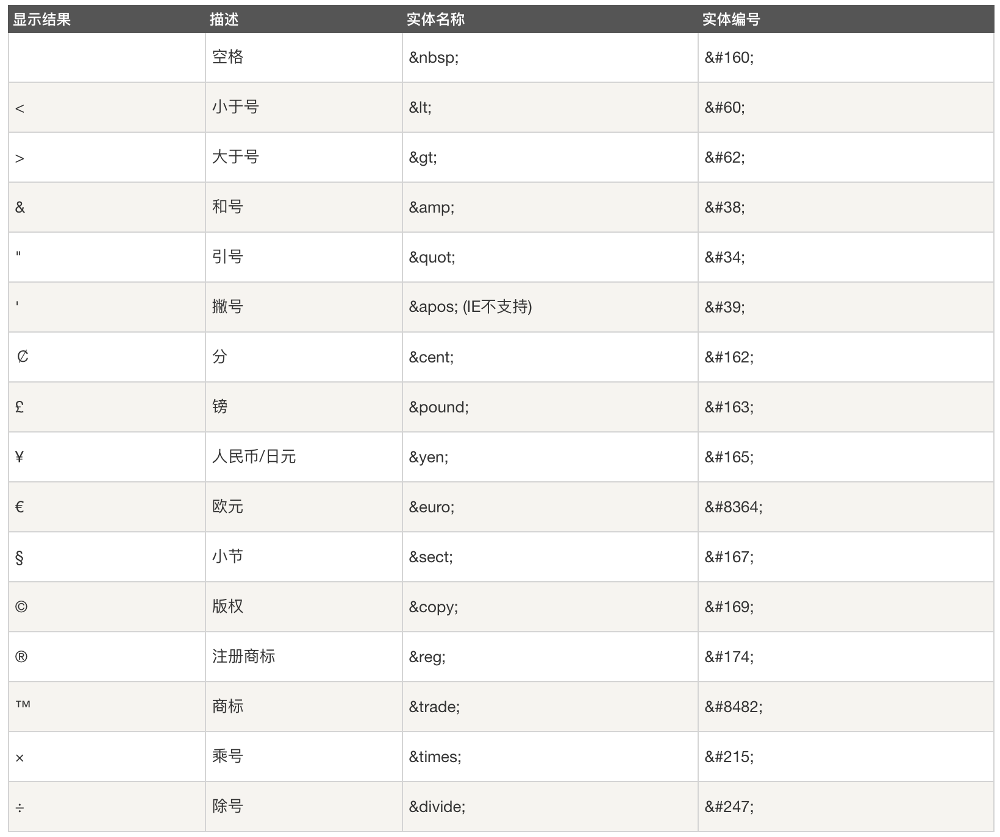

# HTML -  基础

## HTML 标题
标题（Heading）是通过 \<h1\> - \<h6\> 标签进行定义的.
\<h1\> 定义最大的标题。 \<h6\> 定义最小的标题。

``` html
<h1>这是一个标题。</h1>
<h2>这是一个标题。</h2>
<h3>这是一个标题。</h3>
```

## HTML 水平线
\<hr\> 标签在 HTML 页面中创建水平线。

hr 元素可用于分隔内容。
``` html
<p>这是一个段落。</p>
<hr>
<p>这是一个段落。</p>
<hr>
<p>这是一个段落。</p>
```

## HTML 注释
可以将注释插入 HTML 代码中，这样可以提高其可读性，使代码更易被人理解。浏览器会忽略注释，也不会显示它们。
注释写法如下:
``` html
<!-- 这是一个注释 -->
```

## HTML 折行
如果您希望在不产生一个新段落的情况下进行换行（新行），请使用 \<br\> 标签：
``` html
<p>这个<br>段落<br>演示了分行的效果</p>
```

## HTML 文本格式化标签



## HTML 链接 - target 属性
使用 target 属性，你可以定义被链接的文档在何处显示。
下面的这行会在新窗口打开文档：
``` html
<a href="http://www.runoob.com/" target="_blank">访问菜鸟教程!</a>
```

## HTML 链接- id 属性
id属性可用于创建在一个HTML文档书签标记。
::: tip
提示: 书签是不以任何特殊的方式显示，在HTML文档中是不显示的，所以对于读者来说是隐藏的。
:::

在HTML文档中插入ID:
``` html
<a id="tips">有用的提示部分</a>
```
在HTML文档中创建一个链接到"有用的提示部分(id="tips"）"：
``` html
<a href="#tips">访问有用的提示部分</a>
```
或者，从另一个页面创建一个链接到"有用的提示部分(id="tips"）"：
``` html
<a href="http://www.runoob.com/html/html-links.html#tips">
访问有用的提示部分</a>
```

## HTML head 元素
\<head\> 元素包含了所有的头部标签元素。在 \<head\>元素中你可以插入脚本（scripts）, 样式文件（CSS），及各种meta信息。
可以添加在头部区域的元素标签为: \<title\>, \<style\>, \<meta\>, \<link\>, \<script\>, \<noscript\>, and \<base\>.


``` html
<!DOCTYPE html>
<html>
<head> 
<meta charset="utf-8"> 
<title>文档标题</title>
<!--<base> 标签描述了基本的链接地址/链接目标，该标签作为HTML文档中所有的链接标签的默认链接: -->
<base href="http://www.runoob.com/images/" target="_blank">


<!-- <link> 标签定义了文档与外部资源之间的关系。
<link> 标签通常用于链接到样式表:-->
<link rel="stylesheet" type="text/css" href="mystyle.css">

<!-- <style> 标签定义了HTML文档的样式文件引用地址.
在<style> 元素中你也可以直接添加样式来渲染 HTML 文档:-->
<style type="text/css">
body {background-color:yellow}
p {color:blue}
</style>

<!--meta标签描述了一些基本的元数据。
<meta> 标签提供了元数据.元数据也不显示在页面上，但会被浏览器解析。
META 元素通常用于指定网页的描述，关键词，文件的最后修改时间，作者，和其他元数据。
元数据可以使用于浏览器（如何显示内容或重新加载页面），搜索引擎（关键词），或其他Web服务。
<meta> 一般放置于 <head> 区域 -->
<!--为搜索引擎定义关键词:-->
<meta name="keywords" content="HTML, CSS, XML, XHTML, JavaScript">
<!--为网页定义描述内容:-->
<meta name="description" content="免费 Web & 编程 教程">
<!--定义网页作者:-->
<meta name="author" content="Runoob">
<!--每30秒钟刷新当前页面:-->
<meta http-equiv="refresh" content="30">


<!--<script>标签用于加载脚本文件，如： JavaScript。
<script> 元素在以后的章节中会详细描述。 -->

</head>
 
<body>
文档内容......
</body>
 
</html>
```

## 如何使用CSS
CSS 是在 HTML 4 开始使用的,是为了更好的渲染HTML元素而引入的.
CSS 可以通过以下方式添加到HTML中:

 - 内联样式- 在HTML元素中使用"style" 属性
 - 内部样式表 -在HTML文档头部 \<head\> 区域使用\<style\> 元素 来包含CSS
 - 外部引用 - 使用外部 CSS 文件
 
最好的方式是通过外部引用CSS文件.


## 内联样式
当特殊的样式需要应用到个别元素时，就可以使用内联样式。 使用内联样式的方法是在相关的标签中使用样式属性。样式属性可以包含任何 CSS 属性。以下实例显示出如何改变段落的颜色和左外边距。

``` html
<p style="color:blue;margin-left:20px;">This is a paragraph.</p>
```

## HTML样式实例 - 背景颜色
背景色属性（background-color）定义一个元素的背景颜色：
``` html
<body style="background-color:yellow;">
<h2 style="background-color:red;">这是一个标题</h2>
<p style="background-color:green;">这是一个段落。</p>
</body>
```

## HTML 样式实例 - 字体, 字体颜色 ，字体大小
我们可以使用font-family（字体），color（颜色），和font-size（字体大小）属性来定义字体的样式:

``` html
<h1 style="font-family:verdana;">一个标题</h1>
<p style="font-family:arial;color:red;font-size:20px;">一个段落。</p>
```

## HTML 样式实例 - 文本对齐方式
使用 text-align（文字对齐）属性指定文本的水平与垂直对齐方式：
``` html
<h1 style="text-align:center;">居中对齐的标题</h1>
<p>这是一个段落。</p>
```

## 内部样式表
当单个文件需要特别样式时，就可以使用内部样式表。你可以在\<head\> 部分通过 \<style\>标签定义内部样式表:
``` html
<head>
<style type="text/css">
body {background-color:yellow;}
p {color:blue;}
</style>
</head>
```

## 外部样式表
当样式需要被应用到很多页面的时候，外部样式表将是理想的选择。使用外部样式表，你就可以通过更改一个文件来改变整个站点的外观。
``` html
<head>
<link rel="stylesheet" type="text/css" href="mystyle.css">
</head>
```

## HTML 图像 img- Alt属性
alt 属性用来为图像定义一串预备的可替换的文本。
替换文本属性的值是用户定义的。height（高度） 与 width（宽度）属性用于设置图像的高度与宽度。
属性值默认单位为像素:
``` html

```

## HTML 表格
表格由 \<table\> 标签来定义。每个表格均有若干行（由 \<tr\> 标签定义），每行被分割为若干单元格（由 \<td\> 标签定义）。字母 td 指表格数据（table data），即数据单元格的内容。数据单元格可以包含文本、图片、列表、段落、表单、水平线、表格等等。
``` html
<!--如果不定义边框属性，表格将不显示边框。有时这很有用，但是大多数时候，我们希望显示边框。 -->
<table border="1">
    <tr>
        <td>row 1, cell 1</td>
        <td>row 1, cell 2</td>
    </tr>
    <tr>
        <td>row 2, cell 1</td>
        <td>row 2, cell 2</td>
    </tr>
</table>
```

## HTML 表格表头

表格的表头使用 \<th\> 标签进行定义。
大多数浏览器会把表头显示为粗体居中的文本：
``` html
<table border="1">
    <tr>
        <th>Header 1</th>
        <th>Header 2</th>
    </tr>
    <tr>
        <td>row 1, cell 1</td>
        <td>row 1, cell 2</td>
    </tr>
    <tr>
        <td>row 2, cell 1</td>
        <td>row 2, cell 2</td>
    </tr>
</table>
```
## HTML 表格标签


## HTML无序列表
无序列表是一个项目的列表，此列项目使用粗体圆点（典型的小黑圆圈）进行标记。
无序列表使用 \<ul\> 标签
``` html
<ul>
<li>Coffee</li>
<li>Milk</li>
</ul>
```

## HTML 有序列表
同样，有序列表也是一列项目，列表项目使用数字进行标记。 有序列表始于 \<ol\> 标签。每个列表项始于 \<li\> 标签。
列表项使用数字来标记。
``` html
<ol>
<li>Coffee</li>
<li>Milk</li>
</ol>
```

## HTML 自定义列表
自定义列表不仅仅是一列项目，而是项目及其注释的组合。
自定义列表以 \<dl\> 标签开始。每个自定义列表项以 \<dt\> 开始。每个自定义列表项的定义以 \<dd\> 开始。
``` html
<dl>
<dt>Coffee</dt>
<dd>- black hot drink</dd>
<dt>Milk</dt>
<dd>- white cold drink</dd>
</dl>
```

## HTML div 和span
HTML 可以通过 \<div\> 和 \<span\>将元素组合起来。
## HTML 区块元素
大多数 HTML 元素被定义为块级元素或内联元素。
块级元素在浏览器显示时，通常会以新行来开始（和结束）。
实例: \<h1\>, \<p\>, \<ul\>, \<table\>
## HTML 内联元素
内联元素在显示时通常不会以新行开始。
实例: \<b\>, \<td\>, \<a\>, \
## HTML div 元素
HTML \<div\> 元素是块级元素，它可用于组合其他 HTML 元素的容器。
\<div\> 元素没有特定的含义。除此之外，由于它属于块级元素，浏览器会在其前后显示折行。
如果与 CSS 一同使用，\<div\> 元素可用于对大的内容块设置样式属性。
\<div\> 元素的另一个常见的用途是文档布局。它取代了使用表格定义布局的老式方法。使用 \<table\> 元素进行文档布局不是表格的正确用法。\<table\> 元素的作用是显示表格化的数据。
## HTML span 元素
HTML \<span\> 元素是内联元素，可用作文本的容器
\<span\> 元素也没有特定的含义。
当与 CSS 一同使用时，\<span\> 元素可用于为部分文本设置样式属性。

## HTML 布局 - 使用 div 元素
div 元素是用于分组 HTML 元素的块级元素。
下面的例子使用五个 div 元素来创建多列布局：

``` html
<!DOCTYPE html>
<html>
<head> 
<meta charset="utf-8"> 
<title>菜鸟教程(runoob.com)</title> 
</head>
<body>
 
<div id="container" style="width:500px">
 
<div id="header" style="background-color:#FFA500;">
<h1 style="margin-bottom:0;">主要的网页标题</h1></div>
 
<div id="menu" style="background-color:#FFD700;height:200px;width:100px;float:left;">
<b>菜单</b><br>
HTML<br>
CSS<br>
JavaScript</div>
 
<div id="content" style="background-color:#EEEEEE;height:200px;width:400px;float:left;">
内容在这里</div>
 
<div id="footer" style="background-color:#FFA500;clear:both;text-align:center;">
版权 © runoob.com</div>
 
</div>
 
</body>
</html>
```

## HTML 布局 - 使用表格
使用 HTML \<table\> 标签是创建布局的一种简单的方式。
大多数站点可以使用 \<div\> 或者 \<table\> 元素来创建多列。CSS 用于对元素进行定位，或者为页面创建背景以及色彩丰富的外观。

``` html
<!DOCTYPE html>
<html>
<head> 
<meta charset="utf-8"> 
<title>菜鸟教程(runoob.com)</title> 
</head>
<body>
 
<table width="500" border="0">
<tr>
<td colspan="2" style="background-color:#FFA500;">
<h1>主要的网页标题</h1>
</td>
</tr>
 
<tr>
<td style="background-color:#FFD700;width:100px;">
<b>菜单</b><br>
HTML<br>
CSS<br>
JavaScript
</td>
<td style="background-color:#eeeeee;height:200px;width:400px;">
内容在这里</td>
</tr>
 
<tr>
<td colspan="2" style="background-color:#FFA500;text-align:center;">
版权 © runoob.com</td>
</tr>
</table>
 
</body>
</html>
```


## HTML 布局 - 有用的提示
::: tip

-  使用 CSS 最大的好处是，如果把 CSS 代码存放到外部样式表中，那么站点会更易于维护。通过编辑单一的文件，就可以改变所有页面的布局。如需学习更多有关 CSS 的知识，请访问我们的CSS 教程。
- 由于创建高级的布局非常耗时，使用模板是一个快速的选项。通过搜索引擎可以找到很多免费的网站模板（您可以使用这些预先构建好的网站布局，并优化它们）。
:::


## HTML 表单
表单是一个包含表单元素的区域。
表单元素是允许用户在表单中输入内容,比如：文本域(textarea)、下拉列表、单选框(radio-buttons)、复选框(checkboxes)等等。
表单使用表单标签 \<form\> 来设置:

``` html
<form>
<!--文本域通过<input type="text"> 标签来设定，当用户要在表单中键入字母、数字等内容时，就会用到文本域。-->
First name: <input type="text" name="firstname"><br>
Last name: <input type="text" name="lastname">
<!--密码字段通过标签<input type="password"> 来定义:-->
Password: <input type="password" name="pwd">

<!--<input type="radio"> 标签定义了表单单选框选项-->
<input type="radio" name="sex" value="male">Male<br>
<input type="radio" name="sex" value="female">Female


<!--<input type="checkbox"> 定义了复选框. 用户需要从若干给定的选择中选取一个或若干选项。-->
<input type="checkbox" name="vehicle" value="Bike">I have a bike<br>
<input type="checkbox" name="vehicle" value="Car">I have a car 


<!--<input type="submit"> 定义了提交按钮.
当用户单击确认按钮时，表单的内容会被传送到另一个文件。表单的动作属性定义了目的文件的文件名。由动作属性定义的这个文件通常会对接收到的输入数据进行相关的处理。:-->
Username: <input type="text" name="user">
<input type="submit" value="Submit">


</form>
```


##Iframe - 设置高度与宽度
height 和 width 属性用来定义iframe标签的高度与宽度。
属性默认以像素为单位, 但是你可以指定其按比例显示 (如："80%")。
``` html
<iframe src="demo_iframe.htm" width="200" height="200"></iframe>
```
## Iframe - 移除边框
frameborder 属性用于定义iframe表示是否显示边框。
设置属性值为 "0" 移除iframe的边框:
``` html
<iframe src="demo_iframe.htm" frameborder="0"></iframe>
```

## 使用iframe来显示目标链接页面
iframe可以显示一个目标链接的页面
目标链接的属性必须使用iframe的属性，如下实例:
``` html
<iframe src="demo_iframe.htm" name="iframe_a"></iframe>
<p><a href="http://www.runoob.com" target="iframe_a">RUNOOB.COM</a></p>
```
## 颜色值
HTML 颜色由一个十六进制符号来定义，这个符号由红色、绿色和蓝色的值组成（RGB）。
每种颜色的最小值是0（十六进制：#00）。最大值是255（十六进制：#FF）。
这个表格给出了由三种颜色混合而成的具体效果：



## HTML script 标签
\<script\> 标签用于定义客户端脚本，比如 JavaScript。
\<script\> 元素既可包含脚本语句，也可通过 src 属性指向外部脚本文件。
JavaScript 最常用于图片操作、表单验证以及内容动态更新。
下面的脚本会向浏览器输出"Hello World!"：

``` html
<script>
document.write("Hello World!");
</script>
```

## HTML noscript 标签
\<noscript\> 标签提供无法使用脚本时的替代内容，比方在浏览器禁用脚本时，或浏览器不支持客户端脚本时。
\<noscript\>元素可包含普通 HTML 页面的 body 元素中能够找到的所有元素。
只有在浏览器不支持脚本或者禁用脚本时，才会显示 \<noscript\> 元素中的内容：
``` html
<script>
document.write("Hello World!")
</script>
<noscript>抱歉，你的浏览器不支持 JavaScript!</noscript>
```

## JavaScript体验

JavaScript可以直接在HTML输出:
``` html
document.write("<p>这是一个段落。</p>");
```

JavaScript事件响应:
``` html
<button type="button" onclick="myFunction()">点我！</button>
```

JavaScript处理 HTML 样式:
``` html
document.getElementById("demo").style.color="#ff0000";
```


## HTML字符实体


## URL - 统一资源定位器
Web浏览器通过URL从Web服务器请求页面。
当您点击 HTML 页面中的某个链接时，对应的 \<a\> 标签指向万维网上的一个地址。
一个统一资源定位器(URL) 用于定位万维网上的文档。
一个网页地址实例: http://www.runoob.com/html/html-tutorial.html 语法规则:
``` html
scheme://host.domain:port/path/filename
```
说明:

- scheme - 定义因特网服务的类型。最常见的类型是 http
- host - 定义域主机（http 的默认主机是 www）
- domain - 定义因特网域名，比如 runoob.com
- :port - 定义主机上的端口号（http 的默认端口号是 80）
- path - 定义服务器上的路径（如果省略，则文档必须位于网站的根目录中）。
- filename - 定义文档/资源的名称


## HTML 总结
本教程已教你如何使用 HTML 创建站点。
HTML 是一种在 Web 上使用的通用标记语言。HTML 允许你格式化文本，添加图片，创建链接、输入表单、框架和表格等等，并可将之存为文本文件，浏览器即可读取和显示。
HTML 的关键是标签，其作用是指示将出现的内容。
如需更多关于 HTML 的信息，请查看我们的 [HTML 教程](http://www.runoob.com/html/html-tutorial.html) 和 [HTML 参考手册](http://www.runoob.com/tags/html-reference.html) 。