# React-Native - FlexBox布局


## 一、FlexBox布局
### 1.1 FlexBox是什么意思呢？
flexible（形容词）：能够伸缩或者很容易变化，以适应外界条件的变化
box（名词）：通用的矩形容器

### 1.2  什么是FlexBox布局?
 弹性盒模型（The Flexible Box Module）,又叫Flexbox，意为“弹性布局”，旨在通过弹性的方式来对齐和分布容器中内容的空间，使其能适应不同屏幕，为盒装模型提供最大的灵活性。
 Flex布局主要思想是：让容器有能力让其子项目能够改变其宽度、高度（甚至是顺序），以最佳方式填充可用空间；
 React native中的FlexBox是这个规范的一个子集。
 
### 1.3 大部分情况下是处理图中FlexItem在FlexContainer中的位置和尺寸关系

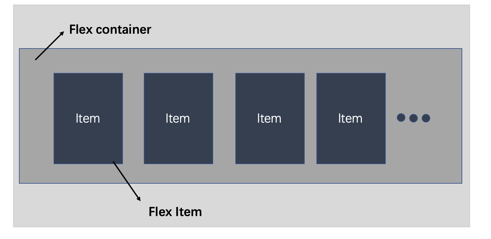

## 二、Flexbox在开发中的应用场景
### 2.1 Flexbox在布局中能够解决什么问题？
 - 浮动布局
 - 各种机型屏幕的适配
 - 水平和垂直居中
 - 自动分配宽度
 - ......
 
### 2.2 在CSS中，常规的布局是基于块和内联流方向，而Flex布局是基于flex-flow流,下图很好解释了Flex布局的思想：

 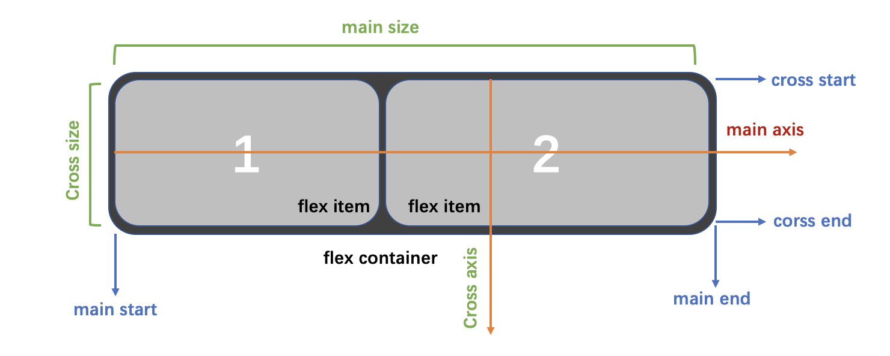
 
 容器默认存在两根轴：水平的主轴（main axis）和垂直的交叉轴（cross axis）。主轴的开始位置（与边框的交叉点）叫做main start，结束位置叫做main end；交叉轴的开始位置叫做cross start，结束位置叫做cross end。

 项目默认沿主轴排列，单个项目占据的主轴空间叫做main size，占据的交叉轴空间叫做cross size。
 
### 2.3 根据伸缩项目排列方式的不同，主轴和侧轴方向也有所变化：
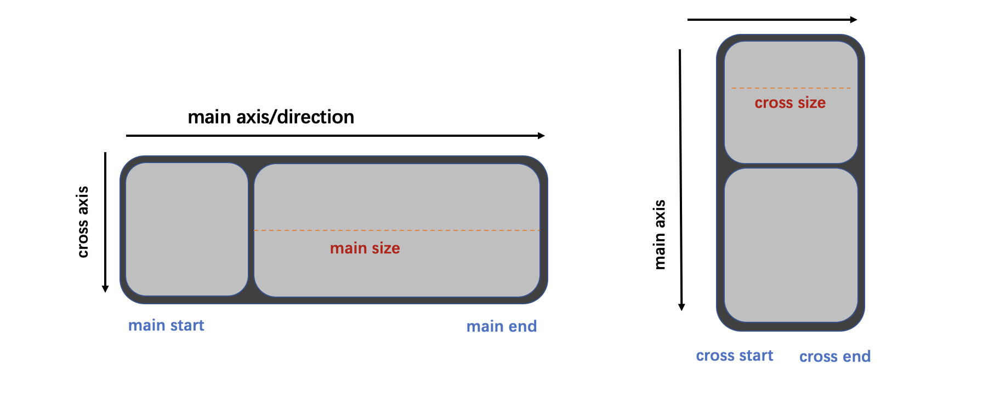

## 三、Flexbox的常用属性
### 3.1 容器属性
 - a)  flexDirection: `row | row-reverse | column | column-reverse`

     - 该属性决定主轴的方向（即项目的排列方向）。
     - row：主轴为水平方向，起点在左端。
     - row-reverse：主轴为水平方向，起点在右端。
     - column(默认值)：主轴为垂直方向，起点在上沿。
     - column-reverse：主轴为垂直方向，起点在下沿。
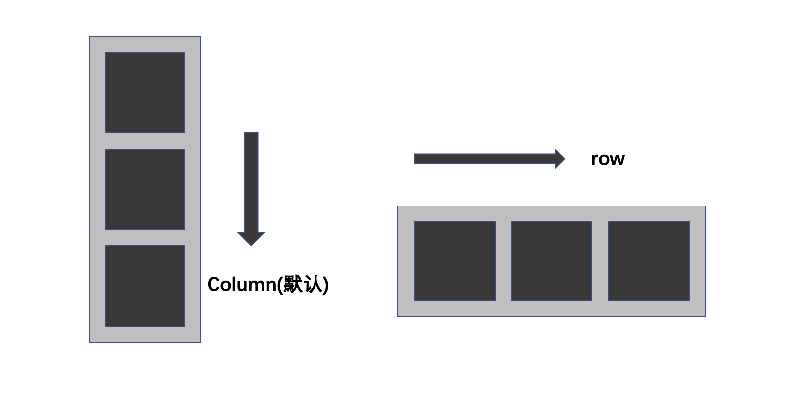
     
- b）justifyContent:`flex-start | flex-end | center | space-between | space-around`

  - 定义了伸缩项目在主轴线的对齐方式
  - flex-start(默认值)：伸缩项目向一行的起始位置靠齐。
  - flex-end：伸缩项目向一行的结束位置靠齐。
  - center：伸缩项目向一行的中间位置靠齐。
  - space-between：两端对齐，项目之间的间隔都相等。
  - space-around：伸缩项目会平均地分布在行里，两端保留一半的空间。

  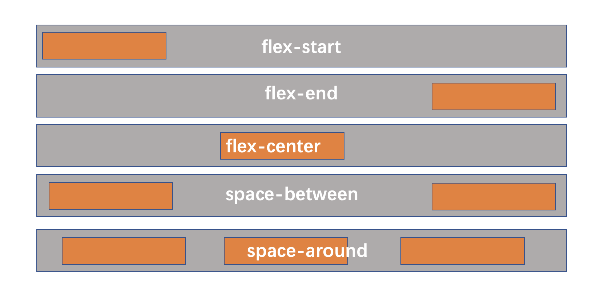


- c） alignItems:  `flex-start | flex-end | center | baseline | stretch`

  - 定义项目在交叉轴上如何对齐，可以把其想像成侧轴（垂直于主轴）的“对齐方式”。
  - flex-start：交叉轴的起点对齐。
  - flex-end：交叉轴的终点对齐 。
  - center：交叉轴的中点对齐。
  - baseline：项目的第一行文字的基线对齐。
  - stretch（默认值）：如果项目未设置高度或设为auto，将占满整个容器的高度。

   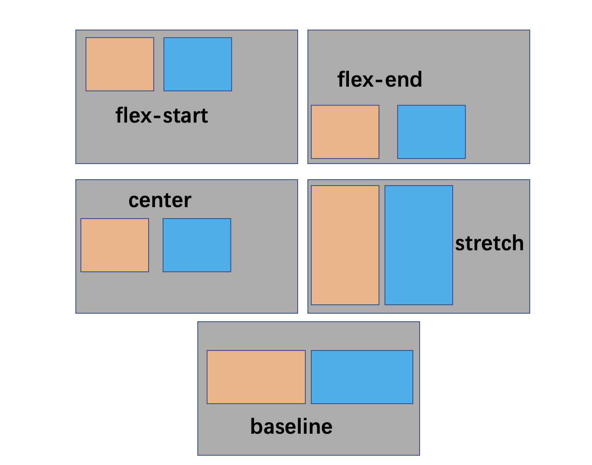 

- d)  flexWrap: `nowrap | wrap | wrap-reverse`
    - 默认情况下，项目都排在一条线（又称"轴线"）上。flex-wrap属性定义，如果一条轴线排不下，如何换行。  
    - nowrap(默认值)：不换行。
 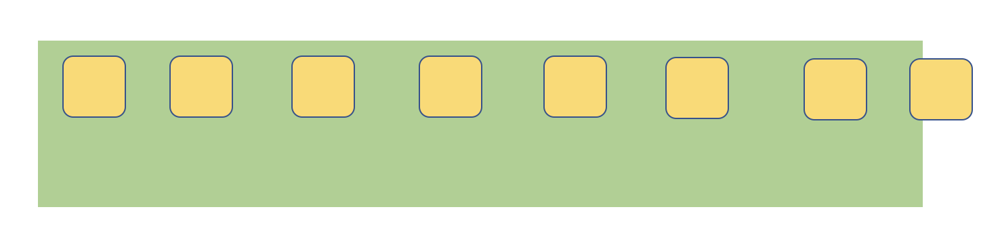 
    - wrap：换行，第一行在上方。
   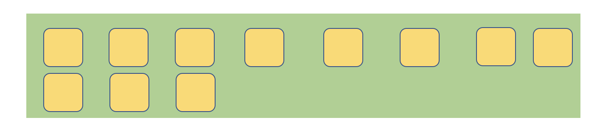  
    - wrap-reverse：换行，第一行在下方。（和wrap相反）
     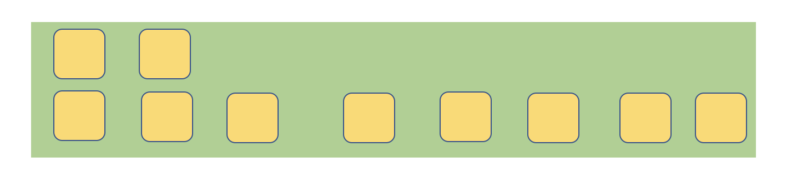 
  
     
###  3.2 元素属性
- a）flex
       - “flex-grow”、“flex-shrink”和“flex-basis”三个属性的缩写， 其中第二个和第三个参数（flex-shrink、flex-basis）是可选参数。
     - 默认值为“0 |1| auto”。
     - 宽度 ＝ 弹性宽度 * ( flexGrow / sum( flexGorw ) )    

 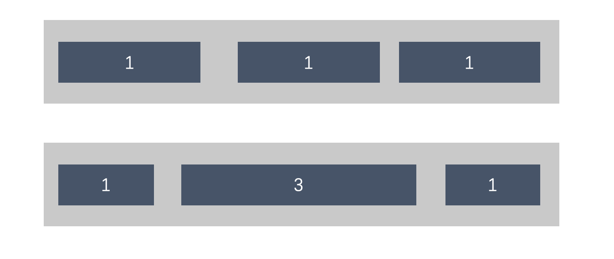 

- b）alignSelf:  “auto | flex-start | flex-end | center | baseline | stretch”
       - align-self属性允许单个项目有与其他项目不一样的对齐方式，可覆盖align-items属性。默认值为auto，表示继承父元素的align-items属性，如果没有父元素，则等同于stretch。     


 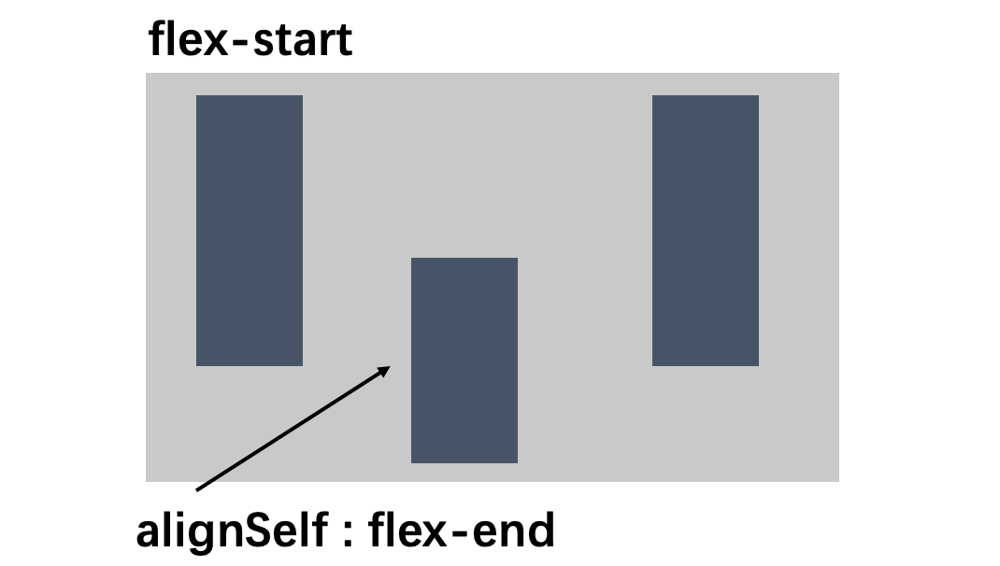 
 
 
## 四、在React Native中使用Flexbox
### 4.1  获取当前屏幕的宽度、高度、分辨率
``` js
var Dimensions = require('Dimensions');

var {width,height,scale} = Dimensions.get('window');

type Props = {};
export default class App extends Component<Props> {
  render() {
    return (
      <View style={styles.container}>

          <Text>
              W:{width+'\n'}
              H:{height+'\n'}
              S:{scale+'\n'}
            
          </Text>

        </TextInput>

      </View>
    );
  }
}
```
效果如下：
 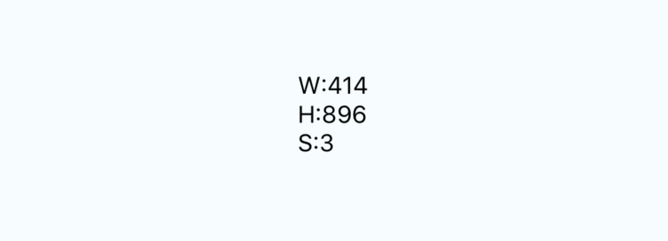 
 
 
### 4.2  常用属性Demo演示-绝对定位和相对定位
与前面所学的css定位不同，在React Native中定位不需要再父组件中设置

``` js
type Props = {};
export default class App extends Component<Props> {
  render() {
    return (
      <View style={styles.container}>

          <View style={styles.myViewS}>

          </View>


      </View>
    );
  }
}

const styles = StyleSheet.create({
  container: {
    flex: 1,
    justifyContent: 'center',
    alignItems: 'center',
    backgroundColor: 'red',
  },
    myViewS:{
    width: 100,
    height:100, 
        top:30,
        left:30,
    backgroundColor:'yellow', 
        position: 'absolute',
    },

});
```
效果如下：  position: 'absolute' （绝对定位）
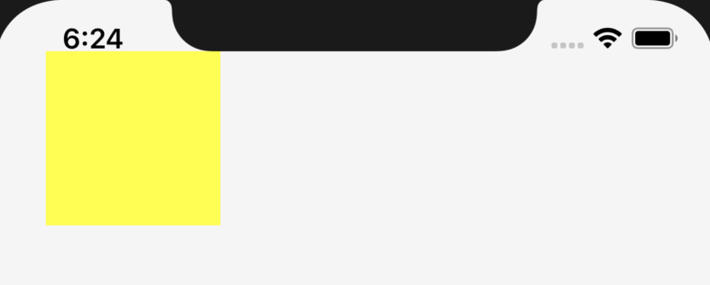

修改后：

``` js
const styles = StyleSheet.create({
  container: {
    flex: 1,
    justifyContent: 'center',
    alignItems: 'center',
    backgroundColor: 'red',
  },
    myViewS:{
    width: 100,
    height:100, 
        top:30,
        left:30,
    backgroundColor:'yellow', 
        position: 'relative',
    },

});
```
效果如下：  position: 'relative' （相对定位）
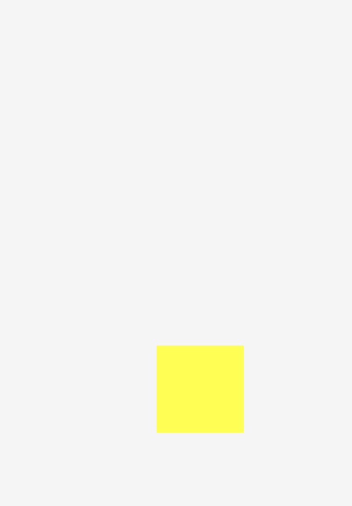

::: tip
结论：通常情况下设置position和absolute，定位的效果是一样的，但是如果父组件设置了内边距，position会做出相应的定位改变，而absolute则不会。
:::


### 4.3  常用属性Demo演示-默认宽度
 在前面的学习中，我们都知道块级标签如果不设置宽度，通常都是独占一行的，那么在React Native中的组件是否也遵循这样的规律呢？
 
 ``` js
 type Props = {};
export default class App extends Component<Props> {
  render() {
    return (
      <View style={styles.container}>

          <View style={{height:30,backgroundColor:'red'}}></View>

          <View style={{width:120,height:30,backgroundColor:'blue'}}></View>

          <View style={{flexDirection: 'row'}}>
          <View style={{height:30,backgroundColor:'orange',flex: 1}}></View>
          <View style={{height:30,backgroundColor:'blue',flex: 1}}></View>
          <View style={{height:30,backgroundColor:'green',flex: 1}}></View>
          </View>

          <View style={{flexDirection: 'column'}}>
              <View style={{height:30,backgroundColor:'red'}}></View>
              <View style={{height:30,backgroundColor:'blue'}}></View>
              <View style={{height:30,backgroundColor:'green'}}></View>
          </View>

      </View>
    );
  }
}

const styles = StyleSheet.create({
  container: {
    flex: 1,
     marginTop:100,
    backgroundColor: '#F5F5F5',
  },
    myViewS:{
    width: 100,
    height:100,
        top:30,
        left:30,
    backgroundColor:'yellow',
        position: 'absolute',
    },

});
 ```
 
 运行结果：
 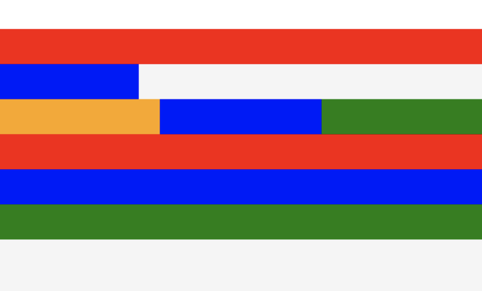
 
 ::: tip
 注意：容器需要添加flexDirection才能让子元素flex;
结论：flex的元素如果不设置宽度， 都会百分之百的占满父容器。
:::
 
### 4.4  常用属性Demo演示-水平垂直居中
在前面的css学习中，我们经常会在布局的时候使文本或者图片水平垂直居中，那么如何通过flexbox的alignItems 和 justifyContent 来让组件居中呢？

代码演示如下：   

``` js
type Props = {};
export default class App extends Component<Props> {
  render() {
    return (
      <View style={styles.container}>


          <View style={{marginLeft: 50,backgroundColor:'red',width:200,height:200,alignItems: 'center'}}>

          <View style={{height:100,width:100,backgroundColor:'orange'}}></View>

          </View>


      </View>
    );
  }
}

const styles = StyleSheet.create({
  container: {
    flex: 1,
     marginTop:100,
    backgroundColor: '#F5F5F5',
  },
});

```
水平居中效果图：
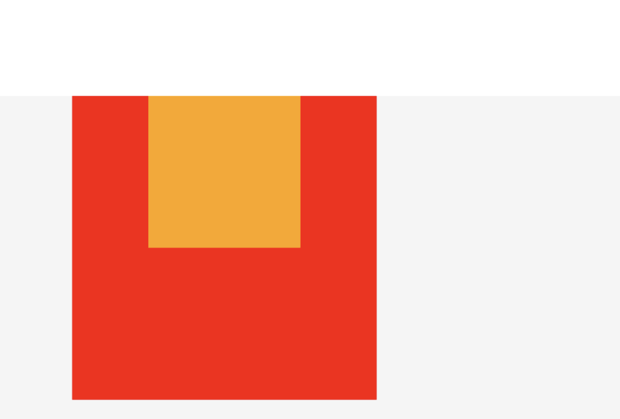
水平垂直居中效果图：

``` js
     <View style={{marginLeft: 50,backgroundColor:'red',width:200,height:200,alignItems: 'center',justifyContent: 'center'}}>

          <View style={{height:100,width:100,backgroundColor:'orange'}}></View>

          </View>
```

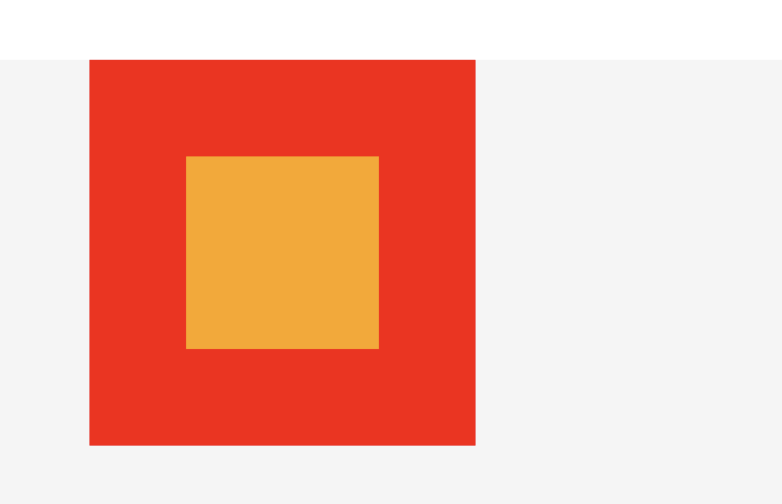

垂直居中效果图：

``` js
     <View style={{marginLeft: 50,backgroundColor:'red',width:200,height:200,justifyContent: 'center'}}>

          <View style={{height:100,width:100,backgroundColor:'orange'}}></View>

          </View>

```

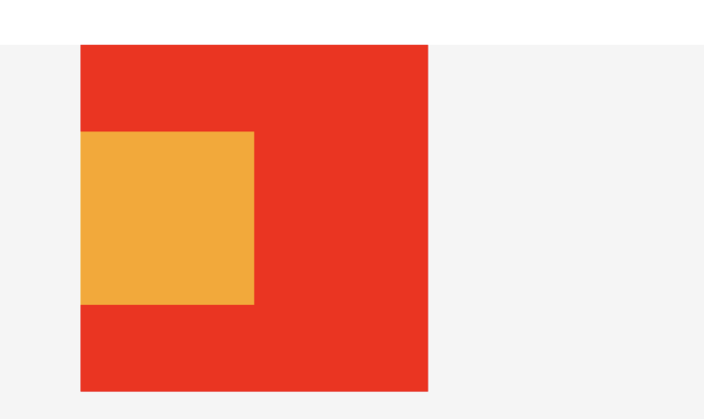


::: warning
注意：一旦设置alignItems属性之后，组件的大小包裹随着内容的尺寸；此外水平居中和垂直居中还要结合FlexDirection进行判断。
:::

### 4.5  常用属性Demo演示-padding和margin
在前面学习css的样式中，我们可以给行内标签和非行内标签设置内边距和外边距，那么在React Native中是否也是遵循同样的规律呢？我们一起来研究下。

- a）padding
在inline和非inline元素上的padding的使用情况：

``` js
type Props = {};
export default class App extends Component<Props> {
  render() {
    return (
      <View style={styles.container}>


          <View style={{padding: 40,marginLeft: 50,backgroundColor:'red',width:200,height:200}}>

              <Text style={{backgroundColor:'yellow'}}> 测试数据</Text>

          </View>


      </View>
    );
  }
}

```

给View设置内边距
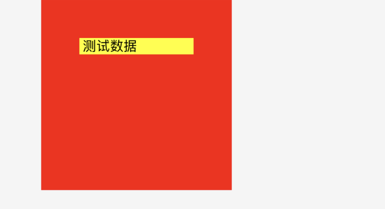

给Text设置内边距

``` js
      <View style={{marginLeft: 50,backgroundColor:'red',width:200,height:200}}>

              <Text style={{padding: 40,backgroundColor:'yellow'}}> 测试数据</Text>

          </View>
```
 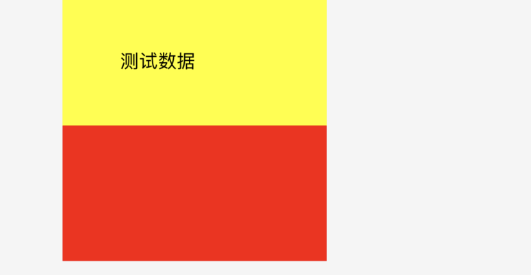
  
  ::: tip
  结论：在React Native中，inline和非inline中padding的用法是可行的。
  
  :::
  
  
  - b）margin
在inline和非inline元素上的margin的使用情况：

``` js
type Props = {};
export default class App extends Component<Props> {
  render() {
    return (
      <View style={styles.container}>


          <View style={{backgroundColor:'red',width:200,height:200}}>

              <Text style={{backgroundColor:'yellow',margin: 10}}> 测试数据</Text>

          </View>


      </View>
    );
  }
}

const styles = StyleSheet.create({
  container: {
    flex: 1,
     marginTop:100,
    backgroundColor: '#F5F5F5',
  },
});

```
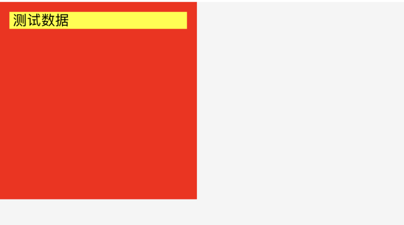

::: tip
结论：在React Native中，inline和非inline中margin的用法同样是可行的。
:::