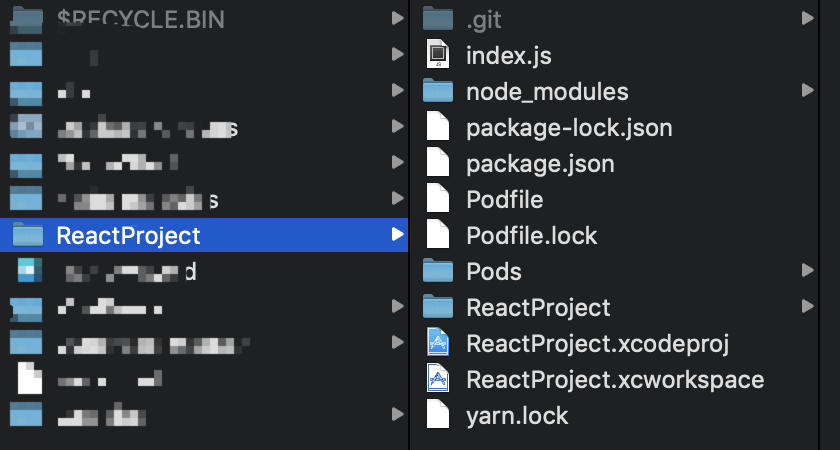
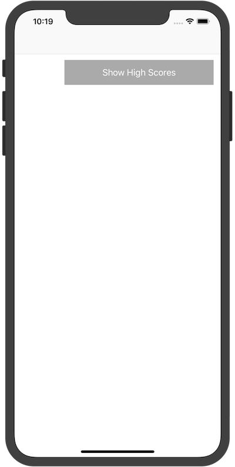
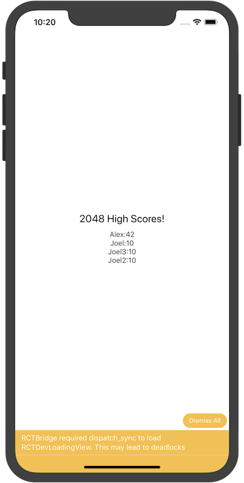

# React-Native - 集成到现有原生应用


## 1. 创建一个iOS项目 
名字为：ReactProject,目录结构图如下：
 
 
 ::: tip
 这个目录文件结构是已经完成集成react-native的目录
 开始的时候只有：
 ReactProject、ReactProject.xcodeproj这两个文件及文件夹
 :::
 
## 2.安装 JavaScript 依赖包
在项目根目录下创建一个名为package.json的空文本文件，然后填入以下内容：

``` js
{
  "name": "ReactProject",
  "version": "0.0.1",
  "private": true,
  "scripts": {
    "start": "node node_modules/react-native/local-cli/cli.js start"
  },
  "dependencies": {
    "react": "16.6.3",
    "react-native": "0.57.8"
  },
  "devDependencies": {
    "babel-jest": "23.6.0",
    "jest": "23.6.0",
    "metro-react-native-babel-preset": "0.51.0",
    "react-test-renderer": "16.6.3"
  },
  "jest": {
    "preset": "react-native"
  }
}
```
::: tip
示例中的version字段没有太大意义（除非你要把你的项目发布到 npm 仓库）。scripts中是用于启动 packager 服务的命令。
:::

接下来我们使用 yarn 或 npm（两者都是 node 的包管理器）来安装 React 和 React Native 模块。请打开一个终端/命令提示行，进入到项目目录中（即包含有 package.json 文件的目录），然后运行下列命令来安装：
```
$ yarn add react-native
```
这样默认会安装最新版本的 React Native，同时会打印出类似下面的警告信息（你可能需要滚动屏幕才能注意到）：
```
warning "react-native@0.52.2" has unmet peer dependency "react@16.2.0".
```
这是正常现象，意味着我们还需要安装指定版本的 React：
```
$ yarn add react@16.2.0
```
注意必须严格匹配警告信息中所列出的版本，高了或者低了都不可以。
::: tip
如果你使用多个第三方依赖，可能这些第三方各自要求的 react 版本有所冲突，此时应优先满足react-native所需要的react版本。其他第三方能用则用，不能用则只能考虑选择其他库。
:::

所有 JavaScript 依赖模块都会被安装到项目根目录下的node_modules/目录中（这个目录我们原则上不复制、不移动、不修改、不上传，随用随装）。

把node_modules/目录记录到.gitignore文件中（即不上传到版本控制系统，只保留在本地）。

## 3.配置 CocoaPods 的依赖
React Native 框架整体是作为 node 模块安装到项目中的。下一步我们需要在 CocoaPods 的Podfile中指定我们所需要使用的"subspecs"。

可用的subspec都列在node_modules/react-native/React.podspec中，基本都是按其功能命名的。一般来说你首先需要添加Core，这一subspec包含了必须的AppRegistry、StyleSheet、View以及其他的一些 React Native 核心库。如果你想使用 React Native 的Text库（即\<Text\>组件），那就需要添加RCTText的subspec。同理，Image需要加入RCTImage，等等。

我们需要在Podfile文件中指定所需的subspec。创建Podfile的最简单的方式就是在/ios子目录中使用 CocoaPods 的init命令：
```
$ pod init
```
Podfile会创建在执行命令的目录中。你需要调整其内容以满足你的集成需求。调整后的Podfile的内容看起来类似下面这样：
``` js
# Uncomment the next line to define a global platform for your project
# platform :ios, '9.0'

target 'ReactProject' do

# 'node_modules'目录一般位于根目录中
  # 但是如果你的结构不同，那你就要根据实际路径修改下面的`:path`
  pod 'React', :path => './node_modules/react-native', :subspecs => [
    'Core',
    'CxxBridge', # 如果RN版本 >= 0.47则加入此行
    'DevSupport', # 如果RN版本 >= 0.43，则需要加入此行才能开启开发者菜单
    'RCTText',
    'RCTNetwork',
    'RCTWebSocket', # 调试功能需要此模块
    'RCTAnimation', # FlatList和原生动画功能需要此模块
    # 在这里继续添加你所需要的其他RN模块
  ]
  # 如果你的RN版本 >= 0.42.0，则加入下面这行
  pod 'yoga', :path => './node_modules/react-native/ReactCommon/yoga'

  # 如果RN版本 >= 0.45则加入下面三个第三方编译依赖
  pod 'DoubleConversion', :podspec => './node_modules/react-native/third-party-podspecs/DoubleConversion.podspec'
  pod 'glog', :podspec => './node_modules/react-native/third-party-podspecs/glog.podspec'
  pod 'Folly', :podspec => './node_modules/react-native/third-party-podspecs/Folly.podspec'


end
```
创建好了Podfile后，就可以开始安装 React Native 的 pod 包了。
```
$ pod install
```
然后你应该可以看到类似下面的输出(译注：同样由于众所周知的网络原因，pod install 的过程在国内非常不顺利，请自行配备稳定的翻墙工具，或是尝试一些镜像源)：
```
Analyzing dependencies
Fetching podspec for `React` from `../node_modules/react-native`
Downloading dependencies
Installing React (0.26.0)
Generating Pods project
Integrating client project
Sending stats
Pod installation complete! There are 3 dependencies from the Podfile and 1 total pod installed.
```
## 4.代码集成

现在我们已经准备好了所有依赖，可以开始着手修改原生代码来把 React Native 真正集成到应用中了。在我们的 2048 示例中，首先尝试添加一个显示有"High Score"（得分排行榜）的 React Native 页面。

**React Native 组件**

我们首先要写的是"High Score"（得分排行榜）的 JavaScript 端的代码。

**1. 创建一个index.js文件**

首先在项目根目录下创建一个空的index.js文件。（注意在 0.49 版本之前是 index.ios.js 文件）

index.js是 React Native 应用在 iOS 上的入口文件。而且它是不可或缺的！它可以是个很简单的文件，简单到可以只包含一行require/import导入语句。本教程中为了简单示范，把全部的代码都写到了index.js里（当然实际开发中我们并不推荐这样做）。

**2. 添加你自己的 React Native 代码**

在index.js中添加你自己的组件。这里我们只是简单的添加一个\<Text\>组件，然后用一个带有样式的\<View\>组件把它包起来。
``` js
import React from 'react';
import {AppRegistry, StyleSheet, Text, View} from 'react-native';

class RNHighScores extends React.Component {
  render() {
    var contents = this.props['scores'].map((score) => (
      <Text key={score.name}>
        {score.name}:{score.value}
        {'\n'}
      </Text>
    ));
    return (
      <View style={styles.container}>
        <Text style={styles.highScoresTitle}>2048 High Scores!</Text>
        <Text style={styles.scores}>{contents}</Text>
      </View>
    );
  }
}

const styles = StyleSheet.create({
  container: {
    flex: 1,
    justifyContent: 'center',
    alignItems: 'center',
    backgroundColor: '#FFFFFF',
  },
  highScoresTitle: {
    fontSize: 20,
    textAlign: 'center',
    margin: 10,
  },
  scores: {
    textAlign: 'center',
    color: '#333333',
    marginBottom: 5,
  },
});

// 整体js模块的名称
AppRegistry.registerComponent('RNHighScores', () => RNHighScores);
```
::: tip
RNHighScores是整体 js 模块（即你所有的 js 代码）的名称。你在 iOS 原生代码中添加 React Native 视图时会用到这个名称。
:::

## 5.掌握核心科技： RCTRootView
现在我们已经在index.js中创建了 React Native 组件，下一步就是把这个组件添加给一个新的或已有的ViewController。
打开Reactproject工程，在ViewController.m 添加如下代码：

``` swift
#import "ViewController.h"
#import <React/RCTRootView.h>
@interface ViewController ()

@end

@implementation ViewController

- (void)viewDidLoad {
    [super viewDidLoad];
    // Do any additional setup after loading the view, typically from a nib.
    
    UIButton *btnShow = [[UIButton alloc]initWithFrame:CGRectMake(100, 100, 300, 50)];
    [btnShow setTitle:@"Show High Scores" forState:UIControlStateNormal];
    
    [btnShow addTarget:self action:@selector(btnClick:) forControlEvents:UIControlEventTouchUpInside];
    btnShow.backgroundColor = [UIColor lightGrayColor];
    [self.view addSubview:btnShow];
    
}
-(void)btnClick:(id)sender
{
    NSLog(@"High Score Button Pressed");
    NSURL *jsCodeLocation = [NSURL URLWithString:@"http://localhost:8081/index.bundle?platform=ios"];
    
    RCTRootView *rootView =
    [[RCTRootView alloc] initWithBundleURL: jsCodeLocation
                                moduleName: @"RNHighScores"
                         initialProperties:
     @{
       @"scores" : @[
               @{
                   @"name" : @"Alex",
                   @"value": @"42"
                   },
               @{
                   @"name" : @"Joel",
                   @"value": @"10"
                   },
               @{
                   @"name" : @"Joel3",
                   @"value": @"10"
                   },
               @{
                   @"name" : @"Joel2",
                   @"value": @"10"
                   }
               ]
       }
                             launchOptions: nil];
    UIViewController *vc = [[UIViewController alloc] init];
    vc.view = rootView;
    [self presentViewController:vc animated:YES completion:nil];
}

@end
```

## 6.测试集成结果
1. 添加 App Transport Security 例外
 Apple 现在默认会阻止读取不安全的 HTTP 链接。所以我们需要把本地运行的 Packager 服务添加到Info.plist的例外中，以便能正常访问 Packager 服务：
 ``` swift
 <key>NSAppTransportSecurity</key>
<dict>
    <key>NSExceptionDomains</key>
    <dict>
        <key>localhost</key>
        <dict>
            <key>NSTemporaryExceptionAllowsInsecureHTTPLoads</key>
            <true/>
        </dict>
    </dict>
</dict>
```
::: tip
App Transport Security 对于用户来说是有利的。所以最好记得在发布之前重新启用这些安全限制。
:::

2. 运行 Packager
 要运行应用，首先需要启动开发服务器（即 Packager，它负责实时监测 js 文件的变动并实时打包，输出给客户端运行）。具体只需简单进入到项目根目录中，然后运行：
 ``` swift
 $ npm start
 ```
 
 3. 运行应用
 如果你使用的是 Xcode，那么照常编译和运行应用即可。如果你没有使用 Xcode（但是你仍然必须安装 Xcode），则可以在命令行中使用以下命令来运行应用：
 ``` swift
 # 在项目的根目录中执行：
$ react-native run-ios
```
运行效果如下图：

 