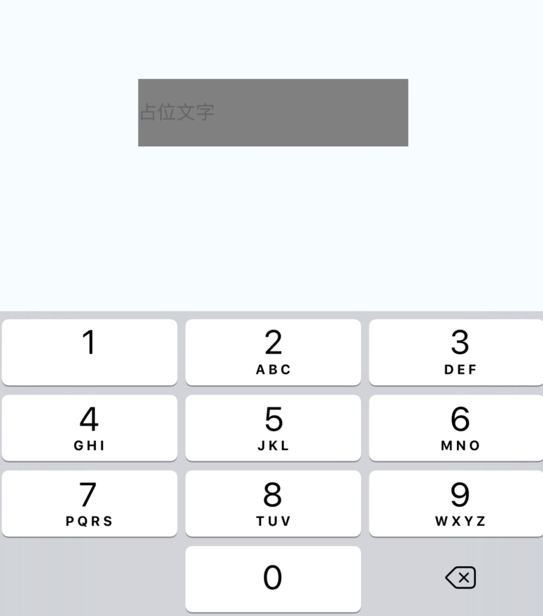

# React-Native - 常用组件Image、TextInput


## 常用组件之Image

### 一、前言
在开发中还有一个非常重要的组件Image，通过这个组件可以展示各种各样的图片，而且在React Native中该组件可以通过多种方式加载图片资源。
### 二、Image组件的基本用法
#### 2.1 静态图片资源
``` js
      <View style={styles.container}>
        <Text style={styles.welcome}>本地图片!</Text>

          <Image source={require('./my-icon.png')} />
      </View>
```
该图片资源文件的查找和JS模块相似，该会根据填写的图片路径相对于当前的js文件路径进行搜索。
     此外，React Naive的Packager会根据平台选择相应的文件，例如:my_icon.ios.png和my_icon.android.png两个文件(命名方式android或者ios)，会分别根据android或者ios平台选择相应的文件。
     
#### 2.2 加载使用APP中的图片
``` js
 <View style={styles.container}>
       <Text style={styles.textMarginTop}>加载Xcode中的图片</Text>
       <Image source={require('image!icon_homepage_map')} style={{width: 50,height:50}}/>
   </View>
```
 使用已经打包在APP中的图片资源(例如:xcode asset文件夹以及Android drawable文件夹)


#### 2.3 加载来自网络的图片 
客户端的很多图片资源基本上都是实时通过网络进行获取的，写法和上面的加载本地资源图片的方式不太一样，这边一定需要指定图片的尺寸大小，实现如下：
``` js
  <View style={styles.container}>
        <Image source={{uri:'https://www.baidu.com/img/bd_logo1.png'}} style={{flex:1,width:200, height:100, resizeMode: Image.resizeMode.cover}}/>
        <Image source={{uri:'https://www.baidu.com/img/bd_logo1.png'}} style={{flex:1,width:200, height:100, resizeMode: Image.resizeMode.contain}}/>
        <Image source={{uri:'https://www.baidu.com/img/bd_logo1.png'}} style={{flex:1,width:200, height:100, resizeMode: Image.resizeMode.stretch}}>
  </View>
``` 
 细心的同学可能已经注意到，我在上面用到了resizeMode这样一个属性，那么这个属性的作用相当于OC中设置图片的内容模式。
 Image.resizeMode.cover：图片居中显示，没有被拉伸，超出部分被截断；
 Image.resizeMode.contain：容器完全容纳图片，图片等比例进拉伸；
 Image.resizeMode.stretch： 图片被拉伸适应容器大小，有可能会发生变形。
 
#### 2.4 设置图片为背景
``` js
    <Image source={{uri:'https://www.baidu.com/img/bd_logo1.png'}} style={{flex:1,width:200, height:100, resizeMode: Image.resizeMode.stretch}}>
           <Text style={{marginTop: 60, backgroundColor: 'red'}}>下面是背景图片</Text>
    </Image>
```
 
效果图：


### 三、Image组件的常见属性

#### 3.1 属性方法
::: tip
- onLayout(function)
   - 当Image布局发生改变的，会进行调用该方法，调用的代码为:{nativeEvent: {layout: {x, y, width, height}}}.

- onLoad (function)

   - 当图片加载成功之后，回调该方法

- onLoadEnd (function)

  - 当图片加载失败回调该方法，该不会管图片加载成功还是失败

- onLoadStart (fcuntion)

   - 当图片开始加载的时候调用该方法

- resizeMode

   - 缩放比例,可选参数('cover', 'contain', 'stretch') 该当图片的尺寸超过布局的尺寸的时候，会根据设置Mode进行缩放或者裁剪图片

- source{uri:string}

   - 进行标记图片的引用，该参数可以为一个网络url地址或者一个本地的路径

 :::
 
 
#### 3.2 样式风格属性
::: tip

FlexBox  支持弹性盒子风格

Transforms  支持属性动画

backgroundColor 背景颜色

borderColor     边框颜色

borderWidth 边框宽度

borderRadius  边框圆角

overflow 设置图片尺寸超过容器可以设置显示或者隐藏('visible','hidden')

tintColor  颜色设置

opacity 设置不透明度0.0(透明)-1.0(完全不透明)

:::

## 常用组件之TextInput
### 一、前言
文本输入框，相当于OC中的UITextField，在用法和属性方面，两者都有很大的借鉴之处：通过键盘将文本输入到应用程序的一个基本的组件；

### 二、TextInput的常见属性
因为TextInput是继承自UIView，所以View的属性TextInput也能够使用，一些样式类的属性在学习的时候可以参照View的相关属性。
::: tip
**value** 字符串型
文本输入的默认值

**onChangeText** 函数    
监听用户输入的值：

-  keyboardType  键盘类型
   - 决定打开哪种键盘，例如，数字键盘。
enum('default', "ascii-capable", 'numbers-and-punctuation', 'url', 'number-pad', 'phone-pad', 'name-phone-pad', 'email-address', 'decimal-pad', 'twitter', 'web-search', "numeric")

- multiline 布尔型

  - 如果值为真，文本输入可以输入多行。默认值为假。

- password 布尔型

  - 如果值为真，文本输入框就成为一个密码区域。默认值为假。

- placeholder 字符串型

   - 在文本输入之前字符串将被呈现出来，通常被称为占位文字

- placeholderTextColor 字符串型

   - 占位符字符串的文本颜色

- autoCapitalize enum('none', 'sentences', 'words', 'characters')

   - 可以通知文本输入自动利用某些字符。
characters：所有字符，
words：每一个单词的首字母
sentences：每个句子的首字母（默认情况下）
none：不会自动使用任何东西

- autoCorrect 布尔型

   - 如果值为假，禁用自动校正。默认值为真。

- autoFocus 布尔型

   - 如果值为真，聚焦 componentDidMount 上的文本。默认值为假。

- bufferDelay 数值型

   - 这个会帮助避免由于 JS 和原生文本输入之间的竞态条件而丢失字符。默认值应该是没问题的，但是如果你每一个按键都操作的非常缓慢，那么你可能想尝试增加这个。

- clearButtonMode enum('never', 'while-editing', 'unless-editing', 'always')

   - 清除按钮出现在文本视图右侧的时机

- controlled 布尔型

   - 如果你真想要它表现成一个控制组件，你可以将它的值设置为真，但是按下按键，并且/或者缓慢打字，你可能会看到它闪烁，这取决于你如何处理 onChange 事件。

- editable 布尔型

   - 如果值为假，文本是不可编辑的。默认值为真。

- enablesReturnKeyAutomatically 布尔型

   - 如果值为真，当没有文本的时候键盘是不能返回键值的，当有文本的时候会自动返回。默认值为假。

- onBlur 函数

   - 当文本输入是模糊的，调用回调函数

- onChange 函数

   - 当文本输入的文本发生变化时，调用回调函数

- onEndEditing 函数

- onFocus 函数

   - 当输入的文本是聚焦状态时，调用回调函数

- returnKeyType enum('default', 'go', 'google', 'join', 'next', 'route', 'search', 'send', 'yahoo', 'done', 'emergency-call')

   - 决定返回键的样式

- secureTextEntry 布尔型

   - 如果值为真，文本输入框就会使输入的文本变得模糊，以便于像密码这样敏感的文本保持安全。默认值为假。

:::


``` js
type Props = {};
export default class App extends Component<Props> {
  render() {
    return (
      <View style={styles.container}>

        <TextInput style={styles.textInputStyle}
          placeholder="占位文字"
          password={true}
          keyboardType="number-pad"
        >
          
        </TextInput>

      </View>
    );
  }
}
```
效果图：



