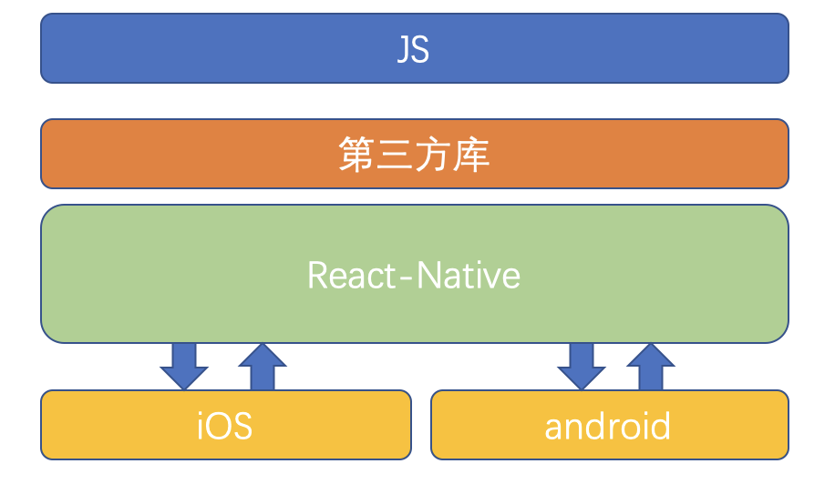
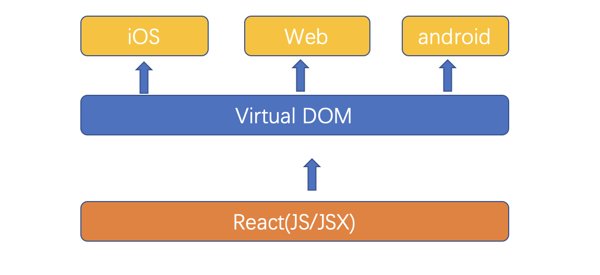

# React-Native - 基础之简介

 
 
尽管在移动开发中，原生App的开发成本很高，但现阶段基于原生开发仍然是必须的，因为Web的用户体验仍无法超越Native，主要体现在：
Native的原生控件有更好的体验；
Native有更好的手势识别；
Native有更合适的线程模型，尽管Web Worker可以解决一部分问题，但如图像解码、文本渲染仍无法多线程渲染，这影响了Web的流畅性。
::: tip
思考？

怎么做才能拥有Native的体验和性能，又能够高效率开发、跨平台开发？
:::
## 一、简介

React Native于F8大会开源,在短短不到一年的时间里,它成为手机端必不可少的开发模式之一。 它充分利用了Facebook现有的业务轮子, 其核心设计理念：既拥有Native的用户体验、又保留React的开发效率。

  目前，React Native基本完成了对多端的支持，实现了真正意义上的面向配置开发: 开发者可以灵活的使用HTML和CSS布局,使用React语法构建组件,实现：Android, iOS 两端代码的复用。
  
  
  此外，使用流畅度和原生的保持在同一层次,这不是我们梦寐以求的开发模式吗?让我们从无到有开启新的学习篇章吧!
## 二、什么是React Native

### 一、时下两大移动互联网主流技术
- BAT等一线互联网公司的插件化，热修改等技术
- 阿里的Weex、尤小右的Vue.js等
- React Native技术

### 二、React Native介绍
 - Facebook于2015年9月15日发布React Native;
 - 广大开发者可以使用JavaScript和React开发跨平台移动应用;
 - React Native特点：
  - 1）使用 Virtual DOM；
  - 2）提供了响应式（Reactive）和组件化（Composable）的视图组件；
  - 3）将注意力集中保持在核心库，伴随于此，有配套的路由和负责处理全局状态管理的库。

### 三、React Native的优势
- 1）跨平台开发运用React Native，我们可以使用同一份业务逻辑核心代码来创建原生应用运行在Web端，Android端和iOS端；
- 2）追求极致的用户体验：实时热部署     
- 3）learn once,write everywhere （最具魅力）React Native不强求一份原生代码支持多个平台，所以不是“Write once, run anywhere”（Java），而是“Learn once, write anywhere”。
        
       
  
### 四、React Native开发注意事项

 1. 目前react native在iOS上仅支持ios7以上，Android仅支持Android4.1以上版本；
  github地址:  https://github.com/facebook/react-native 
 官网文档: http://facebook.github.io/react-native/docs/getting-started.html
 2. 由于React Native的版本更新速度很快，如果没有深厚的JavaScript基础，建议选择：
   - a. 功能适中，交互一般，不需要特别多的系统原生支持；
   - b.对于部分复杂的应用，可以考虑原生+React Native混合开发 
 
