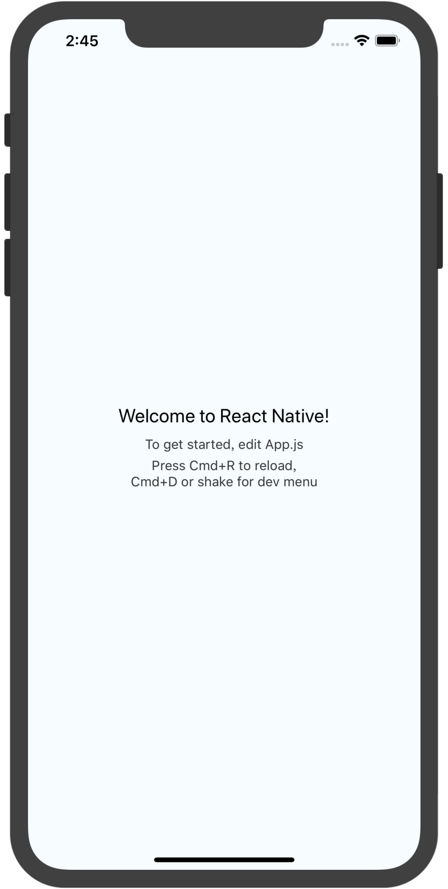
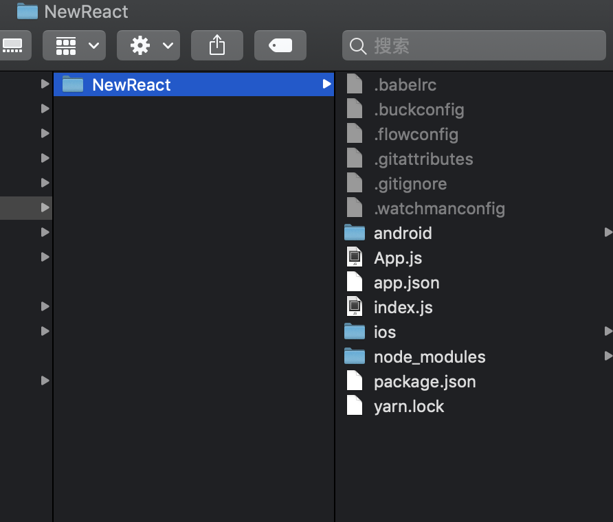
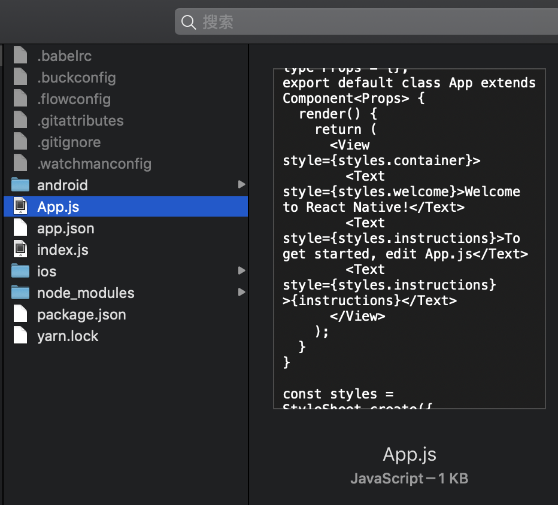

# React-Native - 创建新应用项目


## 创建新项目
使用 React Native 命令行工具来创建一个名为"NewReact"的新项目：

::: tip
！！！注意！！！：init 命令默认会创建最新的版本，而目前最新的 0.45 及以上版本需要下载 boost 等几个第三方库编译。这些库在国内即便翻墙也很难下载成功，导致很多人无法运行iOS项目！！！中文网在论坛中提供了这些库的[国内下载链接](https://bbs.reactnative.cn/topic/4301/ios-rn-0-45以上版本所需的第三方编译库-boost等)。如果你嫌麻烦，又没有对新版本的需求，那么可以暂时创建0.44.3的版本。
:::

``` js
react-native init NewReact
```
::: tip
提示：你可以使用--version参数（注意是两个杠）创建指定版本的项目。例如react-native init MyApp --version 0.44.3。注意版本号必须精确到两个小数点。
:::

如果你是想把 React Native 集成到现有的原生项目中，则步骤完全不同，请参考集成到现有原生应用。

## 编译并运行 React Native 应用
在你的项目目录中运行react-native run-ios：
``` js

cd NewReact
react-native run-ios
```
或者直接进入目录用Xcode手动启动项目


项目目录机构如下：



新版的要修改js在APP.js中进行修改：

