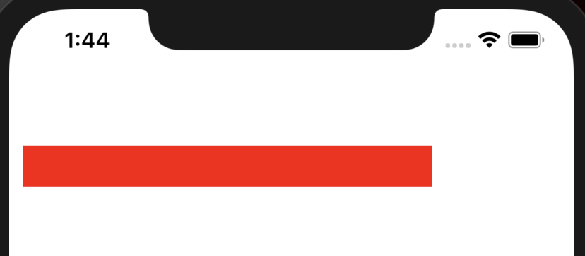
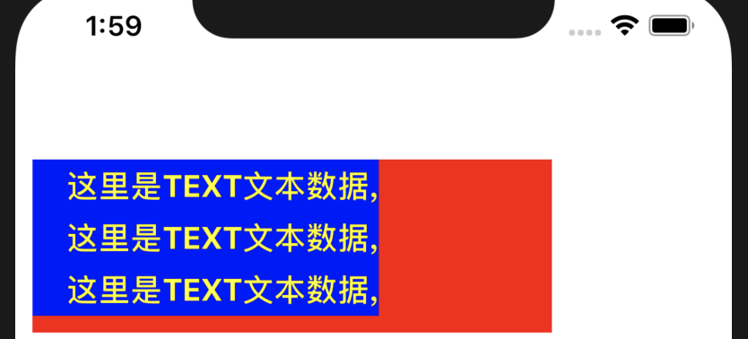

# React-Native - 常用组件View、Text


## 常用组件之View

### 一、 View组件中常见的属性
React Native组件View，其作用等同于iOS中的UIView, Android中的android.view，或是网页中的\<div\>标签，它是所有组件的父组件。
::: tip
**Flexbox 弹性布局**

**Transforms  动画属性**

**backfaceVisibility enum('visible', 'hidden')    定义界面翻转的时候是否可见**

backgroundColor color

borderBottomColor color

borderBottomLeftRadius number

borderBottomRightRadius number

borderBottomWidth number

borderColor color

borderLeftColor color

borderLeftWidth number

borderRadius number

borderRightColor color

borderRightWidth number

borderStyle enum('solid', 'dotted', 'dashed')

borderTopColor color

borderTopLeftRadius number

borderTopRightRadius number

borderTopWidth number

borderWidth number

**opacity number 设置透明度，取值从0-1；**

**overflow enum('visible', 'hidden')  设置内容超出容器部分是显示还是隐藏；**

**elevation number 高度   设置Z轴，可产生立体效果。**
:::
### 二、 View组件运用
 下图就是View的基本运用：
 ``` swift
  class RNHighScores extends React.Component {
    render() {
        return (
            <View style={styles.container}>
                <View style={styles.viewStyles}>
                </View>
            </View>
        );
    }
}
```
在图中的render函数中，我们返回了一个顶层的View，然后View中包含着另一个子层的View。
在顶层的View中的style属性里面设置了其占满父控件，内边距为30，背景颜色为黄色 ；对应子层中的View的style属性中设置了宽度300，高度50，背景色为红色。 这是我们熟悉的css写法。
  运行效果如下：
 
 
 
 在React Native开发中，更加推荐我们采用StyleSheet来进行组件的布局，这样的话，代码在结构上会更加的清晰、也有利于后期维护。
 下面我们采用StyleSheet来实现一下:
 ``` swift
 class RNHighScores extends React.Component {
    render() {

        return (
            <View style={styles.container}>
                <View style={styles.viewStyles}>


                </View>

            </View>
        );
    }
}

const styles = StyleSheet.create({
    container: {
        flex: 1,
        margin:10,
        backgroundColor: '#FFFFFF',
    },
    viewStyles: {

        width: 300,
        height: 30,
        backgroundColor: 'red'
    },

});
 ```
 当然，在开发中会根据具体情况来灵活运用。
 
 
## 常用组件之Text

### 一、什么是Text组件？
一个用于显示文本的React组件，和Android中的TextView组件或者OC中的Label组件相类似，专门用来显示基本的文本信息；除了基本的显示布局之外，可以进行嵌套显示，设置样式，以及可以做事件(例如:点击)处理；
### 二、Text组件常用的属性方法
``` js
Attributes.style = {
    color string
    containerBackgroundColor string
    fontFamily string
    fontSize number
    fontStyle enum('normal', 'italic')
    fontWeight enum("normal", 'bold', '100', '200', '300', '400', '500', '600', '700', '800', '900')
    lineHeight number
    textAlign enum("auto", 'left', 'right', 'center')
    writingDirection enum("auto", 'ltr', 'rtl')
    numberOfLines number
    textAlign ("auto", 'left', 'right', 'center', 'justify')
    fontWeight ("normal", 'bold', '100', '200', '300', '400', '500', '600', '700', '800', '900')
    onPress  fcuntion
 }
```
::: tip
注释如下：

`color` 字体颜色

 `numberOfLines` (number) 进行设置Text显示文本的行数，如果显示的内容超过了行数，默认其他
 多余的信息就不会显示了
 
`onPress` (fcuntion)  该方法当文本发生点击的时候调用该方法

 `color`  字体颜色
 
`fontFamily`  字体名称

`fontSize`  字体大小

`fontStyle`   字体风格(normal,italic)

`fontWeight ` 字体粗细权重("normal", 'bold', '100', '200', '300', '400', '500', '600', '700', '800', '900')

`textShadowOffset`  设置阴影效果{width: number, height: number}

`textShadowRadius`  阴影效果圆角

`textShadowColor`  阴影效果的颜色

`letterSpacing`  字符间距

`lineHeight`  行高

`textAlign`   文本对其方式("auto", 'left', 'right', 'center', 'justify')

`textDecorationLine`  横线位置 ("none", 'underline', 'line-through', 'underline line-through')

`textDecorationStyle` 线的风格("solid", 'double', 'dotted', 'dashed')

 `textDecorationColor` 线的颜色
 
`writingDirection` 文本方向("auto", 'ltr', 'rtl')

:::
 
### 三、Text组件中常用属性的应用 
``` js
class RNHighScores extends React.Component {
    render() {

        return (
            <View style={styles.container}>
                <View style={styles.viewStyles}>
                    <Text style={styles.textS}>
                      这里是TEXT文本数据, 这里是TEXT文本数据, 这里是TEXT文本数据,

                    </Text>

                </View>

            </View>
        );
    }
}

const styles = StyleSheet.create({
    container: {
        flex: 1,
        margin:10,
        marginTop:100,
        backgroundColor: '#FFFFFF',
    },
    viewStyles: {

        width: 300,
        height: 100,
        backgroundColor: 'red'
    },
    textS:{
        backgroundColor: 'blue',
        color: 'yellow',
        textAlign: 'right',
        width: 200,
        lineHeight:30,
        fontSize:18,
        fontWeight: 'bold',
    },

});
```
运行效果如下：

 
 
       
       
       
       