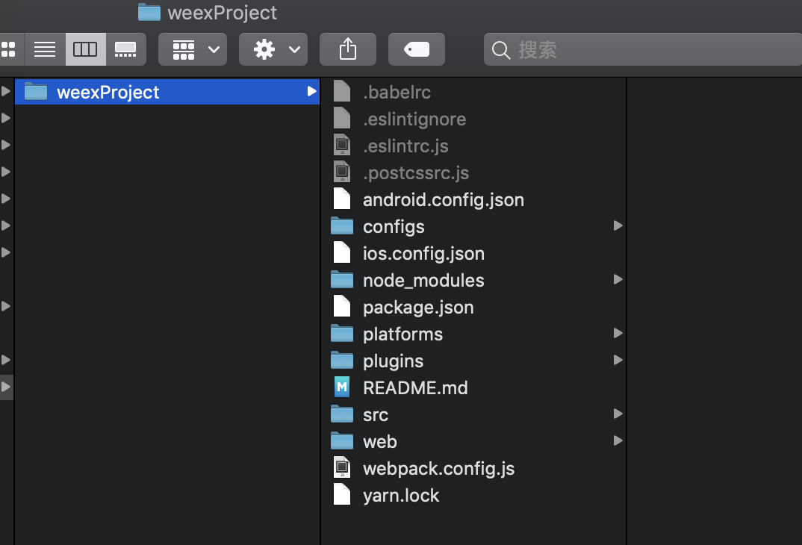
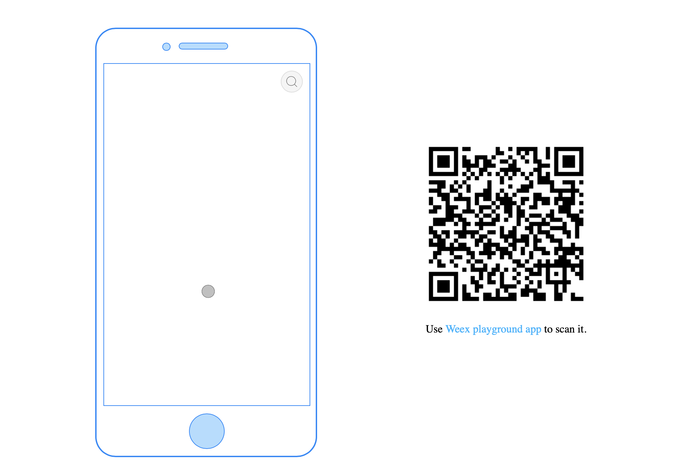
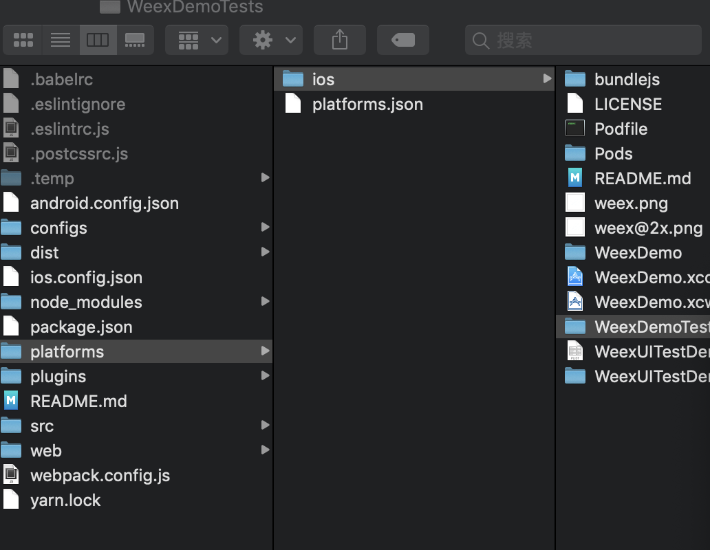

# WEEX - 快速上手

## 创建一个 App
::: tip
以下步骤假设您已经了解了 Node.js 和 npm 的基本知识。如果对它们不熟悉，可以访问 https://docs.npmjs.com/ 来了解更多关于 npm 的用法。
:::
Weex 提供了一个命令行工具 weex-toolkit 来帮助开发者使用 Weex。它可以用来快速创建一个空项目、初始化 iOS 和 Android 开发环境、调试、安装插件等操作。

目前 weex-toolkit 只支持创建 Vue.js 的项目。创建 Rax 的项目可以使用 rax-cli，参考 Rax 的官方网站 了解其用法。

## 初始化

请确保你已经安装了 Node.js，然后全局安装 weex-toolkit。
``` js
npm install weex-toolkit -g
```
这条命令会向你命令行环境中注册一个 weex 命令。你可以用 weex create 命令来创建一个空的模板项目：

``` js
weex create weexProject


? Project name my
? Project description aaa
? Author pan
? Select weex web render latest
? Use vue-router to manage your view router? (not recommended) Yes
? Use ESLint to lint your code? Yes
? Pick an ESLint preset Standard
? Set up unit tests No
? Should we run `npm install` for you after the project has been created? (recom
mended) yarn
11:43:28 : Generated weexProject


# Installing project dependencies ...
# ========================

yarn install v1.12.3
info No lockfile found.
[1/4] 🔍  Resolving packages...
warning css-loader > cssnano > autoprefixer > browserslist@1.7.7: Browserslist 2 could fail on reading Browserslist >3.0 config used in other tools.
warning css-loader > cssnano > postcss-merge-rules > browserslist@1.7.7: Browserslist 2 could fail on reading Browserslist >3.0 config used in other tools.
warning css-loader > cssnano > postcss-merge-rules > caniuse-api > browserslist@1.7.7: Browserslist 2 could fail on reading Browserslist >3.0 config used in other tools.
warning eslint > file-entry-cache > flat-cache > circular-json@0.3.3: CircularJSON is in maintenance only, flatted is its successor.
warning weex-loader > babel-preset-es2015@6.24.1: ????  Thanks for using Babel: we recommend using babel-preset-env now: please read babeljs.io/env to update! 
warning weex-vue-precompiler > autoprefixer > browserslist@2.11.3: Browserslist 2 could fail on reading Browserslist >3.0 config used in other tools.
[2/4] 🚚  Fetching packages...
[3/4] 🔗  Linking dependencies...
warning "weex-loader > babel-loader@6.4.1" has unmet peer dependency "babel-core@^6.0.0".
warning "weex-loader > babel-loader@6.4.1" has incorrect peer dependency "webpack@1 || 2 || ^2.1.0-beta || ^2.2.0-rc".
[4/4] 📃  Building fresh packages...
success Saved lockfile.
✨  Done in 31.11s.


Running eslint --fix to comply with chosen preset rules...
# ========================

yarn run v1.12.3
$ eslint --ext .js,.vue src  --fix
✨  Done in 1.21s.

Success! Created weexProject at /Users/panzhijun/Desktop/weex/weexProject

Inside that directory, you can run several commands:


  npm start
  Starts the development server for you to preview your weex page on browser
  You can also scan the QR code using weex playground to preview weex page on native

  npm run dev
  Open the code compilation task in watch mode

  npm run ios
  (Mac only, requires Xcode)
  Starts the development server and loads your app in an iOS simulator

  npm run android
  (Requires Android build tools)
  Starts the development server and loads your app on a connected Android device or emulator

  npm run pack:ios
  (Mac only, requires Xcode)
  Packaging ios project into ipa package

  npm run pack:android
  (Requires Android build tools)
  Packaging android project into apk package

  npm run pack:web
  Packaging html5 project into `web/build` folder

  npm run test
  Starts the test runner

To get started:

  cd weexProject
  npm start

Enjoy your hacking time!

```

命令执行完以后，在当前目录的 awesome-app 文件夹里就有了一个空的 Weex + Vue.js 项目。
如下图：




## 开发

下一步就是进入刚刚创建的文件夹，并且安装依赖，然后执行 npm start：

``` js
cd weexProject
npm install (这个都不用运行 里面有node_modules文件夹)
npm start

```
然后工具会启动一个本地的 web 服务，监听 8081 端口。你可以打开 http://localhost:8081 查看页面在 Web 下的渲染效果。 源代码在 src/ 目录中，你可以像一个普通的 Vue.js 项目一样来开发.


## 编译和运行

默认情况下 weex create 命令并不初始化 iOS 和 Android 项目，你可以通过执行 weex platform add 来添加特定平台的项目。

``` js
weex platform add ios

13:33:54 : Adding ios weexpack-ios@4.1.6 ...
13:33:54 : Success!

```

由于网络环境的不同，安装过程可能需要一些时间，请耐心等待。如果安装失败，请确保自己的网络环境畅通。

为了能在本地机器上打开 Android 和 iOS 项目，你应该配置好客户端的开发环境。对于 iOS，你应该安装并且配置好 Xcode。对于 Android，你应该安装并且配置好 Android Studio。当开发环境准备就绪后，运行下面的命令，可以在模拟器或真实设备上启动应用：

```js
weex run ios
```

或者进入ios目录 打开项目



## 调试

weex-toolkit 还提供了强大的调试功能，只需要执行：
``` js
weex debug
```

这条命令会启动一个调试服务，并且在 Chrome （目前只支持基于 V8 引擎的桌面浏览器） 中打开调试页面。详细用法请参考 weex-toolkit 的文档。