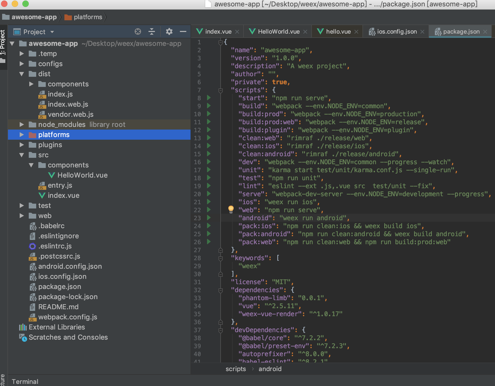
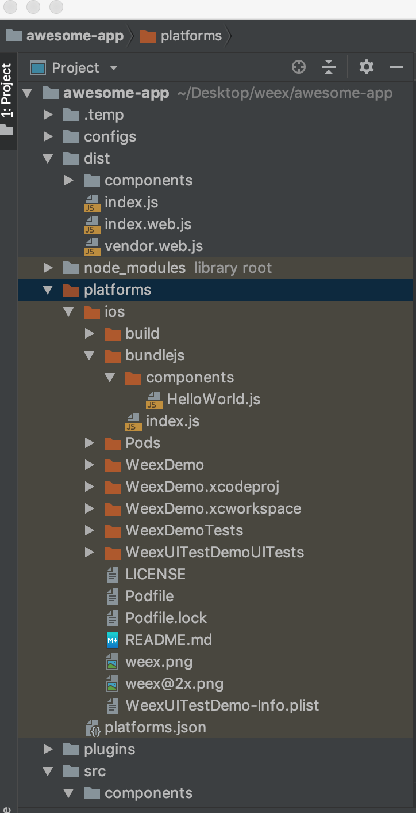
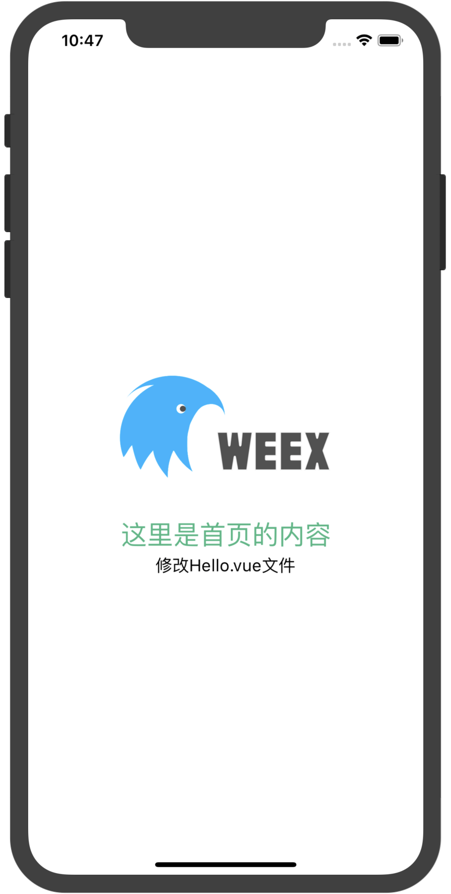

# WEEX - 原生使用

## 修改Vue文件

我们用Webstorm 打开我们创建的weex项目：


修改index.vue

``` vue
<template>
  <div class="wrapper">
    <image :src="logo" class="logo" />
    <text class="greeting">这里是首页的内容</text>
    <HelloWorld/>
  </div>
</template>

<script>
import HelloWorld from '@/components/HelloWorld'
export default {
  name: 'App',
  components: {
    HelloWorld
  },
  data () {
    return {
      logo: 'https://gw.alicdn.com/tfs/TB1yopEdgoQMeJjy1XaXXcSsFXa-640-302.png'
    }
  }
}
</script>

<style scoped>
  .wrapper {
    justify-content: center;
    align-items: center;
  }
  .logo {
    width: 424px;
    height: 200px;
  }
  .greeting {
    text-align: center;
    margin-top: 70px;
    font-size: 50px;
    color: #41B883;
  }
  .message {
    margin: 30px;
    font-size: 32px;
    color: #727272;
  }
</style>

```

下面是引用其他vue文件的写法

``` vue
import HelloWorld from '@/components/HelloWorld'

// 使用的话直接在对应的位置添加
  <HelloWorld/>
  即可调用其他vue文件

```


HelloWorld.vue 如下：

``` vue
<template>
  <text class="message">修改Hello.vue文件</text>
</template>


```


packgae.json 里面存在一些终端的命令

``` js
  "scripts": {
    "start": "npm run serve",
    "build": "webpack --env.NODE_ENV=common",
    "build:prod": "webpack --env.NODE_ENV=production",
    "build:prod:web": "webpack --env.NODE_ENV=release",
    "build:plugin": "webpack --env.NODE_ENV=plugin",
    "clean:web": "rimraf ./release/web",
    "clean:ios": "rimraf ./release/ios",
    "clean:android": "rimraf ./release/android",
    "dev": "webpack --env.NODE_ENV=common --progress --watch",
    "unit": "karma start test/unit/karma.conf.js --single-run",
    "test": "npm run unit",
    "lint": "eslint --ext .js,.vue src  test/unit --fix",
    "serve": "webpack-dev-server --env.NODE_ENV=development --progress",
    "ios": "weex run ios",
    "web": "npm run serve",
    "android": "weex run android",
    "pack:ios": "npm run clean:ios && weex build ios",
    "pack:android": "npm run clean:android && weex build android",
    "pack:web": "npm run clean:web && npm run build:prod:web"
  },

```

我们在终端输入：
``` js
npm run start
```
就会在浏览器中查看运行效果：


## 在模拟器中运行

``` js
npm run ios
```

等待一段时间，在文件夹platforms文件中



其中的index.js 和components文件夹下的HelloWorld.js 就会发生变化

``` js
/***/ }),
/* 7 */
/***/ (function(module, exports) {

module.exports={render:function (){var _vm=this;var _h=_vm.$createElement;var _c=_vm._self._c||_h;
  return _c('div', {
    staticClass: ["wrapper"]
  }, [_c('image', {
    staticClass: ["logo"],
    attrs: {
      "src": _vm.logo
    }
  }), _c('text', {
    staticClass: ["greeting"]
  }, [_vm._v("这里是首页的内容")]), _c('HelloWorld')], 1)
},staticRenderFns: []}
module.exports.render._withStripped = true

/***/ })
/******/ ]);

```

用Xcode运行项目就会在原生项目中查看到修改vue之后的效果：



