# MAC下使用Jekins自动打包iOS项目

## 安装Jenkins
在平时开发中，搭建环境什么的个人建议都使用命令行，不建议使用官网dmg的安装包。使用安装包会有权限问题。

1.安装brew

``` swift
/usr/bin/ruby -e "$(curl -fsSL https://raw.githubusercontent.com/Homebrew/install/master/install)"
```
2.升级java

``` swift
brew cask install java 
```

3.安装jenkins
``` swift

brew install jenkins
```

4.执行
``` swift

java -jar /usr/local/Cellar/jenkins/2.156/libexec/jenkins.war --httpPort=8080

```
::: tip
2.156是指Jenkins的版本号,不同版本替换不同版本
:::

5.链接launchd配置文件
``` swift

ln -sfv /usr/local/opt/jenkins/*.plist ~/Library/LaunchAgents
```
6.启动jenkins
``` swift

 launchctl load /Library/LaunchDaemons/org.jenkins-ci.plist 
```
7.停止jenkins
``` swift
 launchctl unload /Library/LaunchDaemons/org.jenkins-ci.plist 
``` 
打开浏览器,输入 localhost:8080 就可看到Jenkins的web界面

::: tip
安装注意：

若提示org.jenkins-ci.plist文件未找到,手动创建即可

sudo touch /Library/LaunchDaemons/org.jenkins-ci.plist

plist内容(具体内容根据不同设备可能需要稍作更改):
:::

``` swift

<?xml version="1.0" encoding="UTF-8"?>  
<!DOCTYPE plist PUBLIC "-//Apple//DTD PLIST 1.0//EN" "http://www.apple.com/DTDs/PropertyList-1.0.dtd">  
<plist version="1.0">  
<dict>  
<key>Label</key>  
<string>Jenkins</string>  
<key>ProgramArguments</key>  
<array>  
<string>/usr/bin/java</string>  
<string>-jar</string>  
<string>/usr/local/Cellar/jenkins/2.49/libexec/jenkins.war</string>  
</array>  
<key>OnDemand</key>  
<false/>  
<key>RunAtLoad</key>  
<true/>  
<key>UserName</key>  
<string>admin</string>  
</dict>  
</plist>
```

## 安装完成后，我们来进行实际运用

1. 进入首页

在浏览器中输入：http://localhost:8080 （因为在安装时，我设置的端口是8080）
初次打开，会需要进行插件安装
输入密码进入：
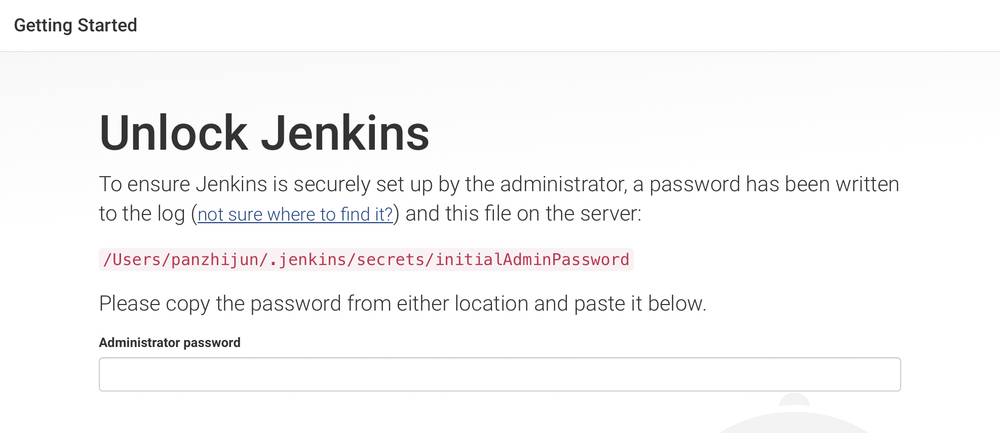

2. 安装推荐插件
  
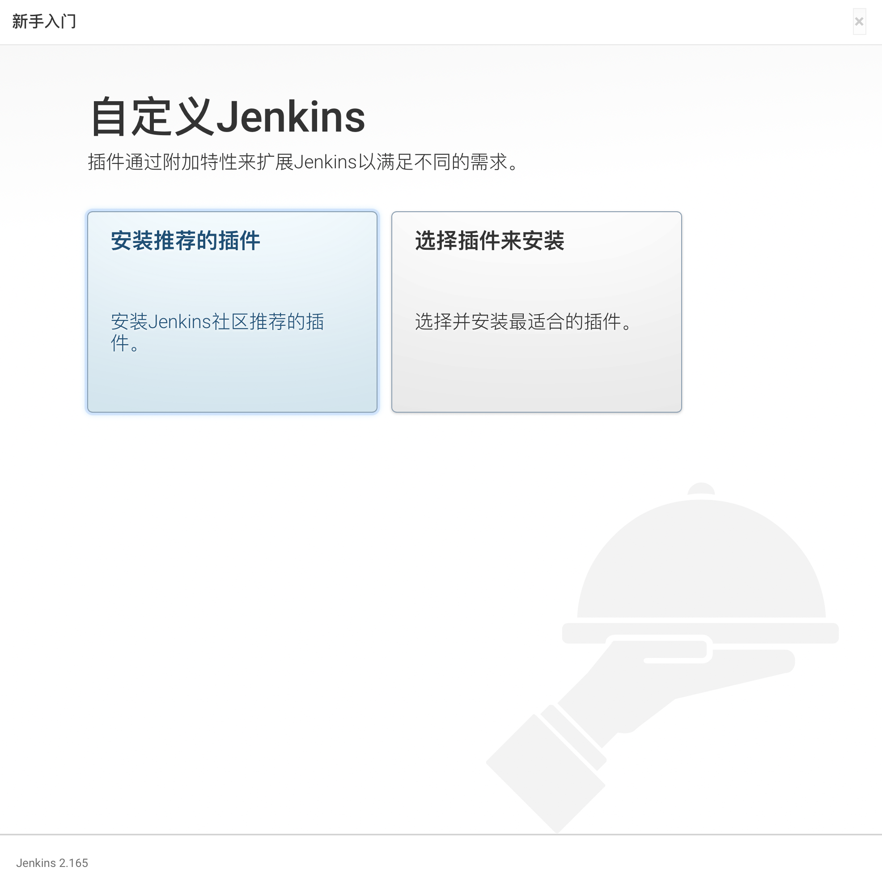

3. 等待安装完成
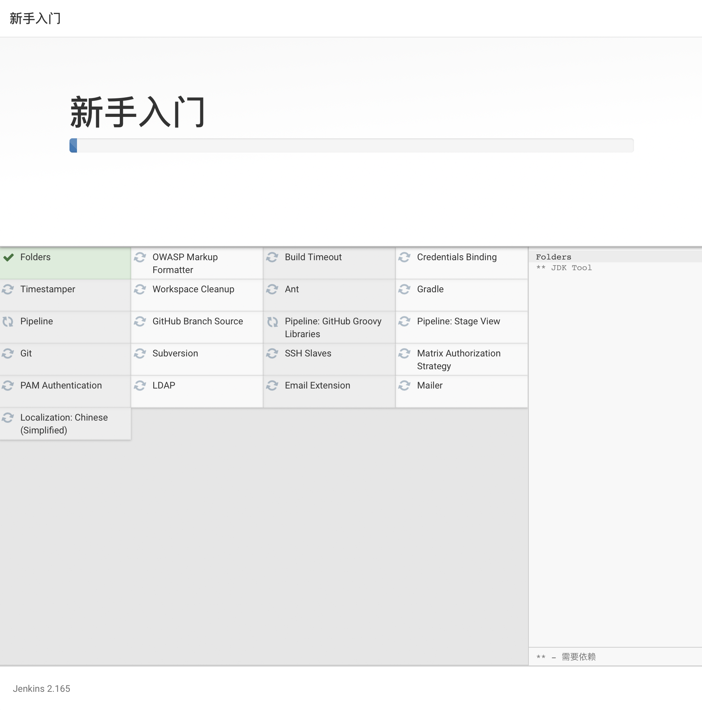

4. 创建用户


5. 配置
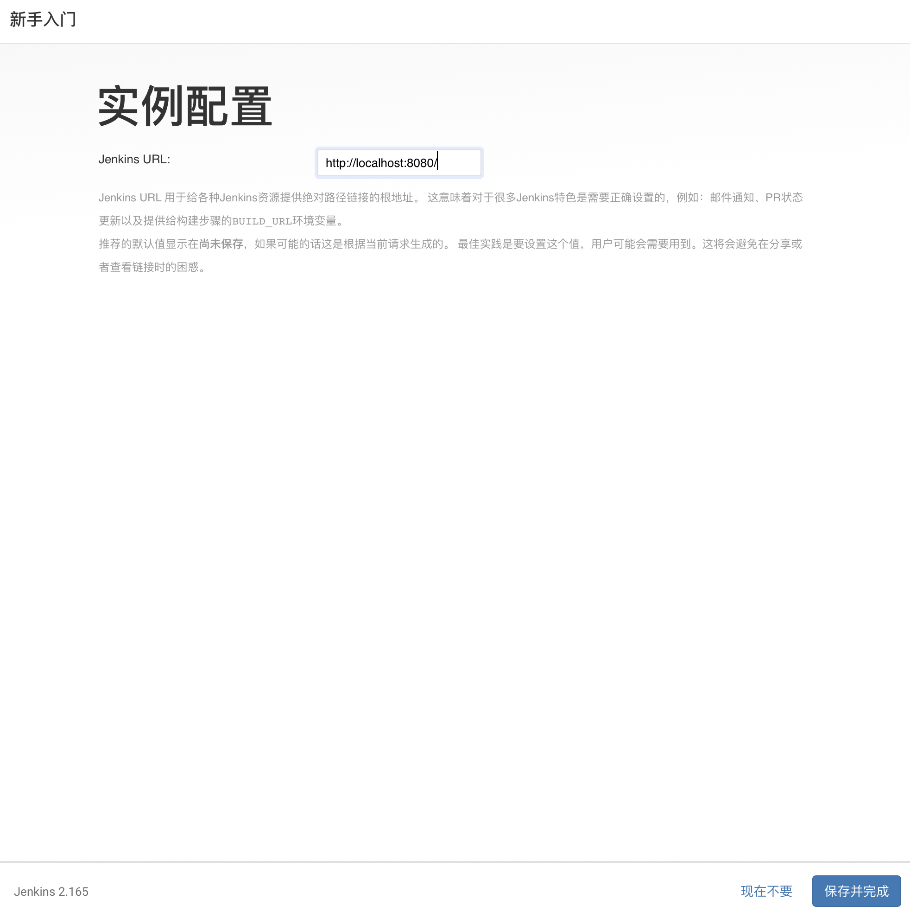

6. 就绪


7. 使用

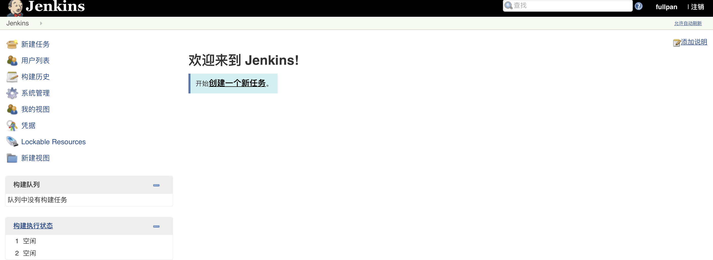


## 创建任务
1. 输入任意名称
 然后选择 构建一个自由风格的软件项目
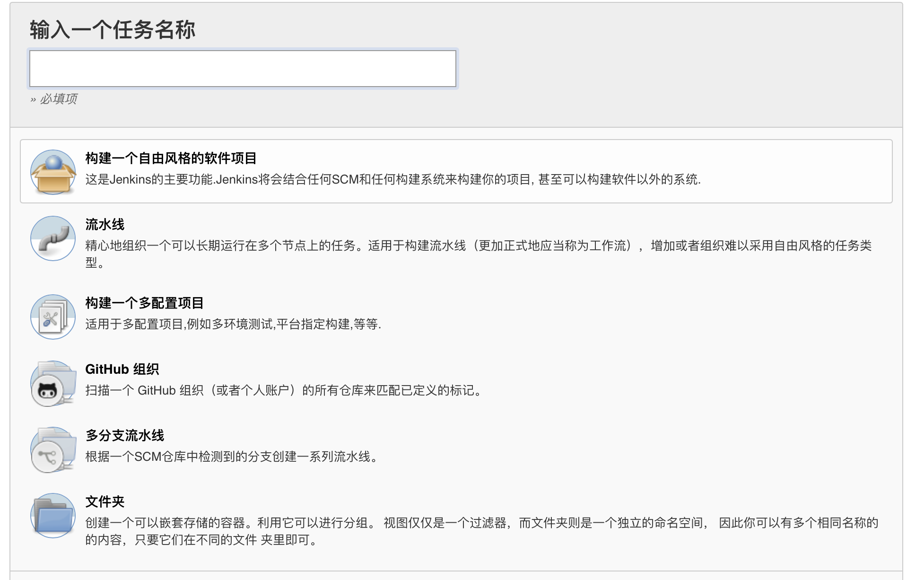

2. 源码管理
   选择自己的项目地址，这里使用git
   Respository URL: 这里输入git项目地址
   Credentials 这里点击添加 输入git的用户名和密码，然后再选中你添加的选项

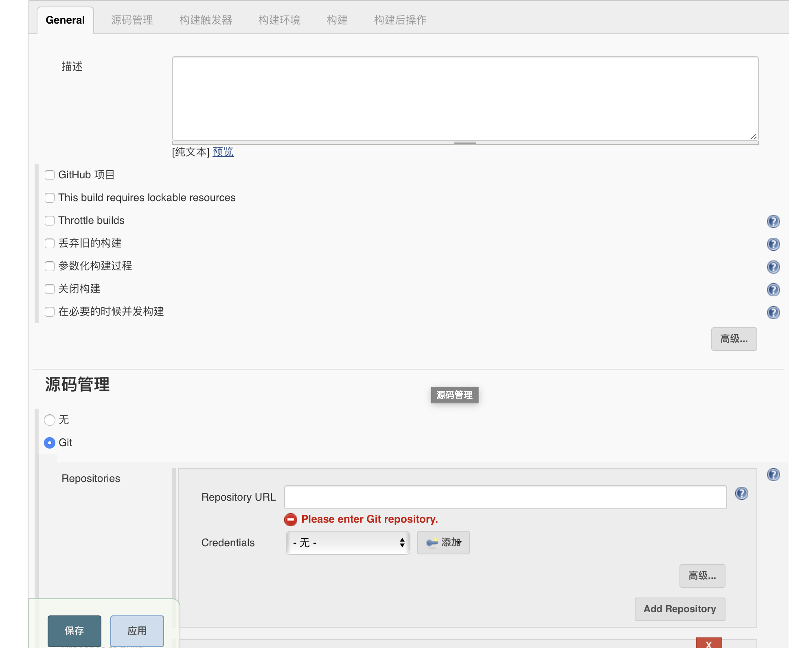

3. 构建
 这里选中执行shell
 
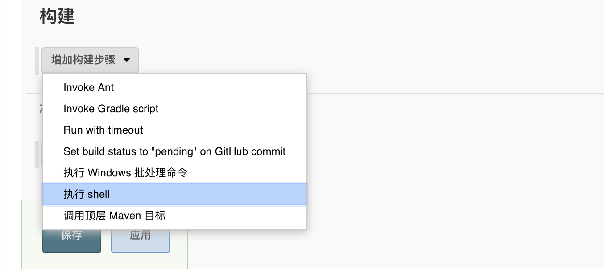
然后按下图输入执行脚本的路径。 然后点击保存，配置就完成了。

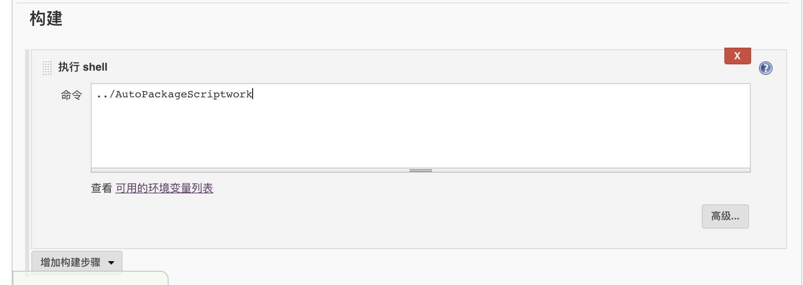

## 构建任务

1. 点击刚才创建的任务，点击执行立即构建(或者点击任务名称，进入详情页点击构建也一样)
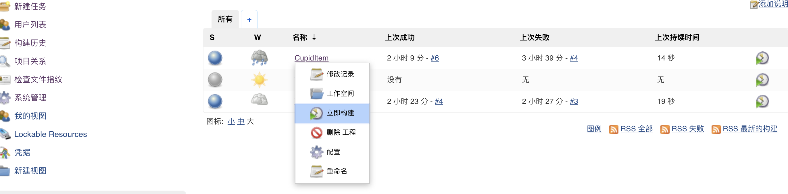

2. 左侧栏显示正在构建的进度

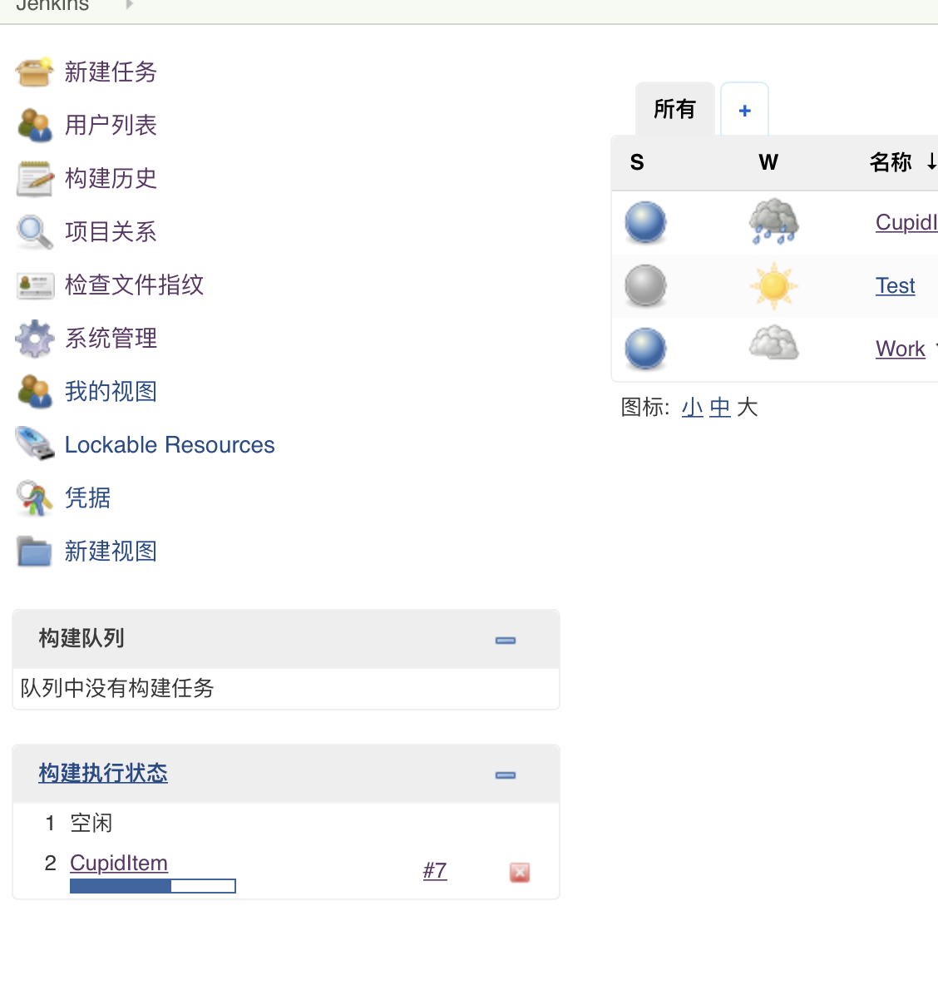

3. 构建的时候，会在如下图路径去通过git地址下载项目到workspace路径下。

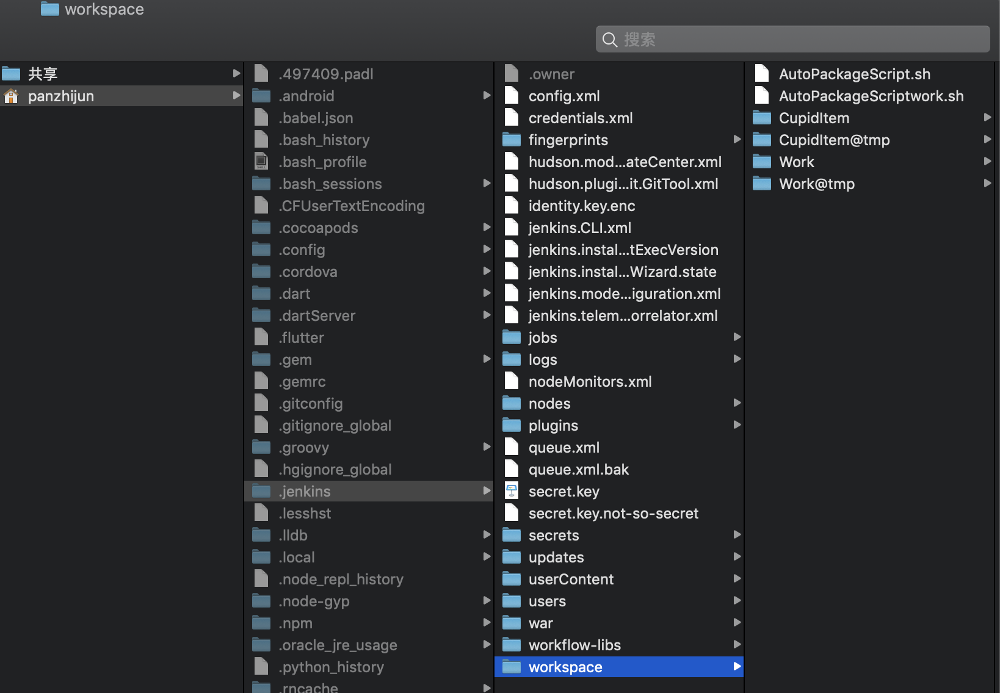

4. 执行的脚本如下：

``` swift

#!/bin/sh

# 使用方法:
# step1: 将该脚本放在工程的根目录下（跟.xcworkspace文件or .xcodeproj文件同目录）
# step2: 根据情况修改下面的参数
# step3: 打开终端，执行脚本。（输入sh，然后将脚本文件拉到终端，会生成文件路径，然后enter就可）

# =============项目自定义部分(自定义好下列参数后再执行该脚本)=================== #

# 是否编译工作空间 (例:若是用Cocopods管理的.xcworkspace项目,赋值true;用Xcode默认创建的.xcodeproj,赋值false)
is_workspace="true"

# .xcworkspace的名字，如果is_workspace为true，则必须填。否则可不填
workspace_name="BuildTestWork"

# .xcodeproj的名字，如果is_workspace为false，则必须填。否则可不填
project_name="BuildTestWork"

# 指定项目的scheme名称（也就是工程的target名称），必填
scheme_name="BuildTestWork"

# 指定要打包编译的方式 : Release,Debug。一般用Release。必填
build_configuration="Debug"

# method，打包的方式。方式分别为 development, ad-hoc, app-store, enterprise 。必填
method="development"


#  下面两个参数只是在手动指定Pofile文件的时候用到，如果使用Xcode自动管理Profile,直接留空就好
# (跟method对应的)mobileprovision文件名，需要先双击安装.mobileprovision文件.手动管理Profile时必填
mobileprovision_name="Dev_XXXXXXX"

# 项目的bundleID，手动管理Profile时必填
bundle_identifier="com.xxx.xxxxxx"


echo "--------------------脚本配置参数检查--------------------"
echo "\033[33;1mis_workspace=${is_workspace} "
echo "workspace_name=${workspace_name}"
echo "project_name=${project_name}"
echo "scheme_name=${scheme_name}"
echo "build_configuration=${build_configuration}"
echo "bundle_identifier=${bundle_identifier}"
echo "method=${method}"
echo "mobileprovision_name=${mobileprovision_name} \033[0m"


# =======================脚本的一些固定参数定义(无特殊情况不用修改)====================== #

# 获取当前脚本所在目录
script_dir="$( cd "$( dirname "$0"  )" && pwd  )"
# 工程根目录
project_dir="$script_dir/Work"

# 时间
DATE=`date '+%Y%m%d_%H%M%S'`
# 指定输出导出文件夹路径
export_path="$project_dir/Package/$scheme_name-$DATE"
# 指定输出归档文件路径
export_archive_path="$export_path/$scheme_name.xcarchive"
# 指定输出ipa文件夹路径
export_ipa_path="$export_path"
# 指定输出ipa名称
ipa_name="${scheme_name}_${DATE}"
# 指定导出ipa包需要用到的plist配置文件的路径
export_options_plist_path="$project_dir/ExportOptions.plist"


echo "--------------------脚本固定参数检查--------------------"
echo "\033[33;1mproject_dir=${project_dir}"
echo "DATE=${DATE}"
echo "export_path=${export_path}"
echo "export_archive_path=${export_archive_path}"
echo "export_ipa_path=${export_ipa_path}"
echo "export_options_plist_path=${export_options_plist_path}"
echo "ipa_name=${ipa_name} \033[0m"

# =======================自动打包部分(无特殊情况不用修改)====================== #

echo "------------------------------------------------------"
echo "\033[32m开始构建项目  \033[0m"
# 进入项目工程目录
cd ${project_dir}


# pod
 export LANG=en_US.UTF-8
 /usr/local/bin/pod install

# 指定输出文件目录不存在则创建
if [ -d "$export_path" ] ; then
    echo $export_path
else
    mkdir -pv $export_path
fi

# 判断编译的项目类型是workspace还是project
if $is_workspace ; then
# 编译前清理工程
xcodebuild clean -workspace ${workspace_name}.xcworkspace \
                 -scheme ${scheme_name} \
                 -configuration ${build_configuration}

xcodebuild archive -workspace ${workspace_name}.xcworkspace \
                   -scheme ${scheme_name} \
                   -configuration ${build_configuration} \
                   -archivePath ${export_archive_path}
else
# 编译前清理工程
xcodebuild clean -project ${project_name}.xcodeproj \
                 -scheme ${scheme_name} \
                 -configuration ${build_configuration}

xcodebuild archive -project ${project_name}.xcodeproj \
                   -scheme ${scheme_name} \
                   -configuration ${build_configuration} \
                   -archivePath ${export_archive_path}
fi

#  检查是否构建成功
#  xcarchive 实际是一个文件夹不是一个文件所以使用 -d 判断
if [ -d "$export_archive_path" ] ; then
    echo "\033[32;1m项目构建成功 🚀 🚀 🚀  \033[0m"
else
    echo "\033[31;1m项目构建失败 😢 😢 😢  \033[0m"
    exit 1
fi
echo "------------------------------------------------------"

echo "\033[32m开始导出ipa文件 \033[0m"


# 先删除export_options_plist文件
if [ -f "$export_options_plist_path" ] ; then
    #echo "${export_options_plist_path}文件存在，进行删除"
    rm -f $export_options_plist_path
fi
# 根据参数生成export_options_plist文件
/usr/libexec/PlistBuddy -c  "Add :method String ${method}"  $export_options_plist_path
/usr/libexec/PlistBuddy -c  "Add :provisioningProfiles:"  $export_options_plist_path
/usr/libexec/PlistBuddy -c  "Add :provisioningProfiles:${bundle_identifier} String ${mobileprovision_name}"  $export_options_plist_path


xcodebuild  -exportArchive \
            -archivePath ${export_archive_path} \
            -exportPath ${export_ipa_path} \
            -exportOptionsPlist ${export_options_plist_path} \
            -allowProvisioningUpdates

# 检查ipa文件是否存在
if [ -f "$export_ipa_path/$scheme_name.ipa" ] ; then
    echo "\033[32;1mexportArchive ipa包成功,准备进行重命名\033[0m"
else
    echo "\033[31;1mexportArchive ipa包失败 😢 😢 😢     \033[0m"
    exit 1
fi

# 修改ipa文件名称
mv $export_ipa_path/$scheme_name.ipa $export_ipa_path/$ipa_name.ipa

# 检查文件是否存在
if [ -f "$export_ipa_path/$ipa_name.ipa" ] ; then
    echo "\033[32;1m导出 ${ipa_name}.ipa 包成功 🎉  🎉  🎉   \033[0m"
    open $export_path
else
    echo "\033[31;1m导出 ${ipa_name}.ipa 包失败 😢 😢 😢     \033[0m"
    exit 1
fi

# 删除export_options_plist文件（中间文件）
if [ -f "$export_options_plist_path" ] ; then
    #echo "${export_options_plist_path}文件存在，准备删除"
    rm -f $export_options_plist_path
fi

# 输出打包总用时
echo "\033[36;1m使用AutoPackageScript打包总用时: ${SECONDS}s \033[0m"

exit 0

```

::: tip
AutoPackageScriptwork.sh 脚本的路径相对于BuildTestWork.xcworkspace文件所在在路径，所以上一步中 执行的shell路径为../AutoPackageScriptwork.sh

ExportOptions.plist 是shell脚本生成的。
:::

5. 打包过程的日志。
 打包过程可以在在构建历史中的列表中选中最近的打包，然后点击控制台输出，来查看打包出现的问题。
 
 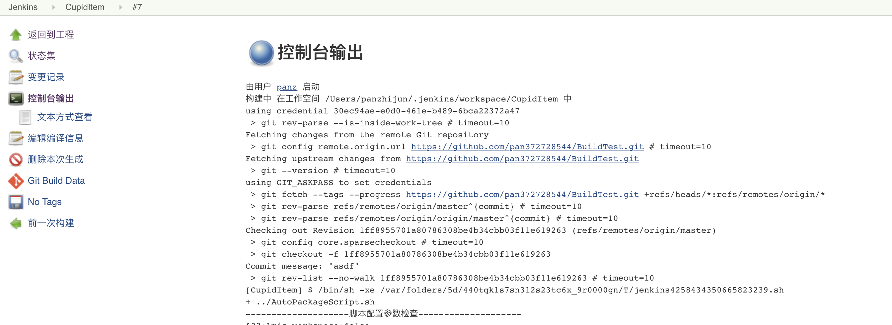
 
 
## 卸载jenkins
 
 ``` swift
 
 //进入以下目录，双击运行
/Library/Application Support/Jenkins/Uninstall.command
```