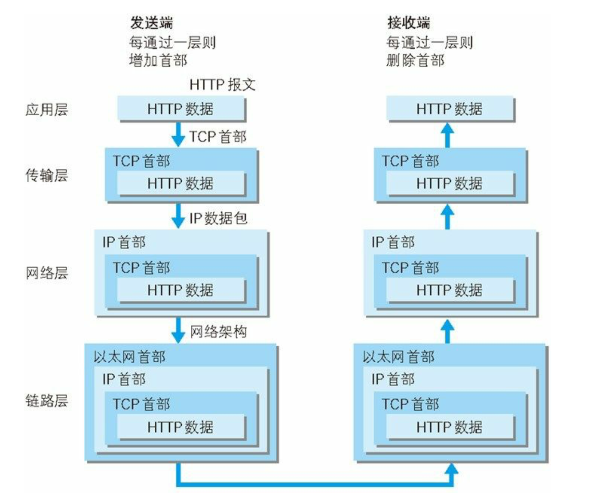
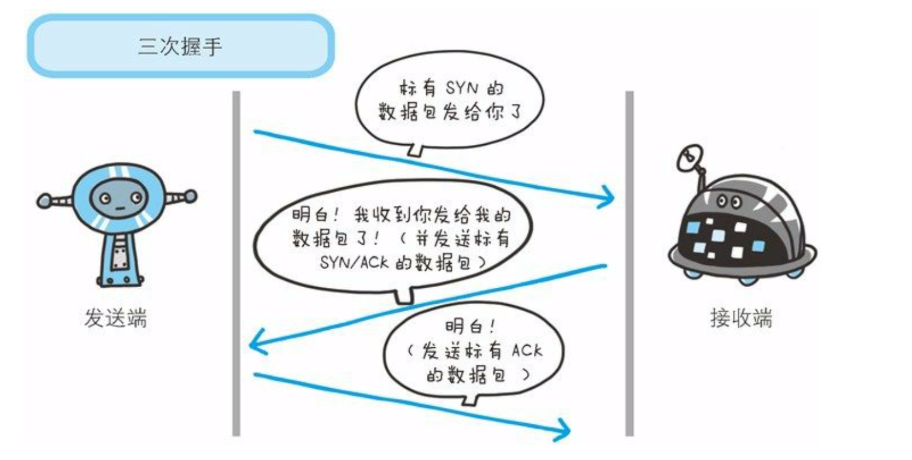

# 图解HTTP

## TCP/IP协议族各层的作用

1. 应用层
   FTP、DNS、HTTP
2. 传输层
   UDP、TCP
3. 网络层
   IP
4. 链路层

TCP协议采用了三次握手策略

发送端发送一个带有SYN（synchronize）标志的数据包给对方。接收端收到后回传一个带有SYN/ACK(acknowledgement)标志的数据包以示传达确认信息。最后发送端在回传一个带ACK标志的数据包，代表握手结束。
若在握手过程中某个阶段莫名中断，TCP协议会再次以相同的顺序发送相同的数据包。

