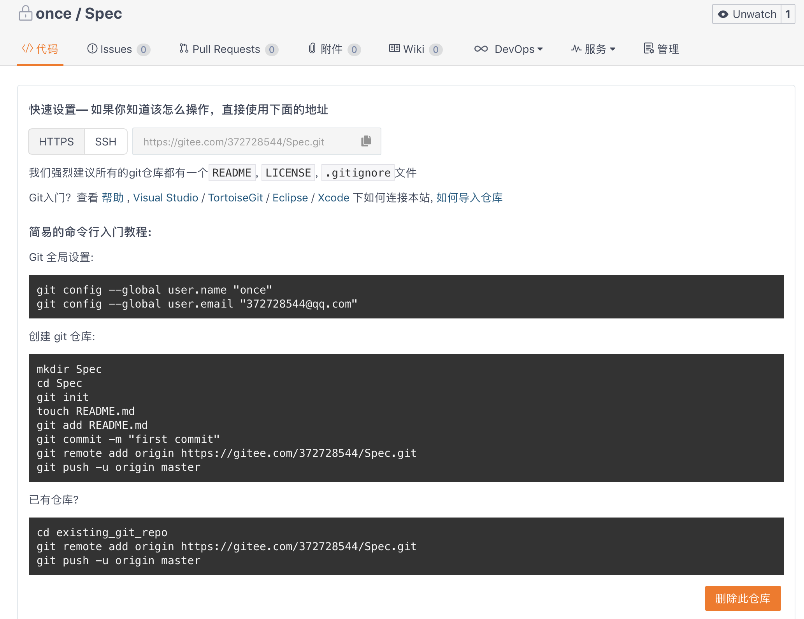
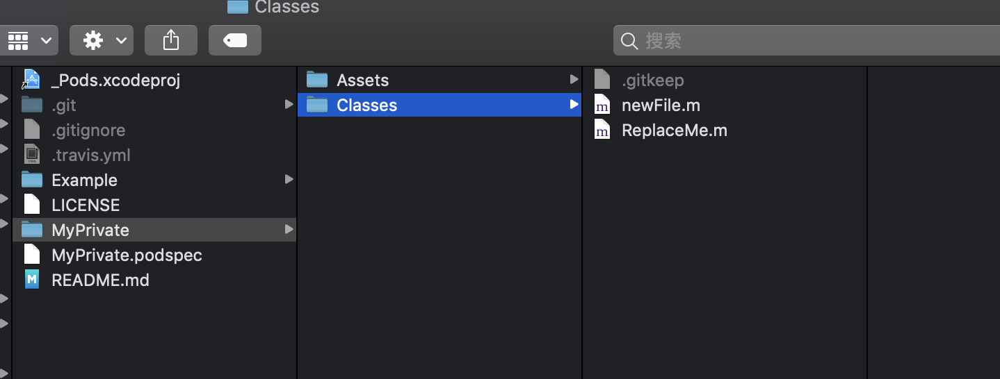
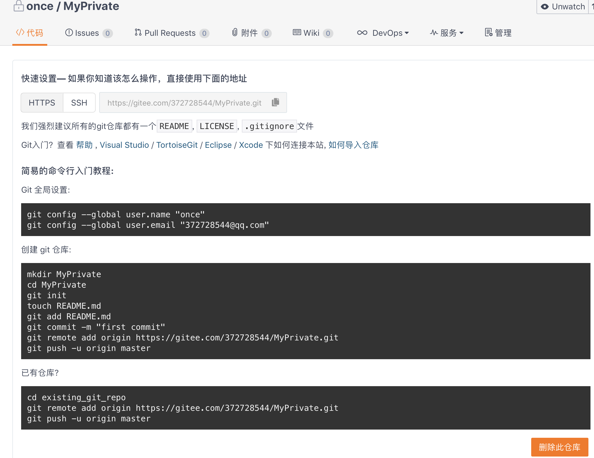
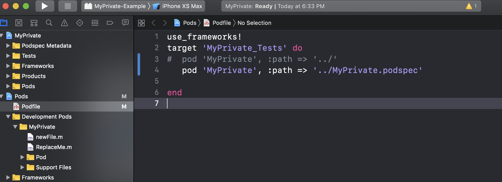
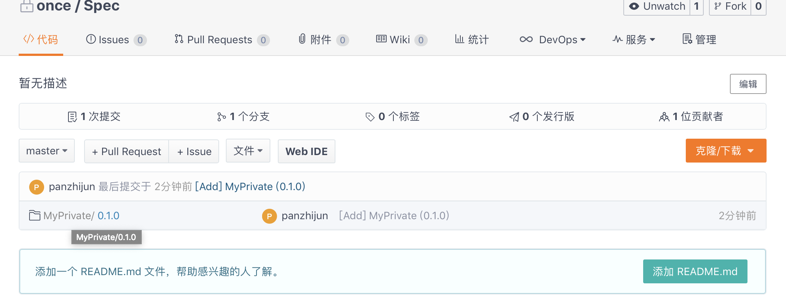
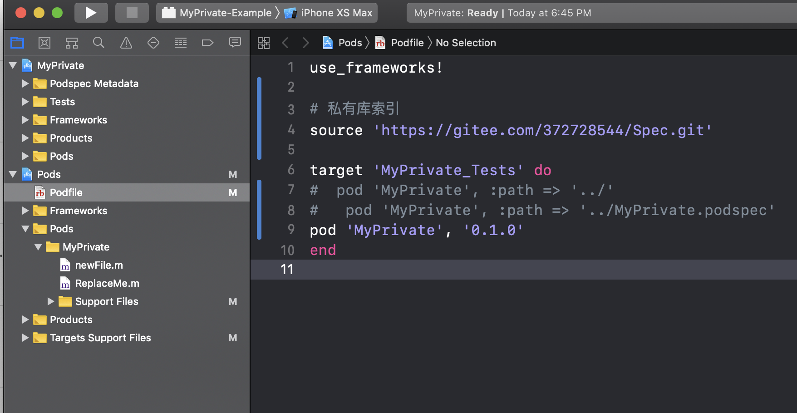

#  一、 创建私有库的索引

1 这里我们使用码云创建。名字Spec，然后点击创建。


2 创建好后如下图：




3 将Spec添加到CocoaPods中

在终端执行如下命令：

```

 pod repo add Spec https://gitee.com/372728544/Spec.git

```

这是在执行：

``` 

pod repo

```

显示的列表中就会出现新增加的Spec了

``` 

Spec

fatal: ambiguous argument 'HEAD': unknown revision or path not in the working tree.

Use '--' to separate paths from revisions, like this:

'git <command> [<revision>...] -- [<file>...]'

- Type: git (unknown)

- URL:  https://gitee.com/372728544/Spec.git

- Path: /Users/panzhijun/.cocoapods/repos/Spec

```


# 二 创建私有库

1 创建好索引后就开始创建私有库了

在终端中，进入桌面，执行如下创建命令

``` 

pod lib create MyPrivate

```

2 成功之后，就会提示你选择平台，语言等。输入完成之后会自动打开工程。

``` 

What platform do you want to use?? [ iOS / macOS ]

 >iOS

What language do you want to use?? [ Swift / ObjC ]

 >ObjC

Would you like to include a demo application with your library? [ Yes / No ]

 >No

Which testing frameworks will you use? [ Specta / Kiwi / None ]

 >None

Would you like to do view based testing? [ Yes / No ]

 >No

What is your class prefix?

 >AAA

```

3 在MyPrivate->MyPrivate->Classes文件夹下添加你需要的文件




4 在码云上面创建一个地址，把工程上传到git上面去。




命令如下：

``` 

 cd /Users/panzhijun/Desktop/MyPrivate/

 git add .

git commit -m "test"

git remote add origin  https://gitee.com/372728544/MyPrivate.git

 git push -u origin master

```

4 添加podspec标签

终端执行：

``` 

git tag "0.1.0" -m "提交说明"

 git push --tags

```

# 三 创建私有库到索引中

1 MyPrivate.podspec文件如下：

```

#

# Be sure to run `pod lib lint MyPrivate.podspec' to ensure this is a

# valid spec before submitting.

#

# Any lines starting with a # are optional, but their use is encouraged

# To learn more about a Podspec see https://guides.cocoapods.org/syntax/podspec.html

#

Pod::Spec.new do |s|

  s.name            = 'MyPrivate'

  s.version          = '0.1.0'

  s.summary          = 'A short description of MyPrivate.'

# This description is used to generate tags and improve search results.

#  * Think: What does it do? Why did you write it? What is the focus?

#  * Try to keep it short, snappy and to the point.

#  * Write the description between the DESC delimiters below.

#  * Finally, don't worry about the indent, CocoaPods strips it!

  s.description      = <<-DESC

TODO: Add long description of the pod here.

                       DESC

  s.homepage        = 'https://gitee.com/372728544/MyPrivate'

  # s.screenshots    = 'www.example.com/screenshots_1', 'www.example.com/screenshots_2'

  s.license          = { :type => 'MIT', :file => 'LICENSE' }

  s.author          = { 'pan372728544' => 'panzhijun@gomeplus.com' }

  s.source          = { :git => 'https://gitee.com/372728544/MyPrivate.git', :tag => s.version.to_s }

# s.social_media_url = 'https://twitter.com/'

  s.ios.deployment_target = '8.0'

  s.source_files = 'MyPrivate/Classes/**/*'

  # s.resource_bundles = {

  #  'MyPrivate' => ['MyPrivate/Assets/*.png']

  # }

  # s.public_header_files = 'Pod/Classes/**/*.h'

  # s.frameworks = 'UIKit', 'MapKit'

  # s.dependency 'AFNetworking', '~> 2.3'

end

```

2 验证podspec文件

```

pod lib lint --allow-warnings

 ->MyPrivate (0.1.0)

    - WARN  | summary: The summary is not meaningful.

    - WARN  | url: The URL (https://gitee.com/372728544/MyPrivate) is not reachable.

    - NOTE  | xcodebuild:  note: Using new build system

    - NOTE  | [iOS] xcodebuild:  note: Planning build

    - NOTE  | [iOS] xcodebuild:  note: Constructing build description

    - NOTE  | [iOS] xcodebuild:  warning: Skipping code signing because the target does not have an Info.plist file. (in target 'App')

MyPrivate passed validation.

```

MyPrivate passed validation 标示验证通过。

3 本地测试podspec文件

修改Example工程的Podfile文件

```

use_frameworks!

target 'MyPrivate_Tests' do

#  pod 'MyPrivate', :path => '../'

   pod'MyPrivate', :path => '../MyPrivate.podspec'


end

```

执行pod install，pod已经出现了。




4 在索引中提交podspec

cd到有MyPrivate.podspec的文件夹

```

pod repo push Spec MyPrivate.podspec --allow-warnings

```

成功之后显示：

```

Validating spec

 ->MyPrivate (0.1.0)

    - WARN  | summary: The summary is not meaningful.

    - WARN  | url: The URL (https://gitee.com/372728544/MyPrivate) is not reachable.

    - WARN  | [iOS] license: Unable to find a license file

    - NOTE  | xcodebuild:  note: Using new build system

    - NOTE  | [iOS] xcodebuild:  note: Planning build

    - NOTE  | [iOS] xcodebuild:  note: Constructing build description

    - NOTE  | [iOS] xcodebuild:  warning: Skipping code signing because the target does not have an Info.plist file. (in target 'App')

Updating the `Spec' repo

Your configuration specifies to merge with the ref 'refs/heads/master'

from the remote, but no such ref was fetched.

Adding the spec to the `Spec' repo

 - [Add] MyPrivate (0.1.0)

Pushing the `Spec' repo

[!] Unable to read the license file `LICENSE` for the spec `MyPrivate (0.1.0)`

[!] Unable to read the license file `LICENSE` for the spec `MyPrivate (0.1.0)`

```

查看码云上面已经记录了



# 四 使用私有库

1 在Example中修改Podfile

```

use_frameworks!

# 私有库索引

source 'https://gitee.com/372728544/Spec.git'

target 'MyPrivate_Tests' do

#  pod 'MyPrivate', :path => '../'

#  pod 'MyPrivate', :path => '../MyPrivate.podspec'

pod 'MyPrivate', '0.1.0'

end

```

2 pod install之后就可以看到了




