# Object-C - 关联对象实现原理

::: tip
**Category能否添加成员变量？如果可以，如何给Category添加成员变量？**

**答：不能直接添加成员变量，但是可以通过runtime的方式间接实现添加成员变量的效果。**
:::

## RunTime为Category动态关联对象
使用RunTime给系统的类添加属性，首先需要了解对象与属性的关系。我们通过之前的学习知道，对象一开始初始化的时候其属性为nil，给属性赋值其实就是让属性指向一块存储内容的内存，使这个对象的属性跟这块内存产生一种关联。
那么如果想动态的添加属性，其实就是动态的产生某种关联就好了。而想要给系统的类添加属性，只能通过分类。
这里给NSObject添加name属性，创建NSObject的分类
我们可以使用@property给分类添加属性
``` swift
@property(nonatomic,strong)NSString *name;
```
通过探寻Category的本质我们知道，虽然在分类中可以写@property
添加属性，但是不会自动生成私有属性，也不会生成set,get方法的实现，只会生成set,get的声明，需要我们自己去实现。
**方法一：我们可以通过使用静态全局变量给分类添加属性**
``` swift
static NSString *_name;
-(void)setName:(NSString *)name
{
    _name = name;
}
-(NSString *)name
{
    return _name;
}
```
但是这样_name静态全局变量与类并没有关联，无论对象创建与销毁，只要程序在运行_name变量就存在，并不是真正意义上的属性。

**方法二：使用RunTime动态添加属性**

RunTime提供了动态添加属性和获得属性的方法。
``` swift
-(void)setName:(NSString *)name
{
    objc_setAssociatedObject(self, @"name",name, OBJC_ASSOCIATION_RETAIN_NONATOMIC);
}
-(NSString *)name
{
    return objc_getAssociatedObject(self, @"name");    
}
```

1. 动态添加属性

``` swift
objc_setAssociatedObject(id object, const void *key, id value, objc_AssociationPolicy policy);
```
::: tip

- 参数一：id object : 给哪个对象添加属性，这里要给自己添加属性，用self。
- 参数二：void * == id key : 属性名，根据key获取关联对象的属性的值，在-objc_getAssociatedObject中通过次key获得属性的值并返回。
- 参数三：id value : 关联的值，也就是set方法传入的值给属性去保存。
- 参数四：objc_AssociationPolicy policy : 策略，属性以什么形式保存。
:::
有以下几种

``` swift
typedef OBJC_ENUM(uintptr_t, objc_AssociationPolicy) {
    OBJC_ASSOCIATION_ASSIGN = 0,  // 指定一个弱引用相关联的对象
    OBJC_ASSOCIATION_RETAIN_NONATOMIC = 1, // 指定相关对象的强引用，非原子性
    OBJC_ASSOCIATION_COPY_NONATOMIC = 3,  // 指定相关的对象被复制，非原子性
    OBJC_ASSOCIATION_RETAIN = 01401,  // 指定相关对象的强引用，原子性
    OBJC_ASSOCIATION_COPY = 01403     // 指定相关的对象被复制，原子性   
};

```

key值只要是一个指针即可，我们可以传入@selector(name)

2. 获得属性

``` swift
objc_getAssociatedObject(id object, const void *key);
```
::: tip

- 参数一：id object : 获取哪个对象里面的关联的属性。
- 参数二：void * == id key : 什么属性，与objc_setAssociatedObject中的key相对应，即通过key值取出value。
:::

3. 移除所有关联对象

``` swift
 - (void)removeAssociatedObjects
{
    // 移除所有关联对象
    objc_removeAssociatedObjects(self);
}
```
此时已经成功给NSObject添加name属性，并且NSObject对象可以通过点语法为属性赋值。
``` swift
NSObject *objc = [[NSObject alloc]init];
objc.name = @"abc";
NSLog(@"%@",objc.name);
```

NSObject *objc = [[NSObject alloc]init];
objc.name = @"xx_cc";
NSLog(@"%@",objc.name);

可以看出关联对象的使用非常简单，接下来我们来探寻关联对象的底层原理
## 关联对象原理
实现关联对象技术的核心对象有

- AssociationsManager - AssociationsHashMap
- ObjectAssociationMap
- ObjcAssociation
其中Map同我们平时使用的字典类似。通过key-value一一对应存值。

对关联对象技术的核心对象有了一个大概的意识，我们通过源码来探寻这些对象的存在形式以及其作用

**objc_setAssociatedObject函数**
来到runtime源码，首先找到objc_setAssociatedObject函数，看一下其实现

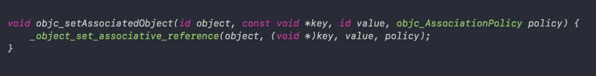

我们看到其实内部调用的是_object_set_associative_reference函数，我们来到_object_set_associative_reference函数中

**_object_set_associative_reference函数**


_object_set_associative_reference函数内部我们可以全部找到我们上面说过的实现关联对象技术的核心对象。接下来我们来一个一个看其内部实现原理探寻他们之间的关系。

**AssociationsManager**

通过AssociationsManager内部源码发现，AssociationsManager内部有一个AssociationsHashMap对象。

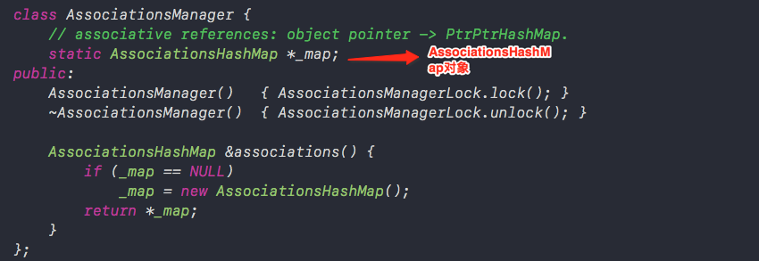

**AssociationsHashMap**

我们来看一下AssociationsHashMap内部的源码。
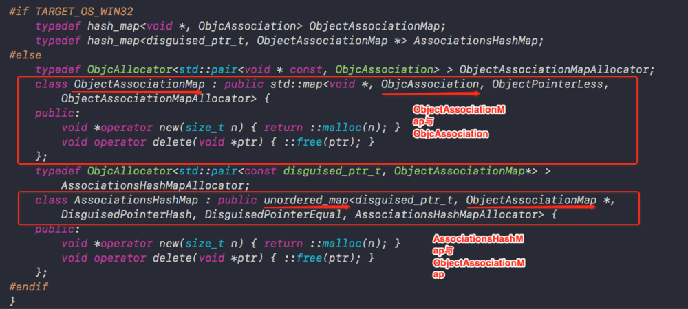

通过AssociationsHashMap内部源码我们发现AssociationsHashMap继承自unordered_map首先来看一下unordered_map内的源码


从unordered_map源码中我们可以看出_Key和_Tp也就是前两个参数对应着map中的Key和Value，那么对照上面AssociationsHashMap内源码发现_Key中传入的是disguised_ptr_t，_Tp中传入的值则为ObjectAssociationMap*。
紧接着我们来到ObjectAssociationMap中，上图中ObjectAssociationMap已经标记出，我们发现ObjectAssociationMap中同样以key、Value的方式存储着ObjcAssociation。
接着我们来到ObjcAssociation中


我们发现ObjcAssociation存储着_policy、_value，而这两个值我们可以发现正是我们调用objc_setAssociatedObject函数传入的值，也就是说我们在调用objc_setAssociatedObject函数中传入的value和policy这两个值最终是存储在ObjcAssociation中的。
现在我们已经对AssociationsManager、 AssociationsHashMap、 ObjectAssociationMap、ObjcAssociation四个对象之间的关系有了简单的认识，那么接下来我们来细读源码，看一下objc_setAssociatedObject函数中传入的四个参数分别放在哪个对象中充当什么作用。

**重新回到_object_set_associative_reference函数实现中**


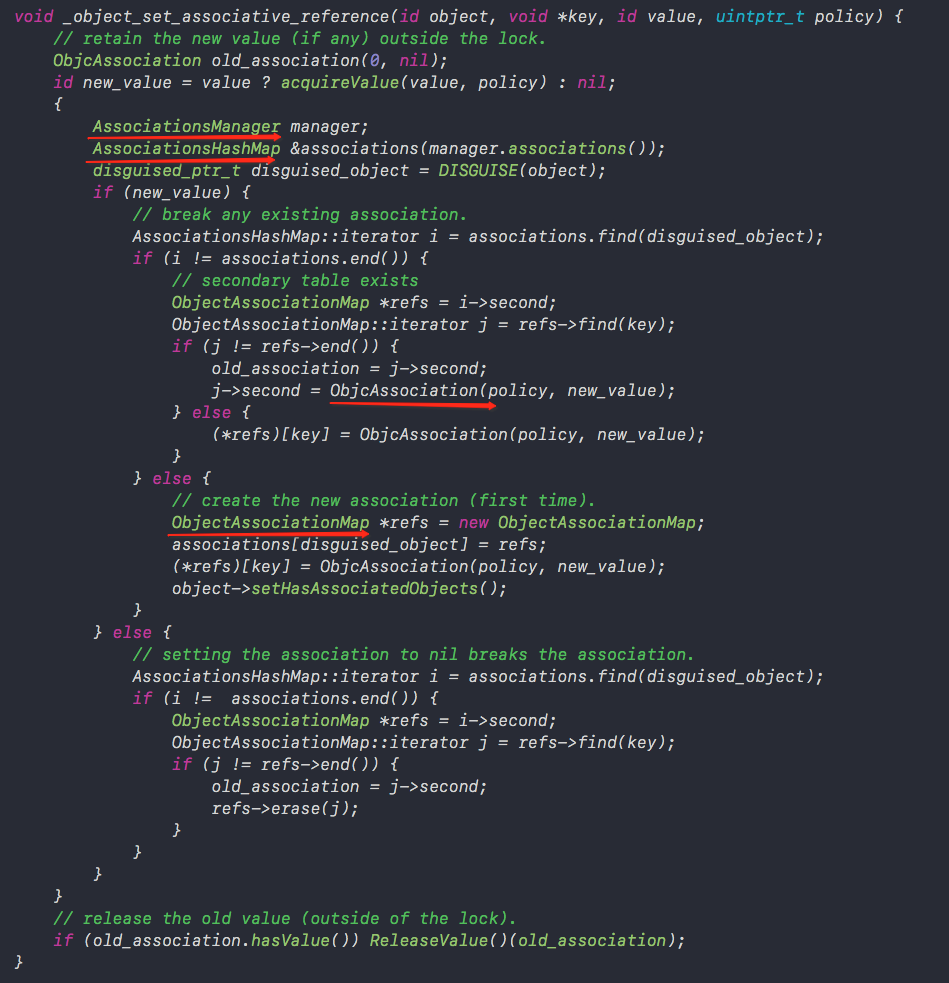

细读上述源码我们可以发现，首先根据我们传入的value经过acquireValue函数处理获取new_value。acquireValue函数内部其实是通过对策略的判断返回不同的值

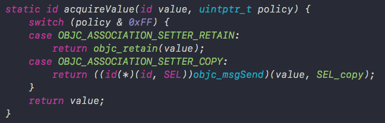

之后创建AssociationsManager manager;以及拿到manager内部的AssociationsHashMap即associations。
之后我们看到了我们传入的第一个参数object
object经过DISGUISE函数被转化为了disguised_ptr_t类型的disguised_object。


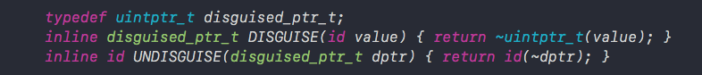

DISGUISE函数其实仅仅对object做了位运算
之后我们看到被处理成new_value的value，同policy被存入了ObjcAssociation中。
而ObjcAssociation对应我们传入的key被存入了ObjectAssociationMap中。
disguised_object和ObjectAssociationMap则以key-value的形式对应存储在associations中也就是AssociationsHashMap中。


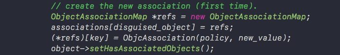

如果我们value设置为nil的话那么会执行下面的代码

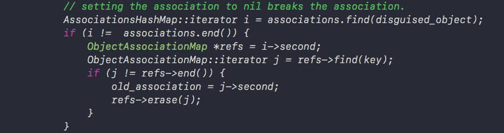

从上述代码中可以看出，如果我们设置value为nil时，就会将关联对象从ObjectAssociationMap中移除。

最后我们通过一张图可以很清晰的理清楚其中的关系


通过上图我们可以总结为：一个实例对象就对应一个ObjectAssociationMap，而ObjectAssociationMap中存储着多个此实例对象的关联对象的key以及ObjcAssociation，为ObjcAssociation中存储着关联对象的value和policy策略。
由此我们可以知道关联对象并不是放在了原来的对象里面，而是自己维护了一个全局的map用来存放每一个对象及其对应关联属性表格。
**objc_getAssociatedObject函数**
objc_getAssociatedObject内部调用的是_object_get_associative_reference


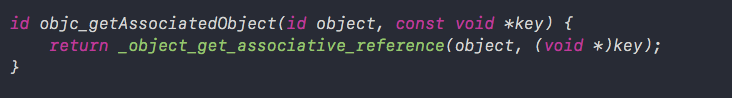

**_object_get_associative_reference函数**

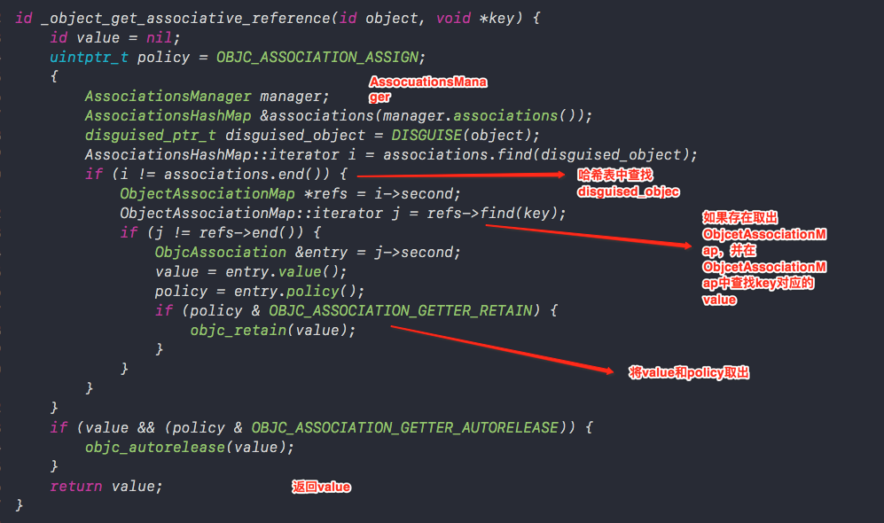

从_object_get_associative_reference函数内部可以看出，向set方法中那样，反向将value一层一层取出最后return出去。
**objc_removeAssociatedObjects函数**
objc_removeAssociatedObjects用来删除所有的关联对象，objc_removeAssociatedObjects函数内部调用的是_object_remove_assocations函数


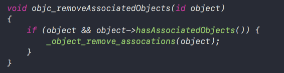

**_object_remove_assocations函数**

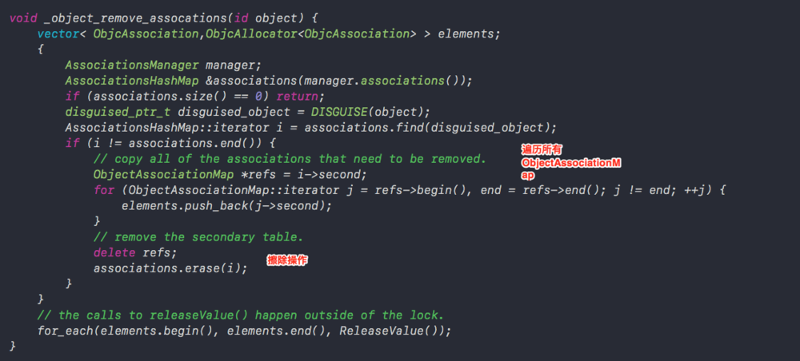

上述源码可以看出_object_remove_assocations函数将object对象向对应的所有关联对象全部删除。

::: tip
**总结：**
关联对象并不是存储在被关联对象本身内存中，而是存储在全局的统一的一个AssociationsManager中，如果设置关联对象为nil，就相当于是移除关联对象。
:::

此时我们我们在回过头来看objc_AssociationPolicy policy 参数: 属性以什么形式保存的策略。

``` swift
typedef OBJC_ENUM(uintptr_t, objc_AssociationPolicy) {
    OBJC_ASSOCIATION_ASSIGN = 0,  // 指定一个弱引用相关联的对象
    OBJC_ASSOCIATION_RETAIN_NONATOMIC = 1, // 指定相关对象的强引用，非原子性
    OBJC_ASSOCIATION_COPY_NONATOMIC = 3,  // 指定相关的对象被复制，非原子性
    OBJC_ASSOCIATION_RETAIN = 01401,  // 指定相关对象的强引用，原子性
    OBJC_ASSOCIATION_COPY = 01403     // 指定相关的对象被复制，原子性   
};
```

我们会发现其中只有RETAIN和COPY而为什么没有weak呢？
总过上面对源码的分析我们知道，object经过DISGUISE函数被转化为了disguised_ptr_t类型的
``` swift
disguised_object。
disguised_ptr_t disguised_object = DISGUISE(object);
```

而同时我们知道，weak修饰的属性，当没有拥有对象之后就会被销毁，并且指针置位nil，那么在对象销毁之后，虽然在map中既然存在值object对应的AssociationsHashMap，但是因为object地址已经被置位nil，会造成坏地址访问而无法根据object对象的地址转化为disguised_object了。

