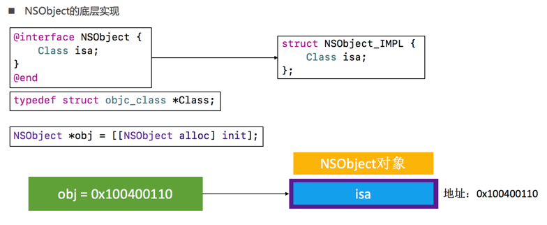
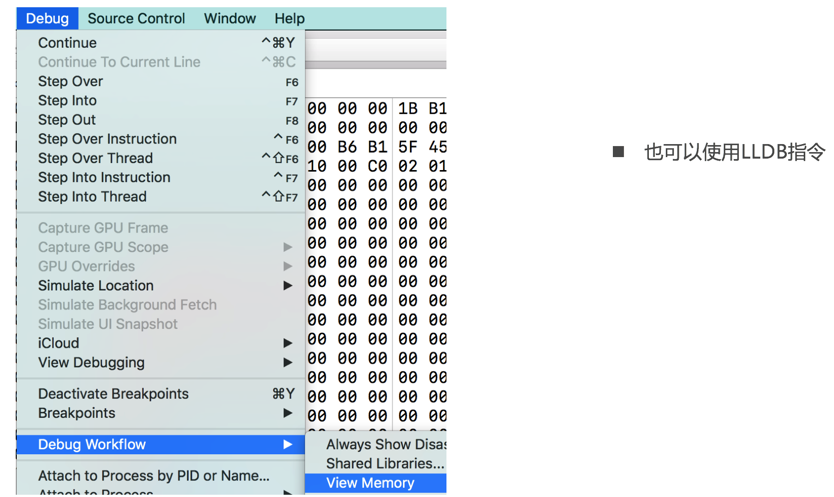
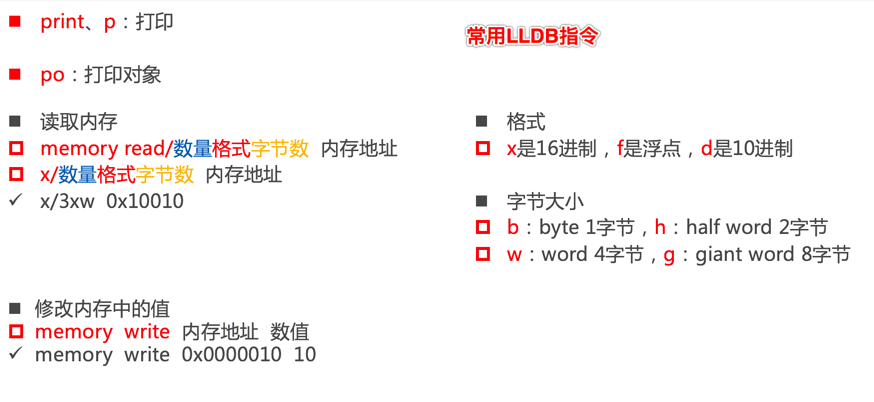
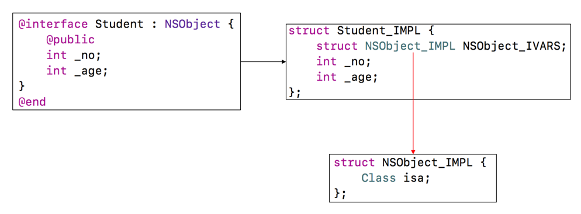
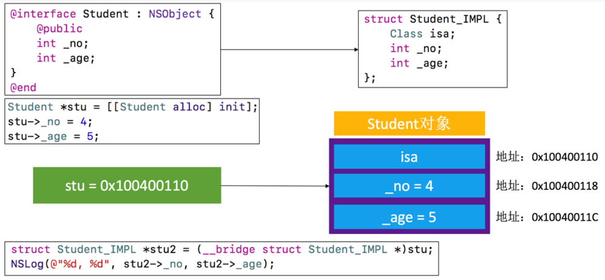
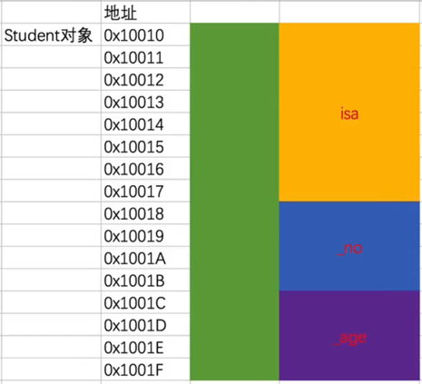
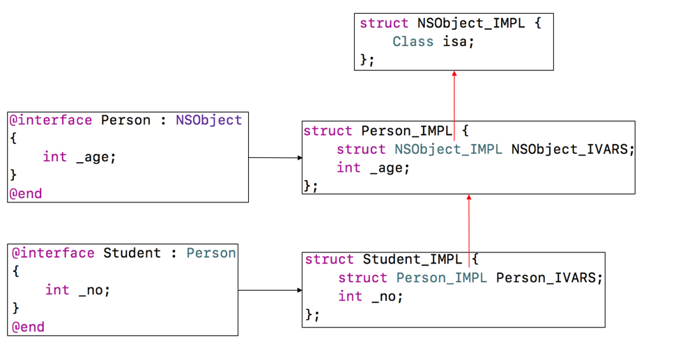

# Object-C - 对象的本质(上)

什么是OC语言，OC对象、类的本质是什么，OC对象的内存布局是什么样子的，一个NSObject对象占用多少内存，一个自定义类的对象的本质及占用多少内存？

万物皆对象，可能是大部分程序员对这个问题的第一反应，再往具体说，可能就不太知道怎么描述了，本文将围绕这几个问题进行展开。

## 1.什么是OC语言？
首先我们谈谈什么是做编程语言，编程语言是一种让人们能读懂并且能够展现程序的执行行为的语言，包括语法（正确的表达式以及状态机的使用规则）以及语义（如何去组织这些表达式以及状态机以一种有意义的方式去完成我们的目标）。
我们平时编写的Objective-C代码，底层实现都是C/C++代码，Objective-C的面向对象都是基于C/C++的数据结构实现的。


## 2.OC对象、类的本质是什么？
::: tip
OC对象、类是基于C\C++的什么数据结构实现的?
:::

我们可以将Objective-C代码转换为C\C++代码
xcrun  -sdk  iphoneos  clang  -arch  arm64  -rewrite-objc  OC源文件  -o  输出的CPP文件
如果需要链接其他框架，使用-framework参数。比如-framework UIKit

``` swift
#import <Foundation/Foundation.h>

// NSObject Implementation (NSObject 底层实现)
struct NSObject_IMPL {
    Class isa;
};

// isa 本质就是一个指向 objc_class 结构体的指针
typedef struct objc_class *Class;

int main(int argc, const char * argv[]) {
    @autoreleasepool {
        NSObject *obj = [[NSObject alloc] init];   
    }
    return 0;
}

```

我们可以发现，OC对象、类其实是基于C\C++结构体实现的。

## 3.一个OC对象在内存中是如何布局的？
一个OC对象的内存布局入下图所示：


## 4.一个NSObject对象占用多少内存？
::: tip
既然 isa 本质上就是一个指针，一个指针在32位环境下占用4个字节，64位环境下占用8个字节。一个 NSObject 对象结构体内部就包含一个 isa 指针，那么，我们可以认为一个 NSObject 对象就占用8个字节么？ NO NO NO，虽然表面如此，但是实际上并不是。
:::

``` swift
NSObject *obj = [[NSObject alloc] init];

// 获得 NSObject 实例对象的成员变量所占用的大小 >> 8
NSLog(@"%zd", class_getInstanceSize([NSObject class])); // 输出为8

// 获得 obj 指针所指向内存的大小 >> 16
NSLog(@"%zd", malloc_size((__bridge const void *)(obj))); // 输出为 16

```
我们也可以通过 Xcode -> Debug -> Debug Workflow -> View Memory3



这个是什么意思呢，其实一个 NSObject 实例对象的大小确实为8个字节，但是系统给其分配的内存其实是16个字节，接下来我们通过objc4源码来探究下到底是为什么。
::: tip
objc源码： https://opensource.apple.com/tarballs/objc4/
:::
打开下载好的objc4源码，搜索class_getInstanceSize方法
``` swift
size_t class_getInstanceSize(Class cls)
{
    if (!cls) return 0;
    return cls->alignedInstanceSize();
}
```

我们会发现这个方法返回值是cls->alignedInstanceSize()，点进去查看如下：
``` swift
// Class's ivar size rounded up to a pointer-size boundary.
// 注释意思：返回值成员变量的占用内存大小
uint32_t alignedInstanceSize() {
    return word_align(unalignedInstanceSize());
}
```

我们继续看下 malloc_size，由于苹果部分源码不公开，不过不影响今天讨论内容，我们先 malloc.h 文件中函数声明：
``` swift
/* Returns size of given ptr */
// 注释意思：返回分配给指针的占用内存大小
extern size_t malloc_size(const void *ptr);
```

总结：通过阅读源码，发现一个 NSObject 对象，系统给其分配的空间为 16 个字节，只不过其真正利用起来的只有 8 个字节。

真的是分配 16 个字节么？
``` swift
NSObject *obj = [[NSObject alloc] init];
```
上面这行代码，可以发现，创建一个新的实例对象，分为两步：
::: tip
alloc：分配一块内存空间
init：初始化
:::

所以，我们想探究实质的话可以从 alloc 方法往里面查看，从 alloc 开始搜索的话太多了，我们直接从 allocWithZone 开始查看，感兴趣的同学可以从 alloc 开始进行查看。
``` swift
+ (id)allocWithZone:(struct _NSZone *)zone {
    return _objc_rootAllocWithZone(self, (malloc_zone_t *)zone);
}
```
allocWithZone 调用的是: _objc_rootAllocWithZone
``` swift
id _objc_rootAllocWithZone(Class cls, malloc_zone_t *zone)
{
    id obj;
    /* 为了更方便理解，将部分代码省略 */
    obj = class_createInstance(cls, 0);
    return obj;
}
```
_objc_rootAllocWithZone 分配内存空间其实是: class_createInstance
``` swift
id class_createInstance(Class cls, size_t extraBytes)
{
    return _class_createInstanceFromZone(cls, extraBytes, nil);
}
```
继续点击进去查看：
``` swift
static __attribute__((always_inline)) 
id _class_createInstanceFromZone(Class cls, size_t extraBytes, void *zone)
{
    /* 为了更方便理解，将部分代码省略 */
    size_t size = cls->instanceSize(extraBytes);

    id obj;
    obj = (id)calloc(1, size);

    return obj;
}
```
我们发现，最后调用 C 语言底层的 calloc 分配内存函数，我们发现传入了一个 size 参数， size 通过 cls 的 instanceSize 函数获得。
嘿，哥们儿，别睡了，重点来了：
``` swift
// Class's ivar size rounded up to a pointer-size boundary.
uint32_t alignedInstanceSize() {
    return word_align(unalignedInstanceSize());
}

size_t instanceSize(size_t extraBytes) {
    // 如果是 NSObject ，下面这行代码相当于 size_t size = 8;
    size_t size = alignedInstanceSize() + extraBytes;
    // CF requires all objects be at least 16 bytes.
    if (size < 16) size = 16;
    return size;
}
```
::: tip
通过注释和代码可以发现，CF：CoreFoundation，硬性规定，返回 size 最小为16。
这是为什么呢，因为苹果设计 CF 框架，包括我们自己设计一套框架，为了我们的框架能够更好的运行，肯定会做出一些规定、约束，这样就可以理解了。
至于 word_align，涉及到 内存对齐 概念，下面的的章节也会提到一些，但不会涉及太深，感兴趣的同学可以 Google 相关文档。
::: 

接下来，我们可以对这个问题做下总结：
::: tip
一个NSObject对象占用多少内存？

系统分配了16个字节给 NSObject 对象（通过 malloc_size 函数获得）
但 NSObject 对象内部只使用了8个字节的空间（64bit环境下，可以通过  class_getInstanceSize 函数获得）
:::

## 5.一个自定义类的对象占用多少内存？
讲到这里，相信很多小伙伴还是有很多疑问的。刚才只讲了NSObject相关知识。我们平常开发中肯定不会只用NSObject对象，基本上都是我们自定义自己的对象，接下来，来通过两个复杂一点的例子来进行讲解。

（1）自定义一个 Student 类继承 NSObject :
``` swift
@interface Student : NSObject {
    @public
    int _no;
    int _age;
}
@end

@implementation Student
@end

int main(int argc, const char * argv[]) {
    @autoreleasepool {
        Student *stu = [[Student alloc] init];
        stu -> _no = 4;
        stu -> _age = 5;
    }
    return 0;
}
```

根据上文通过 NSObject 实例对象讲解的铺垫，Student 实例对象的本质以及其在内存中布局如下图所示：


从图中最下面把实例对象 stu 强转成结构体类型 stu2，通过结构体可以正常进行访问，也从另一角度证明 stu 底层结构确实为 Student_IMPL 结构体类型。当然也可以从 View Memory 或者 LLDB 进行证明。

内存布局这样画可能理解更清楚：


（2）举一反三，当 Person 继承 NSObject，Student 继承 Person 的情况，一个 Person 对象，一个 Student 对象占用多少内存空间？
Student: Person: NSObject：

``` swift
#import <Foundation/Foundation.h>
#import <objc/runtime.h>
#import <malloc/malloc.h>

struct NSObject_IMPL {
    Class isa;
};

struct Person_IMPL {
    struct NSObject_IMPL NSObject_IVARS;
    int _age;
};

struct Student_IMPL {
    struct Person_IMPL Person_IVARS;
    int _no;
};

@interface Person: NSObject {
    @public
    int _age;
}
@end

@implementation Person
@end

@interface Student: Person {
    @public
    int _no;
}
@end

int main(int argc, const char * argv[]) {
    @autoreleasepool {
        Student *stu = [[Student alloc] init];
        stu->_no = 5;
        NSLog(@"student:%zd, %zd", class_getInstanceSize([Student class]), malloc_size((__bridge const void*)stu));

        Person *per = [[Person alloc] init];
        per->_age = 4;
        NSLog(@"person:%zd, %zd", class_getInstanceSize([Person class]), malloc_size((__bridge const void*)per));
    }
    return 0;
}

```

::: tip
我们先来分析下 Person 实例对象占用多少内存空间：
struct NSObject_IMPL NSObject_IVARS；即 isa 占用8个字节，int _age; 占4个字节，那么 Person 实例对象占 8 + 4 = 12 个字节么，错，上文中也有提到，一个 OC 对象至少占用 16 个字节，所以 Person 实例对象占用 16 个字节。
:::
从另外一个角度，其实还有 内存对齐 这个概念，就算是没有 OC对象 至少占用 16 个字节这个规定， Person_IMPL 也占用 16 个字节，内存对齐有一条规定：结构体的大小比必须是最大成员大小的倍数。
内存对齐还有很多规定，属于计算机知识范畴，感兴趣的同学可以自行 Google。
::: tip
我们再来分析下 Student 实例对象占用多少内存空间：
:::

struct Person_IMPL Person_IVARS; 占用 16 个字节，int _no；占用 4 个字节，16 + 4 = 20，而且刚讲了内存对齐规定结构体大小必须是最大成员变量大小的倍数，那么， Student_IMPL 占用 16 * 2 = 32 个字节么？错！结果为 16 * 1 = 16 个字节。

为什么呢？因为 Person_IMPL 虽然分配16个字节，但是实际变量只占用了 12 个字节，还有 4 个字节空出来了，我们伟大的 iOS 系统会这么傻，白白浪费这 4 个字节的空间么，当然不会，所以，int _no；其实被放到了 Person_IMPL 空余的 4 个字节空间当中。


malloc_size 我们已经没有太多疑问了，但是可能对 class_getInstanceSize 还存在疑问，class_getInstanceSize 返回 ivar size，即成员变量 size，那么上文 Person instance size 为什么不返回 12 呢？
有疑问怎么办，撸源码：
``` c
size_t class_getInstanceSize(Class cls)
{
    if (!cls) return 0;
    return cls->alignedInstanceSize();
}

// Class's ivar size rounded up to a pointer-size boundary.
uint32_t alignedInstanceSize() {
    return word_align(unalignedInstanceSize());
}
```
通过源码可以发现，class_getInstanceSize 实际返回的其实也是  word_align(unalignedInstanceSize());  内存对齐过的大小。

总结：我们更多的时候其实不需要过多关注 class_getInstanceSize，我们只需要关注 malloc_size 返回的实际分配的内存大小即可。
::: tip
结尾
通过今天的讲解，希望可以给一些小伙伴带来帮助，刚开始写博客，排版略乱，还请见谅，文中错误或者不足欢迎指点。
:::