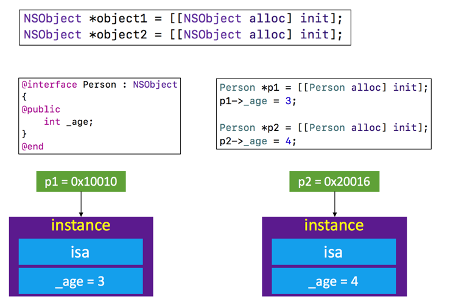
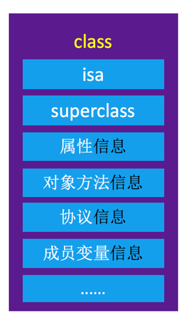
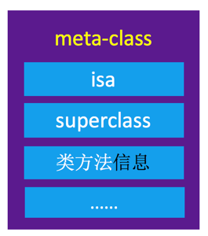
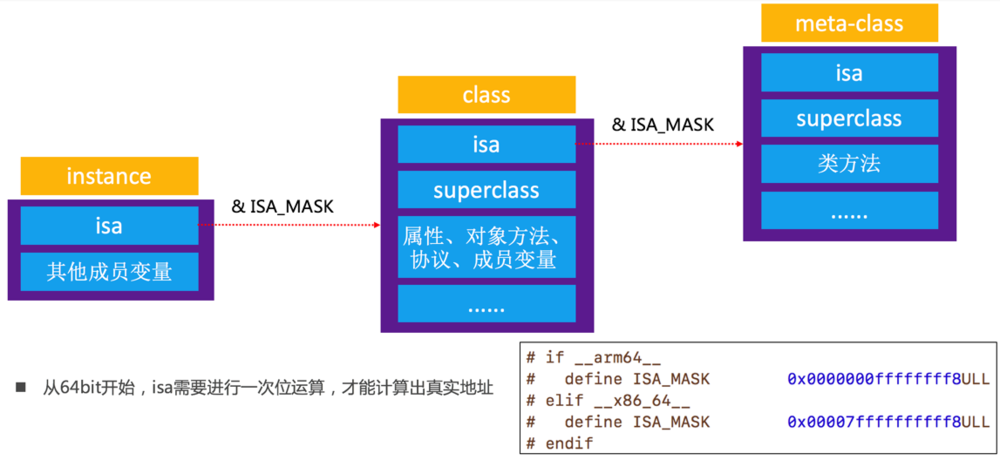
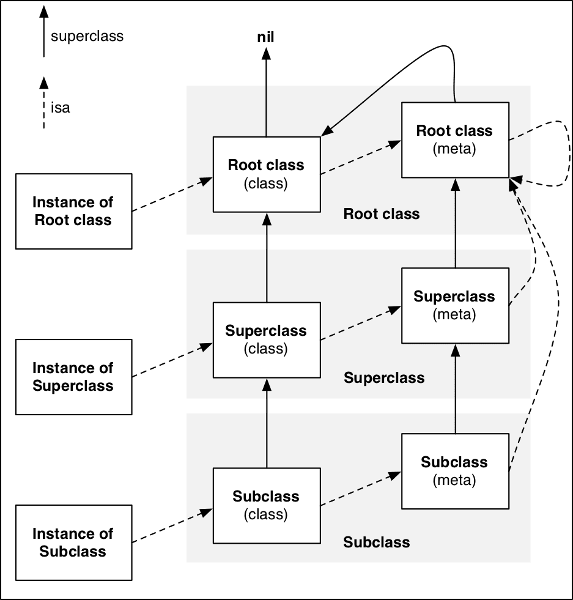
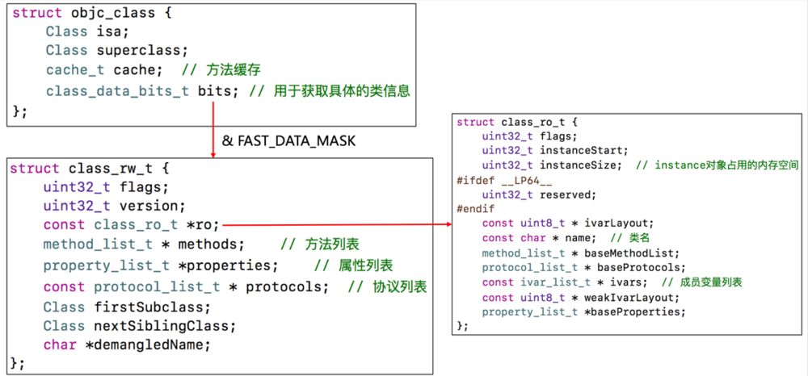

# Object-C对象的本质(下)

OC对象的分类，对象的isa指针指向哪里，superClass指针，OC的类信息存放在哪里？

上篇文章中，我们讲述了一个 NSObject实例对象，Person实例对象的本质，在内存中长什么样子。但是，上篇文章中讲的OC对象的本质，还不包括所有的OC对象。

## 1.OC对象的分类

Objective-C中的对象，简称OC对象，主要可以分为 3 种：

* instance对象（实例对象）
instance对象就是通过类alloc出来的对象，每次调用alloc都会产生新的instance对象
``` swift
NSObject *object1 = [[NSObject alloc] init];
NSObject *object2 = [[NSObject alloc] init];
```


1> object1、object2是NSObject的instance对象（实例对象)

2> 它们是不同的两个对象，分别占据着两块不同的内存

3> instance对象在内存中存储信息包括：isa指针、其他成员变量

* class对象（类对象）

``` swift
// instance 对象，实例对象
NSObject *object = [[NSObject alloc] init];

// class 对象，类对象      
Class objectClass1 = [object class];
Class objectClass2 = [NSObject class];
// class 方法返回的一直是class对象，类对象
// Class objectClass2 = [[[[NSObject class] class] class] class];
Class objectClass3 = object_getClass(object);

// 0x100444830 0x7fffa5ab9140 0x7fffa5ab9140 0x7fffa5ab9140
NSLog(@"%p %p %p %p", object, objectClass1, objectClass2, objectClass3);

```



1> objectClass1~objectClass3都是NSObject的class对象（类对象）

2> 它们都是同一个对象，每个类在内存中有且只有一个class对象

3> class对象在内存中存储的信息主要包括：isa指针、superClass指针、类的属性信息（@property）、类的实例方法信息（instance method）、类的协议信息（protocol）、类的成员变量信息（ivar，这里指的并不是成员变量的值是多少，成员变量的值是实例对象进行存储的，类对象存储的是成员变量的类型、变量名等只需要存储一份的）等...

* meta-class对象（元类对象）

```swift
// class 对象，类对象
Class objectClass = [object class];

// meta-class 对象，元类对象
// 将类对象当做参数传入，获得元类对象;将实例对象当做参数传入，获得的是类对象
Class metaClass1 = object_getClass([object class]);
Class metaClass2 = object_getClass([NSObject class]);
Class metaClass3 = object_getClass(object_getClass(object));

// 0x7fffa5ab90f0 0x7fffa5ab90f0 0x7fffa5ab90f0 0 1
NSLog(@"%p %p %p %d %d", metaClass1, metaClass2, metaClass3, class_isMetaClass(objectClass), class_isMetaClass(metaClass1));

```
1> objectMetaClass是NSObject的meta-class对象（元类对象）
2> 每个类在内存中有且只有一个meta-class对象
3> meta-class对象和class对象的内存结构是一样的（都是 Class 类型），但是用途不一样，在内存中存储的信息主要包括：isa指针、superClass指针、类的类方法信息（class method）、等...

::: tip
注意：为什么说 meta-class 对象和 class 对象结构一样，但是图上画的却不一样呢，因为图上只是将比较重要的一些东西摘了出来，方便理解。其实本质是，class对象类方法信息存储的可能是null空的，meta-class内部属性信息、对象方法信息、协议信息、成员变量信息存储的可能是null空的。
:::
**objc_getClass、object_getClass方法区别？**

本文和上篇文章有用到这几个方法，这几个方法有什么区别呢？
``` swift
Class objc_getClass(const char *aClassName)
{
    if (!aClassName) return Nil;
    // NO unconnected, YES class handler
    return look_up_class(aClassName, NO, YES);
}

Class object_getClass(id obj)
{
    // 如果传入instance对象，返回class对象
    // 如果传入class对象，返回meta-class对象
    // 如果传入meta-class对象，返回NSObject的meta-class对象
    if (obj) return obj->getIsa();
    else return Nil;
}

```
从源码进行分析，objc_getClass传入参数为字符串，根据字符串去Map中取出类对象并返回。 object_getClass传入参数为 id，并且返回值是通过 getIsa 获得，说明返回 isa 指向的类型（即：传入instance对象，返回类对象；传入class对象，返回meta-class对象；传入meta-class对象，返回NSObject的meta-class对象）。
## 2.isa指针
我们发现，OC对象不管是instance对象、类对象还是meta-class都有一个isa指针，那么，isa指针都指向哪里呢，起到了什么作用。
我们都知道，OC对象调用方法是通过消息机制实现的，通过上面的总结我们也知道了实例方法存放在class对象中，类方法存放在meta-class对象中，那么对象是怎么查找到方法并实现调用呢？
这个时候就需要isa指针了，instance对象的isa指针指向class对象，class对象的isa指向meta-class对象，通过isa指针，instance对象、class对象、meta-class对象就可以串起来了，方法调用、以及各种作用就都可以实现了。



* instance对象的isa指向class对象，当调用对象方法时，通过instance对象的isa找到class对象，最后找到对象方法的实现进行调用
* class对象的isa指向meta-class对象，当调用类方法时，通过class对象的isa找到meta-class对象，最后找到类方法的实现进行调用
::: tip
注意：isa指针并不是直接指向对象地址值，还需要逻辑与上一个掩码 ISA_MASK，这个了解下就行，如果不了解的话可以直接理解为isa直接指向class对象、meta-class对象。
:::
**superClass指针**
附上一张经典的图：


总结如下：

* instance对象的isa指向class对象
* class对象的isa指向meta-class对象
* meta-class对象的isa指向基类的meta-class对象
* class对象的superClass指向父类的class对象，如果没有父类，superClass指针为nil
* meta-class对象的superClass指针指向父类的meta-class对象，基类的meta-class对象的
* superClass指针指向基类的class对象
* instance调用方法的轨迹，isa找到class对象，方法不存在，就通过superClass寻找父类
* class调用类方法的轨迹，isa找到meta-class，方法不存在，就通过superClass寻找父类


## 3.窥探 objc_class 结构
类对象与元类对象的结构是一样的，通过都是class类型就可以证明。即 *typedef struct objc_class Class; 这个结构体，接下来我们一起来探究下这个结构体内部结构。
我们搞懂这个结构体之后也就可以知道class对象和meta-class对象里面到底放了什么东西了。
点击 objc_class 进入：
``` swift
struct objc_class {
    Class _Nonnull isa  OBJC_ISA_AVAILABILITY;

    #if !__OBJC2__
    Class _Nullable super_class                              OBJC2_UNAVAILABLE;
    const char * _Nonnull name                               OBJC2_UNAVAILABLE;
    long version                                             OBJC2_UNAVAILABLE;
    long info                                                OBJC2_UNAVAILABLE;
    long instance_size                                       OBJC2_UNAVAILABLE;
    struct objc_ivar_list * _Nullable ivars                  OBJC2_UNAVAILABLE;
    struct objc_method_list * _Nullable * _Nullable methodLists                    OBJC2_UNAVAILABLE;
    struct objc_cache * _Nonnull cache                       OBJC2_UNAVAILABLE;
    struct objc_protocol_list * _Nullable protocols          OBJC2_UNAVAILABLE;
    #endif

} OBJC2_UNAVAILABLE;
```
进入之后，我们发现，内部如我们想象之中差不多，确实是有 ivars、methodLists、protocols之类的。
但是，我们发现里面有一个条件编译：#if !OBJC2，意思是如果不是 OBJC2 的话才会编译这段代码，现在最新已经是 OC2.0 了，所以，这段代码相当于已经过时了，这个结构体在 OC2.0 时已经不可用了，我们要研究学习的话建议还是参考最新的代码，这个已经研究价值不大了。
打开上篇文章带领大家下载的 objc4源码，搜索 struct objc_class， 找到 objc-runtime-new.h 中 结构体的最新定义：
我们发现 struct objc_class : objc_object，结构体也可以继承，对，没错，这是 C++ 语法，C++ 里面的结构体跟类其实区别不大，基本上卫衣的区别是成员变量默认 public 还是private。C++ 结构体里面还可以定义方法。
``` swift
struct objc_object {
    private:
    isa_t isa;

    public:

    // ISA() assumes this is NOT a tagged pointer object
    Class ISA();

    // getIsa() allows this to be a tagged pointer object
    Class getIsa();

    ......
    方便理解，部分与本文讲述联系不大的先省略了，感兴趣的同学可以自行查看
```
我们可以发现：struct objc_object 结构体内部只有一个 isa 成员以及一些方法。
``` swift
struct objc_class : objc_object {
    // Class ISA;
    Class superclass;
    cache_t cache;             // formerly cache pointer and vtable
    class_data_bits_t bits;    // class_rw_t * plus custom rr/alloc flags

    class_rw_t *data() { 
        return bits.data();
    }
    void setData(class_rw_t *newData) {
        bits.setData(newData);
    }

    void setInfo(uint32_t set) {
        assert(isFuture()  ||  isRealized());
        data()->setFlags(set);
    }

    void clearInfo(uint32_t clear) {
        assert(isFuture()  ||  isRealized());
        data()->clearFlags(clear);
    }

    ......
    方便理解，部分与本文讲述联系不大的先省略了，感兴趣的同学可以自行查看
```
我们发现其内部有一个 class_rw_t，即可读、可写、table，一个可读可写的表格，而且一些信息都在这个表格里面：
``` swift
struct class_rw_t {
    // Be warned that Symbolication knows the layout of this structure.
    uint32_t flags;
    uint32_t version;

    const class_ro_t *ro;

    method_array_t methods;
    property_array_t properties;
    protocol_array_t protocols;

    ......
    方便理解，部分与本文讲述联系不大的先省略了，感兴趣的同学可以自行查看
};
struct class_ro_t {
    uint32_t flags;
    uint32_t instanceStart;
    uint32_t instanceSize;
    #ifdef __LP64__
    uint32_t reserved;
    #endif

    const uint8_t * ivarLayout;

    const char * name;
    method_list_t * baseMethodList;
    protocol_list_t * baseProtocols;
    const ivar_list_t * ivars;

    const uint8_t * weakIvarLayout;
    property_list_t *baseProperties;

    method_list_t *baseMethods() const {
        return baseMethodList;
    }
};
```
总结如下图：




总结： 通过 struct objc_class 内部结构，内部确实有存放 方法、成员变量、协议 的数组，也证明 class对象/meta-class对象 内部确实是如我们所才像一样。对象方法、属性、成员变量、协议信息，存放在class对象中；类方法，存放在meta-class对象中；成员变量的具体值，存放在instance对象中。


