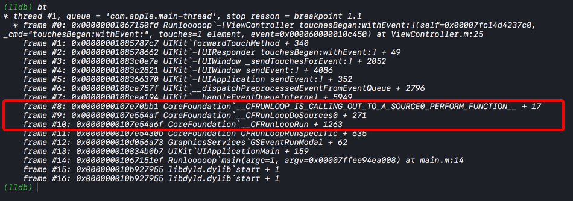
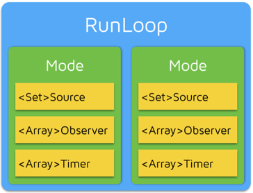
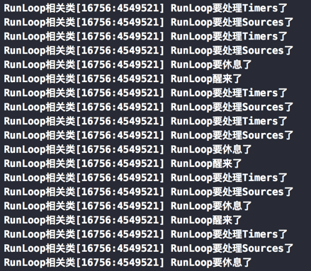
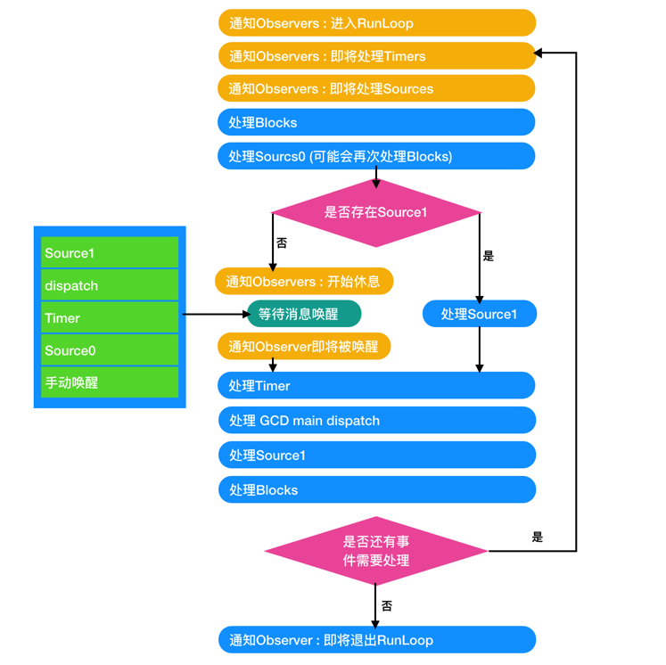

# Object-C - Runloop

- 讲讲 RunLoop，项目中有用到吗？
- RunLoop内部实现逻辑？
- Runloop和线程的关系？
- timer 与 Runloop 的关系？
- 程序中添加每3秒响应一次的NSTimer，当拖动tableview时timer可能无法响应要怎么解决？
- Runloop 是怎么响应用户操作的， 具体流程是什么样的？
- 说说RunLoop的几种状态？
- Runloop的mode作用是什么？


## 一. RunLoop简介
运行循环，在程序运行过程中循环做一些事情，如果没有Runloop程序执行完毕就会立即退出，如果有Runloop程序会一直运行，并且时时刻刻在等待用户的输入操作。RunLoop可以在需要的时候自己跑起来运行，在没有操作的时候就停下来休息。充分节省CPU资源，提高程序性能。

## 二. RunLoop基本作用：


保持程序持续运行，程序一启动就会开一个主线程，主线程一开起来就会跑一个主线程对应的RunLoop,RunLoop保证主线程不会被销毁，也就保证了程序的持续运行

处理App中的各种事件（比如：触摸事件，定时器事件，Selector事件等）

节省CPU资源，提高程序性能，程序运行起来时，当什么操作都没有做的时候，RunLoop就告诉CPU，现在没有事情做，我要去休息，这时CUP就会将其资源释放出来去做其他的事情，当有事情做的时候RunLoop就会立马起来去做事情
我们先通过API内一张图片来简单看一下RunLoop内部运行原理

通过图片可以看出，RunLoop在跑圈过程中，当接收到Input sources 或者 Timer sources时就会交给对应的处理方去处理。当没有事件消息传入的时候，RunLoop就休息了。这里只是简单的理解一下这张图，接下来我们来了解RunLoop对象和其一些相关类，来更深入的理解RunLoop运行流程。

## 三. RunLoop在哪里开启
UIApplicationMain函数内启动了Runloop，程序不会马上退出，而是保持运行状态。因此每一个应用必须要有一个runloop，
我们知道主线程一开起来，就会跑一个和主线程对应的RunLoop，那么RunLoop一定是在程序的入口main函数中开启。
``` swift
int main(int argc, char * argv[]) {
    @autoreleasepool {
        return UIApplicationMain(argc, argv, nil, NSStringFromClass([AppDelegate class]));
    }
}
```

进入UIApplicationMain
``` swift
UIKIT_EXTERN int UIApplicationMain(int argc, char *argv[], NSString * __nullable principalClassName, NSString * __nullable delegateClassName);
```
我们发现它返回的是一个int数，那么我们对main函数做一些修改
``` swift
int main(int argc, char * argv[]) {
    @autoreleasepool {
        NSLog(@"开始");
        int re = UIApplicationMain(argc, argv, nil, NSStringFromClass([AppDelegate class]));
        NSLog(@"结束");
        return re;
    }
}
```
运行程序，我们发现只会打印开始，并不会打印结束，这说明在UIApplicationMain函数中，开启了一个和主线程相关的RunLoop，导致UIApplicationMain不会返回，一直在运行中，也就保证了程序的持续运行。
我们来看到RunLoop的源码
``` swift
// 用DefaultMode启动
void CFRunLoopRun(void) {   /* DOES CALLOUT */
    int32_t result;
    do {
        result = CFRunLoopRunSpecific(CFRunLoopGetCurrent(), kCFRunLoopDefaultMode, 1.0e10, false);
        CHECK_FOR_FORK();
    } while (kCFRunLoopRunStopped != result && kCFRunLoopRunFinished != result);
}
```
我们发现RunLoop确实是do while通过判断result的值实现的。因此，我们可以把RunLoop看成一个死循环。如果没有RunLoop，UIApplicationMain函数执行完毕之后将直接返回，也就没有程序持续运行一说了。
四. RunLoop对象
>Fundation框架 （基于CFRunLoopRef的封装）
>NSRunLoop对象
>CoreFoundation
>CFRunLoopRef对象

因为Fundation框架是基于CFRunLoopRef的一层OC封装，这里我们主要研究CFRunLoopRef源码
如何获得RunLoop对象
``` swift
Foundation
[NSRunLoop currentRunLoop]; // 获得当前线程的RunLoop对象
[NSRunLoop mainRunLoop]; // 获得主线程的RunLoop对象

Core Foundation
CFRunLoopGetCurrent(); // 获得当前线程的RunLoop对象
CFRunLoopGetMain(); // 获得主线程的RunLoop对象
```
## 五. RunLoop和线程间的关系
- 每条线程都有唯一的一个与之对应的RunLoop对象
- RunLoop保存在一个全局的Dictionary里，线程作为key,RunLoop作为value
- 主线程的RunLoop已经自动创建好了，子线程的RunLoop需要主动创建
- RunLoop在第一次获取时创建，在线程结束时销毁
通过源码查看上述对应

``` swift
// 拿到当前Runloop 调用_CFRunLoopGet0
CFRunLoopRef CFRunLoopGetCurrent(void) {
    CHECK_FOR_FORK();
    CFRunLoopRef rl = (CFRunLoopRef)_CFGetTSD(__CFTSDKeyRunLoop);
    if (rl) return rl;
    return _CFRunLoopGet0(pthread_self());
}

// 查看_CFRunLoopGet0方法内部
CF_EXPORT CFRunLoopRef _CFRunLoopGet0(pthread_t t) {
    if (pthread_equal(t, kNilPthreadT)) {
    t = pthread_main_thread_np();
    }
    __CFLock(&loopsLock);
    if (!__CFRunLoops) {
        __CFUnlock(&loopsLock);
    CFMutableDictionaryRef dict = CFDictionaryCreateMutable(kCFAllocatorSystemDefault, 0, NULL, &kCFTypeDictionaryValueCallBacks);
    // 根据传入的主线程获取主线程对应的RunLoop
    CFRunLoopRef mainLoop = __CFRunLoopCreate(pthread_main_thread_np());
    // 保存主线程 将主线程-key和RunLoop-Value保存到字典中
    CFDictionarySetValue(dict, pthreadPointer(pthread_main_thread_np()), mainLoop);
    if (!OSAtomicCompareAndSwapPtrBarrier(NULL, dict, (void * volatile *)&__CFRunLoops)) {
        CFRelease(dict);
    }
    CFRelease(mainLoop);
        __CFLock(&loopsLock);
    }
    
    // 从字典里面拿，将线程作为key从字典里获取一个loop
    CFRunLoopRef loop = (CFRunLoopRef)CFDictionaryGetValue(__CFRunLoops, pthreadPointer(t));
    __CFUnlock(&loopsLock);
    
    // 如果loop为空，则创建一个新的loop，所以runloop会在第一次获取的时候创建
    if (!loop) {  
    CFRunLoopRef newLoop = __CFRunLoopCreate(t);
        __CFLock(&loopsLock);
    loop = (CFRunLoopRef)CFDictionaryGetValue(__CFRunLoops, pthreadPointer(t));
    
    // 创建好之后，以线程为key runloop为value，一对一存储在字典中，下次获取的时候，则直接返回字典内的runloop
    if (!loop) { 
        CFDictionarySetValue(__CFRunLoops, pthreadPointer(t), newLoop);
        loop = newLoop;
    }
        // don't release run loops inside the loopsLock, because CFRunLoopDeallocate may end up taking it
        __CFUnlock(&loopsLock);
    CFRelease(newLoop);
    }
    if (pthread_equal(t, pthread_self())) {
        _CFSetTSD(__CFTSDKeyRunLoop, (void *)loop, NULL);
        if (0 == _CFGetTSD(__CFTSDKeyRunLoopCntr)) {
            _CFSetTSD(__CFTSDKeyRunLoopCntr, (void *)(PTHREAD_DESTRUCTOR_ITERATIONS-1), (void (*)(void *))__CFFinalizeRunLoop);
        }
    }
    return loop;
}
```
从上面的代码可以看出，线程和 RunLoop 之间是一一对应的，其关系是保存在一个 Dictionary 里。所以我们创建子线程RunLoop时，只需在子线程中获取当前线程的RunLoop对象即可[NSRunLoop currentRunLoop];如果不获取，那子线程就不会创建与之相关联的RunLoop，并且只能在一个线程的内部获取其 RunLoop
[NSRunLoop currentRunLoop];方法调用时，会先看一下字典里有没有存子线程相对用的RunLoop，如果有则直接返回RunLoop，如果没有则会创建一个，并将与之对应的子线程存入字典中。当线程结束时，RunLoop会被销毁。

## 六. RunLoop结构体

通过源码我们找到__CFRunLoop结构体
``` swift
struct __CFRunLoop {
    CFRuntimeBase _base;
    pthread_mutex_t _lock;          /* locked for accessing mode list */
    __CFPort _wakeUpPort;           // used for CFRunLoopWakeUp 
    Boolean _unused;
    volatile _per_run_data *_perRunData;              // reset for runs of the run loop
    pthread_t _pthread;
    uint32_t _winthread;
    CFMutableSetRef _commonModes;
    CFMutableSetRef _commonModeItems;
    CFRunLoopModeRef _currentMode;
    CFMutableSetRef _modes;
    struct _block_item *_blocks_head;
    struct _block_item *_blocks_tail;
    CFAbsoluteTime _runTime;
    CFAbsoluteTime _sleepTime;
    CFTypeRef _counterpart;
};
```
除一些记录性属性外，主要来看一下以下两个成员变量
``` swift
CFRunLoopModeRef _currentMode;
CFMutableSetRef _modes;
```
CFRunLoopModeRef 其实是指向__CFRunLoopMode结构体的指针，__CFRunLoopMode结构体源码如下
``` swift
typedef struct __CFRunLoopMode *CFRunLoopModeRef;
struct __CFRunLoopMode {
    CFRuntimeBase _base;
    pthread_mutex_t _lock;  /* must have the run loop locked before locking this */
    CFStringRef _name;
    Boolean _stopped;
    char _padding[3];
    CFMutableSetRef _sources0;
    CFMutableSetRef _sources1;
    CFMutableArrayRef _observers;
    CFMutableArrayRef _timers;
    CFMutableDictionaryRef _portToV1SourceMap;
    __CFPortSet _portSet;
    CFIndex _observerMask;
#if USE_DISPATCH_SOURCE_FOR_TIMERS
    dispatch_source_t _timerSource;
    dispatch_queue_t _queue;
    Boolean _timerFired; // set to true by the source when a timer has fired
    Boolean _dispatchTimerArmed;
#endif
#if USE_MK_TIMER_TOO
    mach_port_t _timerPort;
    Boolean _mkTimerArmed;
#endif
#if DEPLOYMENT_TARGET_WINDOWS
    DWORD _msgQMask;
    void (*_msgPump)(void);
#endif
    uint64_t _timerSoftDeadline; /* TSR */
    uint64_t _timerHardDeadline; /* TSR */
};
```
主要查看以下成员变量
``` swift
CFMutableSetRef _sources0;
CFMutableSetRef _sources1;
CFMutableArrayRef _observers;
CFMutableArrayRef _timers;
```
通过上面分析我们知道，CFRunLoopModeRef代表RunLoop的运行模式，一个RunLoop包含若干个Mode，每个Mode又包含若干个Source0/Source1/Timer/Observer，而RunLoop启动时只能选择其中一个Mode作为currentMode。
**Source1/Source0/Timers/Observer分别代表什么**

1. Source1 : 基于Port的线程间通信

2. Source0 : 触摸事件，PerformSelectors

我们通过代码验证触摸事件
``` swift
- (void)touchesBegan:(NSSet<UITouch *> *)touches withEvent:(UIEvent *)event
{
    NSLog(@"点击了屏幕");
}
```
打断点之后打印堆栈信息，当xcode工具区打印的堆栈信息不全时，可以在控制台通过“bt”指令打印完整的堆栈信息，由堆栈信息中可以发现，触摸事件确实是会触发Source0事件。


同样的方式验证performSelector堆栈信息
``` swift
dispatch_async(dispatch_get_global_queue(0, 0), ^{
    [self performSelectorOnMainThread:@selector(test) withObject:nil waitUntilDone:YES];
});
```
可以发现PerformSelectors同样是触发Source0事件


3. Timers : 定时器，NSTimer
``` swift
[NSTimer scheduledTimerWithTimeInterval:3.0 repeats:NO block:^(NSTimer * _Nonnull timer) {
    NSLog(@"NSTimer ---- timer调用了");
}];
```


4. Observer : 监听器，用于监听RunLoop的状态


## 七. 详解RunLoop相关类及作用

通过上面的分析，我们对RunLoop内部结构有了大致的了解，接下来来详细分析RunLoop的相关类。以下为Core Foundation中关于RunLoop的5个类
::: tip

- CFRunLoopRef - 获得当前RunLoop和主RunLoop

- CFRunLoopModeRef - RunLoop 运行模式，只能选择一种，在不同模式中做不同的操作

- CFRunLoopSourceRef - 事件源，输入源

- CFRunLoopTimerRef - 定时器时间

- CFRunLoopObserverRef - 观察者
:::

1. CFRunLoopModeRef
CFRunLoopModeRef代表RunLoop的运行模式
一个 RunLoop 包含若干个 Mode，每个Mode又包含若干个Source、Timer、Observer
每次RunLoop启动时，只能指定其中一个 Mode，这个Mode被称作 CurrentMode
如果需要切换Mode，只能退出RunLoop，再重新指定一个Mode进入，这样做主要是为了分隔开不同组的Source、Timer、Observer，让其互不影响。如果Mode里没有任何Source0/Source1/Timer/Observer，RunLoop会立马退出
如图所示：

注意：一种Mode中可以有多个Source(事件源，输入源，基于端口事件源例键盘触摸等) Observer(观察者，观察当前RunLoop运行状态) 和Timer(定时器事件源)。但是必须至少有一个Source或者Timer，因为如果Mode为空，RunLoop运行到空模式不会进行空转，就会立刻退出。

**系统默认注册的5个Mode:

RunLoop 有五种运行模式，其中常见的有1.2两种
::: tip
1. kCFRunLoopDefaultMode：App的默认Mode，通常主线程是在这个Mode下运行
2. UITrackingRunLoopMode：界面跟踪 Mode，用于 ScrollView 追踪触摸滑动，保证界面滑动时不受其他 Mode 影响
3. UIInitializationRunLoopMode: 在刚启动 App 时第进入的第一个 Mode，启动完成后就不再使用，会切换到kCFRunLoopDefaultMode
4. GSEventReceiveRunLoopMode: 接受系统事件的内部 Mode，通常用不到
5. kCFRunLoopCommonModes: 这是一个占位用的Mode，作为标记kCFRunLoopDefaultMode和UITrackingRunLoopMode用，并不是一种真正的Mode
:::

**Mode间的切换**

我们平时在开发中一定遇到过，当我们使用NSTimer每一段时间执行一些事情时滑动UIScrollView，NSTimer就会暂停，当我们停止滑动以后，NSTimer又会重新恢复的情况，我们通过一段代码来看一下
代码中的注释也很重要，展示了我们探索的过程
``` swift
-(void)touchesBegan:(NSSet<UITouch *> *)touches withEvent:(UIEvent *)event
{
    // [NSTimer scheduledTimerWithTimeInterval:2.0 target:self selector:@selector(show) userInfo:nil repeats:YES];
    NSTimer *timer = [NSTimer timerWithTimeInterval:2.0 target:self selector:@selector(show) userInfo:nil repeats:YES];
    // 加入到RunLoop中才可以运行
    // 1. 把定时器添加到RunLoop中，并且选择默认运行模式NSDefaultRunLoopMode = kCFRunLoopDefaultMode
    // [[NSRunLoop mainRunLoop] addTimer:timer forMode:NSDefaultRunLoopMode];
    // 当textFiled滑动的时候，timer失效，停止滑动时，timer恢复
    // 原因：当textFiled滑动的时候，RunLoop的Mode会自动切换成UITrackingRunLoopMode模式，因此timer失效，当停止滑动，RunLoop又会切换回NSDefaultRunLoopMode模式，因此timer又会重新启动了
    
    // 2. 当我们将timer添加到UITrackingRunLoopMode模式中，此时只有我们在滑动textField时timer才会运行
    // [[NSRunLoop mainRunLoop] addTimer:timer forMode:UITrackingRunLoopMode];
    
    // 3. 那个如何让timer在两个模式下都可以运行呢？
    // 3.1 在两个模式下都添加timer 是可以的，但是timer添加了两次，并不是同一个timer
    // 3.2 使用站位的运行模式 NSRunLoopCommonModes标记，凡是被打上NSRunLoopCommonModes标记的都可以运行，下面两种模式被打上标签
    //0 : <CFString 0x10b7fe210 [0x10a8c7a40]>{contents = "UITrackingRunLoopMode"}
    //2 : <CFString 0x10a8e85e0 [0x10a8c7a40]>{contents = "kCFRunLoopDefaultMode"}
    // 因此也就是说如果我们使用NSRunLoopCommonModes，timer可以在UITrackingRunLoopMode，kCFRunLoopDefaultMode两种模式下运行
    [[NSRunLoop mainRunLoop] addTimer:timer forMode:NSRunLoopCommonModes];
    NSLog(@"%@",[NSRunLoop mainRunLoop]);
}
-(void)show
{
    NSLog(@"-------");
}
```
由上述代码可以看出，NSTimer不管用是因为Mode的切换，因为如果我们在主线程使用定时器，此时RunLoop的Mode为kCFRunLoopDefaultMode，即定时器属于kCFRunLoopDefaultMode，那么此时我们滑动ScrollView时，RunLoop的Mode会切换到UITrackingRunLoopMode，因此在主线程的定时器就不在管用了，调用的方法也就不再执行了，当我们停止滑动时，RunLoop的Mode切换回kCFRunLoopDefaultMode，所以NSTimer就又管用了。
同样道理的还有ImageView的显示，我们直接来看代码，不再赘述了
``` swift
-(void)touchesBegan:(NSSet<UITouch *> *)touches withEvent:(UIEvent *)event
{
    NSLog(@"%s",__func__);
    // performSelector默认是在default模式下运行，因此在滑动ScrollView时，图片不会加载
    // [self.imageView performSelector:@selector(setImage:) withObject:[UIImage imageNamed:@"abc"] afterDelay:2.0 ];
    // inModes: 传入Mode数组
    [self.imageView performSelector:@selector(setImage:) withObject:[UIImage imageNamed:@"abc"] afterDelay:2.0 inModes:@[NSDefaultRunLoopMode,UITrackingRunLoopMode]];
```
使用GCD也可是创建计时器，而且更为精确我们来看一下代码
``` swift
-(void)touchesBegan:(NSSet<UITouch *> *)touches withEvent:(UIEvent *)event
{
    //创建队列
    dispatch_queue_t queue = dispatch_get_global_queue(0, 0);
    //1.创建一个GCD定时器
    /*
     第一个参数:表明创建的是一个定时器
     第四个参数:队列
     */
    dispatch_source_t timer = dispatch_source_create(DISPATCH_SOURCE_TYPE_TIMER, 0, 0, queue);
    // 需要对timer进行强引用，保证其不会被释放掉，才会按时调用block块
    // 局部变量，让指针强引用
    self.timer = timer;
    //2.设置定时器的开始时间,间隔时间,精准度
    /*
     第1个参数:要给哪个定时器设置
     第2个参数:开始时间
     第3个参数:间隔时间
     第4个参数:精准度 一般为0 在允许范围内增加误差可提高程序的性能
     GCD的单位是纳秒 所以要*NSEC_PER_SEC
     */
    dispatch_source_set_timer(timer, DISPATCH_TIME_NOW, 2.0 * NSEC_PER_SEC, 0 * NSEC_PER_SEC);
    
    //3.设置定时器要执行的事情
    dispatch_source_set_event_handler(timer, ^{
        NSLog(@"---%@--",[NSThread currentThread]);
    });
    // 启动
    dispatch_resume(timer);
}
```

2. CFRunLoopSourceRef事件源（输入源）
Source分为两种
- Source0：非基于Port的 用于用户主动触发的事件（点击button 或点击屏幕）
- Source1：基于Port的  通过内核和其他线程相互发送消息（与内核相关）

触摸事件及PerformSelectors会触发Source0事件源在前文已经验证过，这里不在赘述

3.  CFRunLoopObserverRef
CFRunLoopObserverRef是观察者，能够监听RunLoop的状态改变
我们直接来看代码，给RunLoop添加监听者，监听其运行状态
``` swift
-(void)touchesBegan:(NSSet<UITouch *> *)touches withEvent:(UIEvent *)event
{
     //创建监听者
     /*
     第一个参数 CFAllocatorRef allocator：分配存储空间 CFAllocatorGetDefault()默认分配
     第二个参数 CFOptionFlags activities：要监听的状态 kCFRunLoopAllActivities 监听所有状态
     第三个参数 Boolean repeats：YES:持续监听 NO:不持续
     第四个参数 CFIndex order：优先级，一般填0即可
     第五个参数 ：回调 两个参数observer:监听者 activity:监听的事件
     */
     /*
     所有事件
     typedef CF_OPTIONS(CFOptionFlags, CFRunLoopActivity) {
     kCFRunLoopEntry = (1UL << 0),   //   即将进入RunLoop
     kCFRunLoopBeforeTimers = (1UL << 1), // 即将处理Timer
     kCFRunLoopBeforeSources = (1UL << 2), // 即将处理Source
     kCFRunLoopBeforeWaiting = (1UL << 5), //即将进入休眠
     kCFRunLoopAfterWaiting = (1UL << 6),// 刚从休眠中唤醒
     kCFRunLoopExit = (1UL << 7),// 即将退出RunLoop
     kCFRunLoopAllActivities = 0x0FFFFFFFU
     };
     */
    CFRunLoopObserverRef observer = CFRunLoopObserverCreateWithHandler(CFAllocatorGetDefault(), kCFRunLoopAllActivities, YES, 0, ^(CFRunLoopObserverRef observer, CFRunLoopActivity activity) {
        switch (activity) {
            case kCFRunLoopEntry:
                NSLog(@"RunLoop进入");
                break;
            case kCFRunLoopBeforeTimers:
                NSLog(@"RunLoop要处理Timers了");
                break;
            case kCFRunLoopBeforeSources:
                NSLog(@"RunLoop要处理Sources了");
                break;
            case kCFRunLoopBeforeWaiting:
                NSLog(@"RunLoop要休息了");
                break;
            case kCFRunLoopAfterWaiting:
                NSLog(@"RunLoop醒来了");
                break;
            case kCFRunLoopExit:
                NSLog(@"RunLoop退出了");
                break;
                
            default:
                break;
        }
    });
    
    // 给RunLoop添加监听者
    /*
     第一个参数 CFRunLoopRef rl：要监听哪个RunLoop,这里监听的是主线程的RunLoop
     第二个参数 CFRunLoopObserverRef observer 监听者
     第三个参数 CFStringRef mode 要监听RunLoop在哪种运行模式下的状态
     */
    CFRunLoopAddObserver(CFRunLoopGetCurrent(), observer, kCFRunLoopDefaultMode);
     /*
     CF的内存管理（Core Foundation）
     凡是带有Create、Copy、Retain等字眼的函数，创建出来的对象，都需要在最后做一次release
     GCD本来在iOS6.0之前也是需要我们释放的，6.0之后GCD已经纳入到了ARC中，所以我们不需要管了
     */
    CFRelease(observer);
}
```
我们来看一下输出



以上可以看出，Observer确实用来监听RunLoop的状态，包括唤醒，休息，以及处理各种事件。

## 八. RunLoop处理逻辑

这时我们再来分析RunLoop的处理逻辑，就会简单明了很多，现在回头看官方文档RunLoop的处理逻辑，对RunLoop的处理逻辑有新的认识。

**源码解析**

下面源码仅保留了主流程代码
``` swift
// 共外部调用的公开的CFRunLoopRun方法，其内部会调用CFRunLoopRunSpecific
void CFRunLoopRun(void) {   /* DOES CALLOUT */
    int32_t result;
    do {
        result = CFRunLoopRunSpecific(CFRunLoopGetCurrent(), kCFRunLoopDefaultMode, 1.0e10, false);
        CHECK_FOR_FORK();
    } while (kCFRunLoopRunStopped != result && kCFRunLoopRunFinished != result);
}

// 经过精简的 CFRunLoopRunSpecific 函数代码，其内部会调用__CFRunLoopRun函数
SInt32 CFRunLoopRunSpecific(CFRunLoopRef rl, CFStringRef modeName, CFTimeInterval seconds, Boolean returnAfterSourceHandled) {     /* DOES CALLOUT */

    // 通知Observers : 进入Loop
    // __CFRunLoopDoObservers内部会调用 __CFRUNLOOP_IS_CALLING_OUT_TO_AN_OBSERVER_CALLBACK_FUNCTION__
函数
    if (currentMode->_observerMask & kCFRunLoopEntry ) __CFRunLoopDoObservers(rl, currentMode, kCFRunLoopEntry);
    
    // 核心的Loop逻辑
    result = __CFRunLoopRun(rl, currentMode, seconds, returnAfterSourceHandled, previousMode);
    
    // 通知Observers : 退出Loop
    if (currentMode->_observerMask & kCFRunLoopExit ) __CFRunLoopDoObservers(rl, currentMode, kCFRunLoopExit);

    return result;
}

// 精简后的 __CFRunLoopRun函数，保留了主要代码
static int32_t __CFRunLoopRun(CFRunLoopRef rl, CFRunLoopModeRef rlm, CFTimeInterval seconds, Boolean stopAfterHandle, CFRunLoopModeRef previousMode) {
    int32_t retVal = 0;
    do {
        // 通知Observers：即将处理Timers
        __CFRunLoopDoObservers(rl, rlm, kCFRunLoopBeforeTimers); 
        
        // 通知Observers：即将处理Sources
        __CFRunLoopDoObservers(rl, rlm, kCFRunLoopBeforeSources);
        
        // 处理Blocks
        __CFRunLoopDoBlocks(rl, rlm);
        
        // 处理Sources0
        if (__CFRunLoopDoSources0(rl, rlm, stopAfterHandle)) {
            // 处理Blocks
            __CFRunLoopDoBlocks(rl, rlm);
        }
        
        // 如果有Sources1，就跳转到handle_msg标记处
        if (__CFRunLoopServiceMachPort(dispatchPort, &msg, sizeof(msg_buffer), &livePort, 0, &voucherState, NULL)) {
            goto handle_msg;
        }
        
        // 通知Observers：即将休眠
        __CFRunLoopDoObservers(rl, rlm, kCFRunLoopBeforeWaiting);
        
        // 进入休眠，等待其他消息唤醒
        __CFRunLoopSetSleeping(rl);
        __CFPortSetInsert(dispatchPort, waitSet);
        do {
            __CFRunLoopServiceMachPort(waitSet, &msg, sizeof(msg_buffer), &livePort, poll ? 0 : TIMEOUT_INFINITY, &voucherState, &voucherCopy);
        } while (1);
        
        // 醒来
        __CFPortSetRemove(dispatchPort, waitSet);
        __CFRunLoopUnsetSleeping(rl);
        
        // 通知Observers：已经唤醒
        __CFRunLoopDoObservers(rl, rlm, kCFRunLoopAfterWaiting);
        
    handle_msg: // 看看是谁唤醒了RunLoop，进行相应的处理
        if (被Timer唤醒的) {
            // 处理Timer
            __CFRunLoopDoTimers(rl, rlm, mach_absolute_time());
        }
        else if (被GCD唤醒的) {
            __CFRUNLOOP_IS_SERVICING_THE_MAIN_DISPATCH_QUEUE__(msg);
        } else { // 被Sources1唤醒的
            __CFRunLoopDoSource1(rl, rlm, rls, msg, msg->msgh_size, &reply);
        }
        
        // 执行Blocks
        __CFRunLoopDoBlocks(rl, rlm);
        
        // 根据之前的执行结果，来决定怎么做，为retVal赋相应的值
        if (sourceHandledThisLoop && stopAfterHandle) {
            retVal = kCFRunLoopRunHandledSource;
        } else if (timeout_context->termTSR < mach_absolute_time()) {
            retVal = kCFRunLoopRunTimedOut;
        } else if (__CFRunLoopIsStopped(rl)) {
            __CFRunLoopUnsetStopped(rl);
            retVal = kCFRunLoopRunStopped;
        } else if (rlm->_stopped) {
            rlm->_stopped = false;
            retVal = kCFRunLoopRunStopped;
        } else if (__CFRunLoopModeIsEmpty(rl, rlm, previousMode)) {
            retVal = kCFRunLoopRunFinished;
        }
        
    } while (0 == retVal);
    
    return retVal;
}

```

上述源代码中，相应处理事件函数内部还会调用更底层的函数，内部调用才是真正处理事件的函数，通过上面bt打印全部堆栈信息也可以得到验证。

::: tip

__CFRunLoopDoObservers 内部调用 __CFRUNLOOP_IS_CALLING_OUT_TO_AN_OBSERVER_CALLBACK_FUNCTION__

__CFRunLoopDoBlocks 内部调用 __CFRUNLOOP_IS_CALLING_OUT_TO_A_BLOCK__

__CFRunLoopDoSources0 内部调用 __CFRUNLOOP_IS_CALLING_OUT_TO_A_SOURCE0_PERFORM_FUNCTION__

__CFRunLoopDoTimers 内部调用 __CFRUNLOOP_IS_CALLING_OUT_TO_A_TIMER_CALLBACK_FUNCTION__

GCD 调用 __CFRUNLOOP_IS_SERVICING_THE_MAIN_DISPATCH_QUEUE__

__CFRunLoopDoSource1 内部调用 __CFRUNLOOP_IS_CALLING_OUT_TO_A_SOURCE1_PERFORM_FUNCTION__
:::

**RunLoop处理逻辑流程图**

此时我们按照源码重新整理一下RunLoop处理逻辑就会很清晰


## 九. RunLoop退出

主线程销毁RunLoop退出
Mode中有一些Timer 、Source、 Observer，这些保证Mode不为空时保证RunLoop没有空转并且是在运行的，当Mode中为空的时候，RunLoop会立刻退出
我们在启动RunLoop的时候可以设置什么时候停止
``` swift
[NSRunLoop currentRunLoop]runUntilDate:<#(nonnull NSDate *)#>
[NSRunLoop currentRunLoop]runMode:<#(nonnull NSString *)#> beforeDate:<#(nonnull NSDate *)#>

```

## 十. RunLoop应用
1. 常驻线程
常驻线程的作用：我们知道，当子线程中的任务执行完毕之后就被销毁了，那么如果我们需要开启一个子线程，在程序运行过程中永远都存在，那么我们就会面临一个问题，如何让子线程永远活着，这时就要用到常驻线程：给子线程开启一个RunLoop
注意：子线程执行完操作之后就会立即释放，即使我们使用强引用引用子线程使子线程不被释放，也不能给子线程再次添加操作，或者再次开启。
子线程开启RunLoop的代码，先点击屏幕开启子线程并开启子线程RunLoop，然后点击button。

``` swift
#import "ViewController.h"

@interface ViewController ()
@property(nonatomic,strong)NSThread *thread;

@end

@implementation ViewController

- (void)viewDidLoad {
    [super viewDidLoad];
}
-(void)touchesBegan:(NSSet<UITouch *> *)touches withEvent:(UIEvent *)event
{
   // 创建子线程并开启
    NSThread *thread = [[NSThread alloc]initWithTarget:self selector:@selector(show) object:nil];
    self.thread = thread;
    [thread start];
}
-(void)show
{
    // 注意：打印方法一定要在RunLoop创建开始运行之前，如果在RunLoop跑起来之后打印，RunLoop先运行起来，已经在跑圈了就出不来了，进入死循环也就无法执行后面的操作了。
    // 但是此时点击Button还是有操作的，因为Button是在RunLoop跑起来之后加入到子线程的，当Button加入到子线程RunLoop就会跑起来
    NSLog(@"%s",__func__);
    // 1.创建子线程相关的RunLoop，在子线程中创建即可，并且RunLoop中要至少有一个Timer 或 一个Source 保证RunLoop不会因为空转而退出，因此在创建的时候直接加入
    // 添加Source [NSMachPort port] 添加一个端口
    [[NSRunLoop currentRunLoop] addPort:[NSMachPort port] forMode:NSDefaultRunLoopMode];
    // 添加一个Timer
    NSTimer *timer = [NSTimer scheduledTimerWithTimeInterval:2.0 target:self selector:@selector(test) userInfo:nil repeats:YES];
    [[NSRunLoop currentRunLoop] addTimer:timer forMode:NSDefaultRunLoopMode];    
    //创建监听者
    CFRunLoopObserverRef observer = CFRunLoopObserverCreateWithHandler(CFAllocatorGetDefault(), kCFRunLoopAllActivities, YES, 0, ^(CFRunLoopObserverRef observer, CFRunLoopActivity activity) {
        switch (activity) {
            case kCFRunLoopEntry:
                NSLog(@"RunLoop进入");
                break;
            case kCFRunLoopBeforeTimers:
                NSLog(@"RunLoop要处理Timers了");
                break;
            case kCFRunLoopBeforeSources:
                NSLog(@"RunLoop要处理Sources了");
                break;
            case kCFRunLoopBeforeWaiting:
                NSLog(@"RunLoop要休息了");
                break;
            case kCFRunLoopAfterWaiting:
                NSLog(@"RunLoop醒来了");
                break;
            case kCFRunLoopExit:
                NSLog(@"RunLoop退出了");
                break;
            
            default:
                break;
        }
    });
    // 给RunLoop添加监听者
    CFRunLoopAddObserver(CFRunLoopGetCurrent(), observer, kCFRunLoopDefaultMode);
    // 2.子线程需要开启RunLoop
    [[NSRunLoop currentRunLoop]run];
    CFRelease(observer);
}
- (IBAction)btnClick:(id)sender {
    [self performSelector:@selector(test) onThread:self.thread withObject:nil waitUntilDone:NO];
}
-(void)test
{
    NSLog(@"%@",[NSThread currentThread]);
}
@end
```
::: tip
注意：创建子线程相关的RunLoop，在子线程中创建即可，并且RunLoop中要至少有一个Timer 或 一个Source 保证RunLoop不会因为空转而退出，因此在创建的时候直接加入，如果没有加入Timer或者Source，或者只加入一个监听者，运行程序会崩溃
:::


2. 自动释放池
Timer和Source也是一些变量，需要占用一部分存储空间，所以要释放掉，如果不释放掉，就会一直积累，占用的内存也就越来越大，这显然不是我们想要的。
那么什么时候释放，怎么释放呢？
RunLoop内部有一个自动释放池，当RunLoop开启时，就会自动创建一个自动释放池，当RunLoop在休息之前会释放掉自动释放池的东西，然后重新创建一个新的空的自动释放池，当RunLoop被唤醒重新开始跑圈时，Timer,Source等新的事件就会放到新的自动释放池中，当RunLoop退出的时候也会被释放。
注意：只有主线程的RunLoop会默认启动。也就意味着会自动创建自动释放池，子线程需要在线程调度方法中手动添加自动释放池。
``` swift
@autorelease{  
      // 执行代码 
}
```
NSTimer、ImageView显示、PerformSelector等在上面已经有过例子，这里不再赘述。

