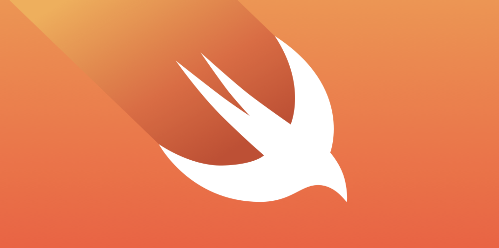

# Object-C - Swift4.2

## 关于Swift
对于移动设备、台式电脑、服务器或者任何可运行代码的地方来说，Swift 都是非常棒的编程方式。Swift 是一种安全、快速且可交互的编程语言。由于苹果公司开放的工程师文化，以及开源社区的多样化贡献，Swift 语言成功整合了现代语言最好的思想于一身。Swift 编译器对性能进行了优化，Swift 语言则对开发进行了优化，两者互不干扰。

Swift 对于新手程序员来说相当友好。它是一门具备工业质量的编程语言，但却如脚本语言一样，富有表现力且生动有趣。在 playground 中编写 Swift 代码，能让你检验代码并立即获得运行结果，为你省去了构建和运行应用的时间。

Swift 采用了现代编程模式，以避免大量常见的编程错误：

- 变量永远会在被使用前完成初始化。
- 对数组的索引操作会自动检查是否出现越界错误。
- 整型值会自动检查是否溢出。
- 可选值确保 nil 值被正确处理。
- 内存被自动管理。
- 错误处理允许从异常故障控制恢复。

Swift 代码被编译和优化，以便利用最先进的现代硬件。语法和标准库是基于指导原则设计的，编写代码的方式也是非常清晰明朗的。通过结合安全性与速度，让其成为「你好，世界！」乃至整个操作系统的最佳选择！

Swift 将强大的类型推理和模式匹配与现代轻量级的语法相结合，让复杂的概念以清晰简洁的方式表达出来。因此，代码不仅更易于编写，而且更易于阅读和维护。

Swift 多年来一直在不断发展，并不断发展新的特性和能力。我们对 Swift 的目标是野心勃勃的。我们迫不及待想看看你用它创造了什么优秀的作品。